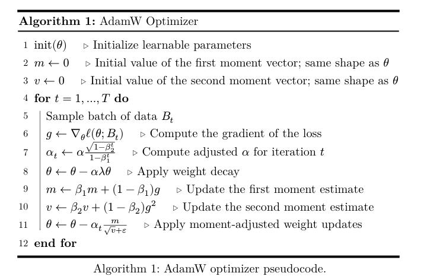

# AdamW

```py
class AdamW(torch.optim.Optimizer):
    def __init__(
        self,
        params: Any,
        lr: float = 1e-3,
        betas: tuple[float, float] = (0.9, 0.999),
        eps: float = 1e-8,
        weight_decay: float = 0.01,
    ):
        defaults = {
            "lr": lr,
            "betas": betas,
            "eps": eps,
            "weight_decay": weight_decay,
        }
        
        super().__init__(params, defaults)
    
    @torch.no_grad()
    def step(self, closure=None):
        loss = None
        if closure is not None:
            with torch.enable_grad():
                loss = closure()
                
        for group in self.param_groups:
            for p in group["params"]:
                if p.grad is None:
                    continue
                
                grad = p.grad
                if grad.is_sparse:
                    raise RuntimeError("AdamW does not support sparse gradients")
                
                state = self.state[p]
                
                if len(state) == 0:
                    state["step"] = 0
                    state["exp_avg"] = torch.zeros_like(p)
                    state["exp_avg_sq"] = torch.zeros_like(p)
                    
                exp_avg, exp_avg_sq = state["exp_avg"], state["exp_avg_sq"]
                beta1, beta2 = group["betas"]
                
                state["step"] += 1
                step = state["step"]
                
                lr = group["lr"]
                eps = group["eps"]
                weight_decay = group["weight_decay"]
                
                adjusted_lr = (
                    lr
                    * math.sqrt(1 - beta2 ** step)
                    / (1 - beta1 ** step)
                )
                
                #apply weight decay
                p.mul_(1 - lr * weight_decay)
                # Update the first moment estimate
                exp_avg.mul_(beta1).add_(grad, alpha=1 - beta1)
                # Update the second moment estimate
                exp_avg_sq.mul_(beta2).addcmul_(grad, grad, value=1 - beta2)
                # Apply moment-adjusted weights update
                denom = exp_avg_sq.sqrt().add_(eps)
                p.addcdiv_(exp_avg, denom, value=-adjusted_lr)
                
    
        return loss
```

一点一点讲一下代码

先看下面的公式



在__init__函数要做的是把超参数存入defaults字典中，然后调用父类的__init__函数,父类会把params存入self.param_groups中，方便后续step函数中使用。

然后step本质是模拟数学公式

首先
@torch.no_grad() 是为了在step函数中不计算梯度，节省内存和计算资源。
```py
loss = None
        if closure is not None:
            with torch.enable_grad():
                loss = closure()
```
这段代码是为了支持闭包函数的调用，如果传入了closure函数，就在计算图中计算loss，并返回loss值。

然后开始循环self.param_groups中的每个参数组，每个参数组中可能有多个参数p。

```py

for group in self.param_groups:
            for p in group["params"]:
                if p.grad is None:
                    continue # 如果参数没有梯度，就跳过这个参数
            grad = p.grad
                if grad.is_sparse:
                    raise RuntimeError("AdamW does not support sparse gradients")
                    # 如果梯度是稀疏的，就抛出异常，因为AdamW不支持稀疏梯度
            
            state = self.state[p] # 获取参数p的状态字典
                if len(state) == 0:
                    state["step"] = 0
                    state["exp_avg"] = torch.zeros_like(p)
                    state["exp_avg_sq"] = torch.zeros_like(p)
                    # 如果状态字典为空，就初始化step为0，exp_avg和exp_avg_sq为与p同形状的零张量
            exp_avg, exp_avg_sq = state["exp_avg"], state["exp_avg_sq"] # 获取一阶矩估计和二阶矩估计
            beta1, beta2 = group["betas"] # 获取beta1和beta2
            state["step"] += 1 # 步数加1
            step = state["step"] # 获取当前步数
            lr = group["lr"] # 获取学习率
            eps = group["eps"] # 获取epsilon
            weight_decay = group["weight_decay"] # 获取权重衰减系数

            #然后计算调整后的学习率
            adjusted_lr = (
                lr
                * math.sqrt(1 - beta2 ** step)
                / (1 - beta1 ** step)
            )

            #计算权重衰减
            p.mul_(1 - lr * weight_decay)
            # 更新一阶矩估计
            exp_avg.mul_(beta1).add_(grad, alpha=1 - beta1)
            # 更新二阶矩估计
            exp_avg_sq.mul_(beta2).addcmul_(grad, grad, value=1 - beta2)
            # 应用矩调整后的权重更新
            denom = exp_avg_sq.sqrt().add_(eps)
            p.addcdiv_(exp_avg, denom, value=-adjusted_lr)
    return loss # 返回loss值，如果有闭包函数的话
```