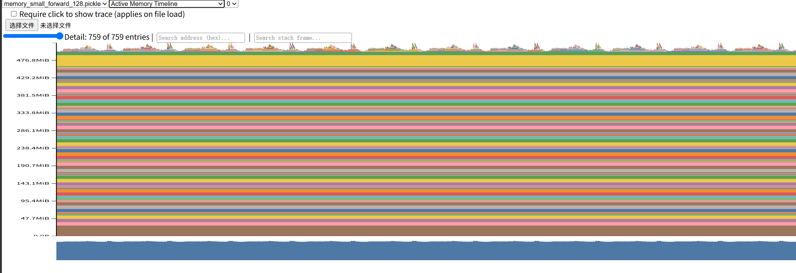
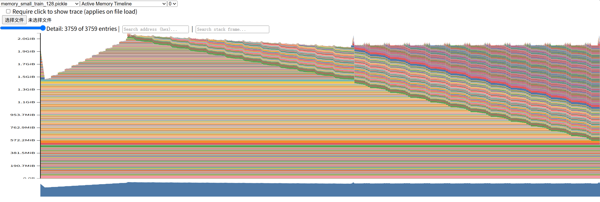

# Memory Profiling

```py

def profile_memory(
    model: BasicsTransformerLM,
    inputs: torch.Tensor,
    targets: torch.Tensor,
    mode : str,
    optimizer : AdamW,
    precision: str,
    warmup_steps :int,
    snapshot_path:str,
):
    if mode not in {"forward","train"}:
        raise ValueError("Memory profiling only supports forward or train mode")

    def profile_step():
        if mode == "forward":
            # 题目书评inference only, 不考虑反向传播
            with torch.inference_mode():
                run_step(
                    model,
                    inputs,
                    targets,
                    mode,
                    optimizer,
                    precision
                )
        else:
            run_step(
                model,
                inputs,
                targets,
                mode,
                optimizer,
                precision,
            )
    for _ in range(warmup_steps):
        profile_step()
    
    torch.cuda.synchronize()
    
    Path(snapshot_path).parent.mkdir(parents=True,exist_ok=True)
    
    # 从稳态显存统计
    torch.cuda.reset_peak_host_memory_stats()
    
    torch.cuda.memory._record_memory_history(
        max_entries = 1_000_000
    )
    
    try:
        #分析一个step
        profile_step()
        torch.cuda.synchronize()
        
        peak_allocated = torch.cuda.max_memory_allocated()
        peak_reserved = torch.cuda.max_memory_reserved()
        
        torch.cuda.memory._dump_snapshot(snapshot_path)
    finally:
        torch.cuda.memory._record_memory_history(
            enabled= None
        )
    
    print(f"snapshot: {snapshot_path}")
    print(
        f"peak allocated: {peak_allocated / 1024**3:.3f} GiB"
    )
    print(
        f"peak reserved: {peak_reserved/1024**3:.3f} GiB"
    )


  

    if args.memory_profile:
        profile_memory(
            model = model,
            inputs= inputs,
            targets= targets,
            mode = args.mode,
            optimizer= optimizer,
            precision= args.precision,
            warmup_steps= args.warmup_steps,
            snapshot_path= args.snapshot_path,
        )
        print("=========================================")
    else:
        mean,std = benchmark(
            model= model,
            inputs= inputs,
            targets= targets,
            mode = args.mode,
            optimizer= optimizer,
            warmup_steps= args.warmup_steps,
            measurement_steps= args.measurement_steps,
            precision= args.precision
        )
    
        print(f"mean time(ms): {mean*1000}")
        print(f"std(ms) : {std*100}")
        print("=========================================")
```


```bash
uv run python scripts/benchmark.py \
  --model-size small \
  --context-length 128 \
  --mode forward \
  --precision fp32 \
  --warmup-steps 1 \
  --memory-profile \
  --snapshot-path profiles/memory_small_forward_128.pickle

=========================================
device: cuda
model size: small
mode: forward
context length: 128
parameters: 128,625,408
input shape: (4, 128)
target shape: (4, 128)
precision: fp32
snapshot: profiles/memory_small_forward_128.pickle
peak allocated: 0.516 GiB
peak reserved: 0.570 GiB
=========================================
```

```bash

uv run python scripts/benchmark.py \
  --model-size small \
  --context-length 128 \
  --mode train \
  --precision fp32 \
  --warmup-steps 1 \
  --memory-profile \
  --snapshot-path profiles/memory_small_train_128.pickle


=========================================
device: cuda
model size: small
mode: train
context length: 128
parameters: 128,625,408
input shape: (4, 128)
target shape: (4, 128)
precision: fp32
snapshot: profiles/memory_small_train_128.pickle
peak allocated: 2.188 GiB
peak reserved: 2.398 GiB
=========================================
```





| 模式                 | Peak allocated | Peak reserved |
| ------------------ | -------------: | ------------: |
| Inference forward  |      0.516 GiB |     0.570 GiB |
| Full training step |      2.188 GiB |     2.398 GiB |

因为在 forward memory profile 中使用了 torch.inference_mode()：

- 不构建 autograd graph；
- 不保存供 backward 使用的中间激活；
- 每层的临时张量使用完就可以释放。
所以图像整体较平坦，只在每个 Transformer 层执行时出现小尖峰。峰值比参数显存只高约：
```
0.516 - 0.479 ≈ 0.037 GiB
```
训练图里存在四类主要显存：

- 模型参数
- 梯度
- Adam 一阶矩
- Adam 二阶矩
- 中间激活与临时张量

对于 FP32：

- 参数          ≈ 0.479 GiB
- 梯度          ≈ 0.479 GiB
- Adam 一阶矩   ≈ 0.479 GiB
- Adam 二阶矩   ≈ 0.479 GiB

>For the small Transformer with sequence length 128, inference-only execution used 0.516 GiB of peak allocated memory, while a complete training step used 2.188 GiB. In inference mode, memory was dominated by the approximately 0.479 GiB of FP32 model parameters, since intermediate activations were released immediately. During training, memory additionally included gradients, two FP32 Adam optimizer states, and saved activations required for backpropagation. This caused the training peak memory to be approximately 4.24 times the inference peak. The staircase-shaped training timeline reflects activations being saved layer by layer during the forward pass and released in reverse order during backpropagation.

