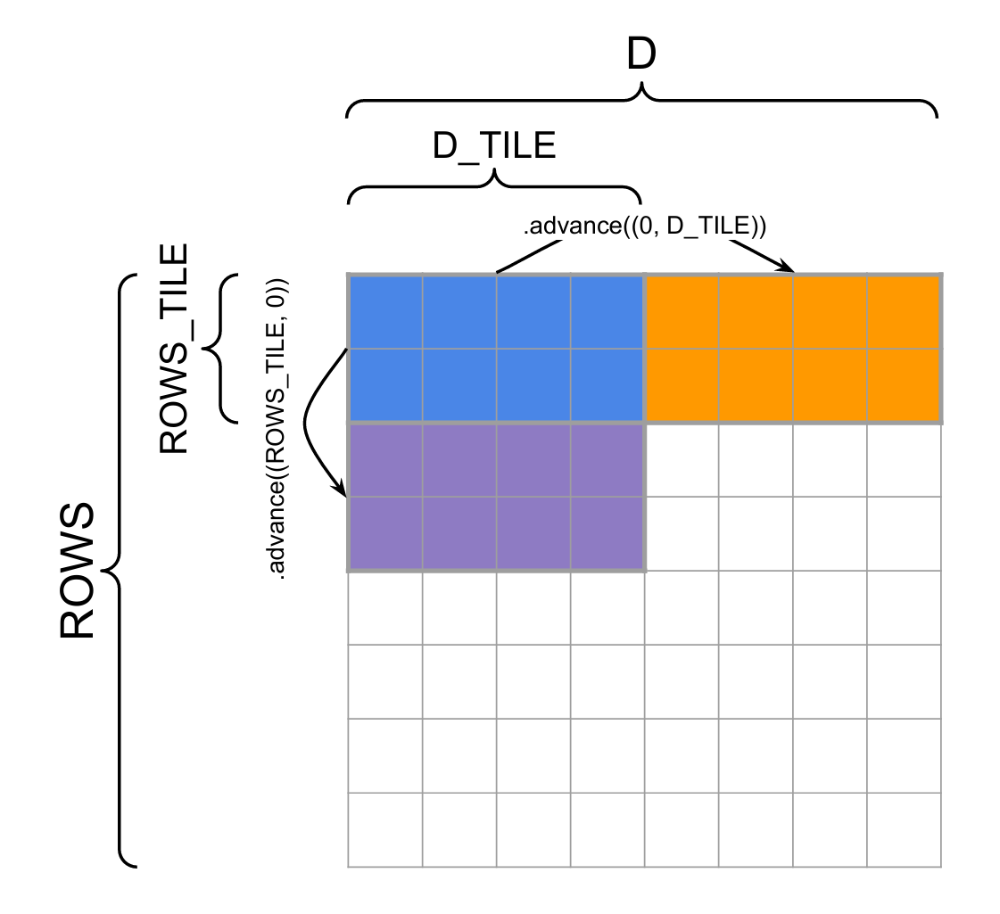
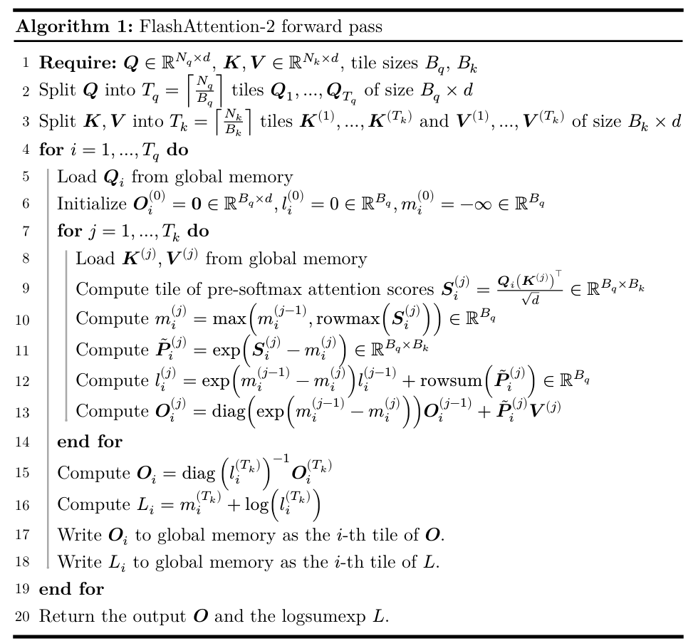

# 4.GPU kernels

## 4.1 Optimizing Attention with FlashAttention-2

### 4.1.1 Benchmarking PyTorch Attention

The naive attention implementation needs to save attention score matrices of shape `seq_len x seq_len` for each batch/head element, which can grow very large with long sequence lengths, causing out-of-memory errors for any tasks with long inputs or outputs.

We will implement an attention kernel following the FlashAttention-2 paper,which computes attention by tiles and avoids ever explicitly materializing the `seq_len x seq_len` attention score matrices,enabling scaling to much longer sequence lengths.

**Problem Pytorch_attention benchmarking**:

(a) Benchmark your attention implementation at different scales. Write a script that will:
  - Fix the batch size to 8 and don't use multihead attention.
  - Iterate through the cartesian product of [16,32,64,128] for the head embedding dimension d_model , and [256 , 1024, 4096, 8192, 16384] for sequence length
  - Create random inputs Q , K , V for appropriate size
  - Time 100 forward passes through attention using the inputs
  - measure how much memory is in use before the backward pass starts, and time 100 backwards.
  - make sure to warmup,and to call sync after each forward/backward pass to get accurate timing.

实现见
`cs336_assignment2_codenote5_attnbench.md`


## 4.2 Benchmarking JIT-Compiled Attention

Since version 2.0, Pytorch also ships with a powerful just-in-time compiler that automatically tries to apply a number of optimizations to PyTorch functions.

In particular , it will try to automatically generate fused Triton kernels by dynamically analyzing your computaiton graph.

The interface for using the pytorch compiler is very simple. For instance , if we wanted to apply it to a single layer of our model:

just:

```py

layer = SomePyTorchModel(...)
compiled_layer = torch.compile(layer)
```

Now,compiled_layer functionally behaves just like layer. 
We can also compile our entire PyTorch model with torch.compile(model) , or even a Python function that calls PyTorch operations.

**Problem: Torch Compile**


(a) Extend your attention benchmarking script to include a compiled version of your PyTorch implementation of attention, and compare its performance to the uncompiled version with the same configuration as the pytorch_attention problem above

(b) Now, compile your entire Transformer model in your end-to-end benchmarking script. How does the performance of the forward pass change? What about the combined forward and backward passes and optimizer steps?

见
`cs336_assignment2_codenote6_compilebench.md`

### 4.2.1 Example - Weighted Sum

To introduce what you'll need to know about triton and how it interoperates with PyTorch, we will work through an example kernel for a "weighted sum" operation. 

For further resources on getting up to speed with Triton, see the [Triton documentation](https://triton-lang.org/).


Given an input matrix X, we'll multiply its entries by a column-wise weight vector w, and sum each row, giving us the matrix-vector product of X and w. We are going to work through the forward pass of this operation first, and then write the Triton kernel for the backward pass.


**Forward pass**

The forward pass of our kernel is just the following broadcasted inner product.

```py

def weighted_sum(x, weight):
    # Here, assume that x has n-dim shape [..., D], and weight has 1D shape [D]
    return (weight * x).sum(axis = -1)
```

Compute the weighted sum of a tile of rows of x, and write the corresponding scalar outputs to the output tensor.

In Triton, a program instance is a block of threads all running the same program, and these thread blocks can be run in parallel on the GPU.

Instead of taking tensors as arguments, we take pointers to their first elements, as well as strides for each tensor that tell us how to move along axes.

We will use the block pointer abstraction with `tl.make_block_ptr` to greatly simplify the pointer arithmetic, although this means we need to do some setup to prepare the block pointers



Refer to figure above, for a schematic of tiling and how block pointers are advanced. The weighted sum function from above looks like the following.

```py

import triton
import triton.language as tl

@triton.jit

def weighted_sum_kernel(
  x_ptr,weight_ptr, # input ptrs,
  output_ptr, # output ptr
  x_stride_row,x_stride_dim , # Strides tell us how to move one element in each axis of a tensor
  weight_stride_dim, # likely 1
  output_stride_row, # likely 1
  NUM_ROWS, D, 
  ROWS_TILE_SIZE: tl.constexpr, D_TILE_SIZE: tl.constexpr, # Tile shapes must be known at compile time
):

  # each instance will compute weighted sum of a tile of rows of x
  # `tl.program_id` gives us a way to check which thread block we're running in

  row_tile_idx = tl.program_id(0) # which tile of rows are we computing?

  # Block pointers gives us a way to select from an ND region of memory
  # and move our selection around
  # The block pointer must know:
  # - The pointer to the first element of the tensor
  # - Tge overall shape of the tensor to handle out of bounds accesses
  # - The strides of each dimension to use the memory layout properly
  # - The ND coordinates of the starting block, i.e., "offsets"
  # - The block shape to load/store at a time
  # - The order of the dimensions in memory from major to minor
  #   axes (= np.argsort(strides)) for optimizations, needed for 
  #   TMA support on >= hopper

  x_block_ptr = tl.make_block_ptr(
    base=x_ptr,
    shape=(NUM_ROWS,D),
    strides=(x_stride_row,x_stride_dim),
    offsets=(row_tile_idx * ROWS_TILE_SIZE,0),
    block_shape=(ROWS_TILE_SIZE,D_TILE_SIZE),
    order=(0,1)
  )

  weight_block_ptr = tl.make_block_ptr(
    base=weight_ptr,
    shape=(D,),
    strides=(weight_stride_dim,),
    offsets=(0,),
    block_shape=(D_TILE_SIZE,),
    order=(0,)
  )
  
  output_block_ptr = tl.make_block_ptr(
    base=output_ptr,
    shape=(NUM_ROWS,),
    strides=(output_stride_row,),
    offsets=(row_tile_idx * ROWS_TILE_SIZE,),
    block_shape=(ROWS_TILE_SIZE,),
    order=(0,)
  )

  output = tl.zeros((ROWS_TILE_SIZE,), dtype = tl.float32)

  for i in range(tl.cdiv(D, D_TILE_SIZE)):
    # Load the current block pointer
    # Since ROWS_TILE_SIZE might not divide NUM_ROWS, and D_TILE_SIZE might not divede D,
    # we need boudary checks for both dimensions
    row = tl.load(x_block_ptr, boundary_check = (0,1), padding_option = "zero")
    weight = tl.load(weight_block_ptr,boundary_check = (0,), padding_option = "zero") # (D_TILE_SIZE,)

    # Compute the weighted sum of the row
    output += tl.sum(row * weight[None, :], axis = 1) # (ROWS_TILE_SIZE,)

    # Move the pointers to the next tile
    # These are (rows, columns) coordinate deltas
    x_block_ptr = x_block_ptr.advance((0,D_TILE_SIZE)) # Move by D_TILE_SIZE in the last dimension
    weight_block_ptr = weight_block_ptr.advance((D_TILE_SIZE,)) # Move by D_TILE_SIZE in the last dimension
  # Store the output tile
  tl.store(output_block_ptr, output, boundary_check = (0,))
```


Let's now warp this kernel in a PyTorch Autograd function that will interoperate with PyTorch

```py

class WeightedSumFunc(torch.autograd.Function):
  @staticmethod
  def forward(ctx, x, weight):
    # Cache x and weight to be used in the backward pass ,when
    # we only receive the gradient wrt. the output tensor, and 
    # Need to compute the gradients wrt. x and weight
    D, output_dims = x.shape[-1], x.shape[:-1]

    # Reshape input tensor to 2D
    input_shape = x.shape
    x = rearrange(x, "... d -> (...) d") # (N, D)
    ctx.save_for_backward(x, weight)

    assert len(weight.shape) == 1, "Weight must be a 1D tensor"
    assert weight.shape[0] == D, f"Weight must have shape ({D},), but got {weight.shape}"
    assert x.is_cuda and weight.is_cuda, "Inputs must be CUDA tensors"
    assert x.is_contiguous() and weight.is_contiguous(), "Inputs must be contiguous tensors"

    ctx.D_TILE_SIZE = triton.next_power_of_2(D) // 16 # roughly 16 loops through the embedding dimension
    ctx.ROWS_TILE_SIZE = 16 # Each thread processes 16 batch elements at a time
    ctx.input_shape = input_shape

    # Need to initialize empty result tensor, Note that these elements are not necessarily 0!
    y = torch.empty(output_dims, device = x.device, dtype = x.dtype)

    # launch the kernel with enough blocks to cover all rows of x
    n_rows = y.numel()
    weighted_sum_fwd[(triton.cdiv(n_rows, ctx.ROWS_TILE_SIZE),)](
      x, weight, y,
      x.stride(0), x.stride(1),
      weight.stride(0),
      y.stride(0),
      n_rows, D,
      ctx.ROWS_TILE_SIZE, ctx.D_TILE_SIZE
    )

    return y.view(input_shape[:-1]) # reshape back to original input shape without the last dimension
```


看到一个 Triton kernel，先问五件事：

```
1. Grid 有多少个 program instance？
2. 每个 program 负责输出的哪一个 tile？
3. 输入 block pointer 的起始 offsets 是什么？
4. 循环中 block pointer 向哪个方向 advance？
5. 哪些数据留在片上累加，最后才 store 回 HBM？
```

对于这个weighted sum
```
1. grid = ceil(NUM_ROWS / ROWS_TILE_SIZE)
2. 每个 program 负责 ROWS_TILE_SIZE 行
3. 起始行为 program_id × ROWS_TILE_SIZE
4. 沿 D 方向逐块 advance
5. output accumulator 留在片上，最后一次性写回
```

```
weighted sum：
固定一组行
沿 D 方向扫描 tile
维护行级 accumulator

FlashAttention：
固定一组 query 行
沿 key/value 方向扫描 tile
维护在线 softmax 和 output accumulator
```


**Backward pass**:

Our kernel for the backward pass will start by defining all the block pointers and then computing gradient of L

```py

@triton.jit
def weighted_sum_backward(
  x_ptr,weight_ptr, #input
  grad_output_ptr, # grad input
  grad_x_ptr, partial_grad_weight_ptr, # grad outputs
  stride_xr, stride_xd,
  stride_wd, stride_gr
  stride_gxr, stride_gxd,
  stride_gwb, stride_gwd,
  NUM_ROWS, D,
  ROWS_TILE_SIZE: tl.constexpr, D_TILE_SIZE: tl.constexpr,
):
  row_tile_idx = tl.program_id(0)
  n_row_tiles = tl.num_programs(0)

  # Inputs
  grad_output_block_ptr = tl.make_block_ptr(
    grad_output_ptr,
    shape = (NUM_ROWS,),
    strides = (stride_gr,),
    offsets = (row_tile_idx * ROWS_TILE_SIZE,),
    block_shape = (ROWS_TILE_SIZE,),
    order = (0,)
  )

  x_block_ptr = tl.make_block_ptr(
    x_ptr,
    shape = (NUM_ROWS,D),
    strides = (stride_xr, stride_xd),
    offsets = (row_tile_idx * ROWS_TILE_SIZE, 0),
    block_shape = (ROWS_TILE_SIZE, D_TILE_SIZE),
    order = (0,1)
  )

  weight_block_ptr = tl.make_block_ptr(
    weight_ptr,
    shape = (D,),
    strides = (stride_wd,),
    offsets = (0,),
    block_shape = (D_TILE_SIZE,),
    order = (0,)
  )

  grad_x_block_ptr = tl.make_block_ptr(
    grad_x_ptr,
    shape = (NUM_ROWS,D),
    strides = (stride_gxr, stride_gxd),
    offsets = (row_tile_idx * ROWS_TILE_SIZE, 0),
    block_shape = (ROWS_TILE_SIZE, D_TILE_SIZE),
    order = (1,0)
  )

  partial_grad_weight_block_ptr = tl.make_block_ptr(
    partial_grad_weight_ptr,
    shape = (n_row_tiles, D),
    strides = (stride_gwb, stride_gwd),
    offsets = (row_tile_idx, 0),
    block_shape = (1, D_TILE_SIZE),
    order = (1,0),
  )

  for i in range(tl.cdiv(D, D_TILE_SIZE)):

    grad_output = tl.load(grad_output_block_ptr, boundary_check = (0,), padding_option = "zero") # (ROWS_TILE_SIZE,)


    # Outer product for grad_x
    weight = tl.load(weight_block_ptr, boundary_check = (0,), padding_option = "zero") # (D_TILE_SIZE,)
    grad_x_row = grad_output[:, None] * weight[None, :] # (ROWS_TILE_SIZE, D_TILE_SIZE)
    tl.store(grad_x_block_ptr, grad_x_row, boundary_check = (0,1))

    # Reduce as many rows as possilbe for the grad_weight result
    row = tl.load(x_block_ptr, boundary_check = (0,1), padding_option = "zero") # (ROWS_TILE_SIZE, D_TILE_SIZE)
    grad_weight_row = tl.sum(row * grad_output[:, None], axis = 0 , keep_dims = True) # (D_TILE_SIZE,)
    tl.store(partial_grad_weight_block_ptr, grad_weight_row, boundary_check = (1,))

    #Move the pointers to the next tile along D
    x_block_ptr = x_block_ptr.advance((0, D_TILE_SIZE))
    weight_block_ptr = weight_block_ptr.advance((D_TILE_SIZE,))
    partial_grad_weight_block_ptr = partial_grad_weight_block_ptr.advance((0, D_TILE_SIZE))
    grad_x_block_ptr = grad_x_block_ptr.advance((0, D_TILE_SIZE))
```


Computing the gradient of x is simple, and we write the result to the appropriate tile of the output tensor.

However, computing The gradient of w is a bit more challenging.

Each kernel instance is responsible for one row tile of x, but we now need to sum across rows of x.

Instead of doing this sum directly in our backward pass, we will assume that partial_grad_weight_ptr contains an n_row_tiles x H matrix, where the first dimension is noly reduced within a row tile from x. We reduce within the current row tile before writing to this tensor.

Outside of the kernel, we reduce gradient of w using torch.sum to sum up the results from each row tile.

The final part of the autograd.Fucntion is then relatively simple.

```py

class WeightedSumFunc(torch.autograd.Function):
  @staticmethod
  def forward(ctx, x, weight):
    ...
    # defined earlier
  
  @staticmethod
  def backward(ctx, grad_out):
    x, weight = ctx.saved_tensors
    ROWS_TILE_SIZE, D_TILE_SIZE = ctx.ROWS_TILE_SIZE, ctx.D_TILE_SIZE # These don't have to be the same
    n_rows, D = x.shape

    # Our stratagy is for each thread block to first write to a partial buffer.
    # Then we reduce over this buffer to get the final gradient.

    partial_grad_weight = torch.empty((triton.cdiv(n_rows, ROWS_TILE_SIZE), D), device = x.device, dtype = x.dtype)
    grad_x = torch.empty_like(x)

    weighted_sum_backward[(triton.cdiv(n_rows, ROWS_TILE_SIZE),)](
      x, weight, grad_out, grad_x, partial_grad_weight,
      x.stride(0), x.stride(1),
      weight.stride(0), grad_out.stride(0),
      grad_x.stride(0), grad_x.stride(1),
      partial_grad_weight.stride(0), partial_grad_weight.stride(1),
      n_rows, D,
      ROWS_TILE_SIZE, D_TILE_SIZE
    )

    grad_weight = partial_grad_weight.sum(axis = 0) # Reduce across the row tiles to get the final gradient
    return grad_x, grad_weight
```

Finally, we can now obtain a function that works much like those implemented in torch.nn.functional:

```py

f_weightedsum = WeightedSumFunc.apply
```

Now, calling f_weightedsum on two PyTorch tensors x and w will give a tensor such as the following:


```py

tensor([....],device = 'cuda:0', grad_fn = <WeightedSumFuncBackward>)
```

Note the grad_fn attached to the tensor —— this shows that PyTorch Knows what to call in the backward pass when this tensor appears in the computation graph.

This completes our Triton implementation of the weighted sum operation.

### 4.2.2 Flash Attention-2 Forward Pass

You will replace your PyTorch attention implementation with a significnatly improved Triton implementation following FlashAttention-2.

FlashAttention-2 employs some tricks to compute the forward pass in tiles, which allows for efficient memory access patterns and avoids the need to materialize the full attention matrix on global memory.

官方推荐先去阅读 original FlashAttention-2 paper. T.Dao et al.,2022.先看一下

#### Paper reading


**Understanding inefficiencies in vanilla attention**:

Recall that the forward pass for attention (ignoring masking for now) can be written as:

$$ S = QK^T/ \sqrt{d} $$
$$ P_{ij} = softmax_j(S_{ij}) $$
$$ O = PV $$

The standard backward pass is:

$$ dV = P^T dO $$
$$ dP = dO V^T $$
$$ dS_i = dsoftmax(dP_i) = (diag(P_i) - P_i P_i^T) dP_i $$
$$ dQ = dSK / \sqrt{d} $$
$$ dK = dS^T Q / \sqrt{d} $$

As we can see, the backward pass depends on some very large activations from the forward pass.

For example, computing $dV$ requires $P$, which are the attention scores of shape (batch_size,n_heads,seq_len,seq_len). —— the size of this activation matrix depends quadratically on the sequence length.

**The main goal of FlashAttention is to avoid reading and writing the attention matrix to and from HBM, to reduce IO and peak memory costs.**

We accomplish using three techniques:

**Tiling**

To avoid reading and writing the attention matrix to and from HBM, we compute the softmax reduction without access to the whole input.
Specifically, we restructure the attention computation to split the input into tiles and kamke several passes over input tiles,thus incrementally performing the softmax reduction.

**Recomputation**:

We avoid storing the large intermediate attention matrices of shape (batch_size, n_heads, seq_len, seq_len) in HBM.

In our final kernel we will compute the L in an online manner,but the final result should be the same.

With tiling and recomputation together, our memory IO and peak usage no longer depend on quadratic seq_length , and therefore we may use larger seq len.

**Operator fusion**:
we avoid repeated memory IO for attention matrix and other intermediate activations by performing all our operations in a single kernel.

We will write a single Triton kernel for the forward pass that performs all the operations involved in attention with limited data transfer between HBM and SRAM.

Operator fusion is partly enabled by recomputation, since we can avoid the usual memory IO we would pay to store every intermediate activation to HBM.

**Backward pass with recomputation**:

Before we start, we precompute the value D = rowsum(O o dO) in global memory. where o is elementwise multiplication.


The full calculation for the backward pass is now:

$$ S = QK^T/ \sqrt{d} $$
$$ P_{ij} = exp(S{ij} - L{i}) $$
$$ dV = P^T dO $$
$$ dP = dO V^T $$
$$ dS_{ij} = P_{ij}(dP_{ij} - D_i) $$
$$ dQ = dSK / \sqrt{d} $$
$$ dK = dS^T Q / \sqrt{d} $$

We can see that the sequence of operations does not require us to have stored the attention scores P in HBM, during the forward pass——we recompute them from activations Q,K, and L in backward pass.



**Problem: FlashAttention-2 Forward Pass**:

(a) Write a pure PyTorch autograd.Function that implements the flashattention-2 forward pass.

take input of Q K V and a flag is_causal and produce the output O and the logsumexp value L.

The autograd.Function forward should then save L,Q,K,V,O for the backward pass and retunr O.

Remember that the implementation of the forward pass always tkae the context as its first parameter.

Any autograd.Function class needs to implement a backward method,but for now, you can just raise NotImplementedError in the backward method.

The interface is then def forward(ctx, Q, K, V, is_causal = False).

(b) Write a Triton kernel for the forward pass of FlashAttention-2 following Algorithm 1.
Then , write another subclass of torch.autograd.Function that call this fused kernel in the forward pass. Instead of computing the result in PyTorch.

- To debug, we suggest comparing the results of each Triton operation you perform with the tiled PyTorch implementation you wrote in part (a).
- Your launch grid should be set as (𝑇𝑞,batch_size), meaning each Triton program instance 
will load only elements from a single batch index, and only read/write to a single query 
tile of 𝑸, 𝑶, and L
-  The kernel should only have a single loop, which will iterate key tiles 1 ≤ 𝑗 ≤ 𝑇𝑘.
-  Advance block pointers at the end of the loop.
- Use the function declaration below (using the block pointer we give you, you should be 
able to infer the setup of the rest of the pointers)

```py

@triton.jit
def flash_fwd_kernel(
  Q_ptr, K_ptr, V_ptr, O_ptr, L_ptr,
  stride_qb, stride_qq, stride_qd,
  stride_kb, stride_kk, stride_kd,
  stride_vb, stride_vv, stride_vd,
  stride_ob, stride_oo, stride_od,
  stride_lb, stride_lo,
  N_QUERIES, N_KEYS,
  scale,
  D: tl.constexpr,
  Q_TILE_SIZE: tl.constexpr,
  K_TILE_SIZE: tl.constexpr,
):
  # Program indices
  query_tile_index = tl.program_id(0) # which tile of queries are we computing?
  batch_index = tl.program_id(1) # which batch are we computing?

  # Offset each pointer with the corresponding batch index
  # multiplied with the batch stride for each tensor
  Q_block_ptr = tl.make_block_ptr(
    base=Q_ptr + batch_index * stride_qb,
    shape=(N_QUERIES, D),
    strides=(stride_qq, stride_qd),
    offsets=(query_tile_index * Q_TILE_SIZE, 0),
    block_shape=(Q_TILE_SIZE, D),
    order=(1, 0),
  )

  ...
```
where scale is $\frac{1}{\sqrt{d}}$. and Q_TILE_SIZE and K_TILE_SIZE are $B_q$ and $B_k$ respectively.


- The on chip buffers (O_i , l , m) should have dtype tl.float32, if you're accumulating into an output buffer, use the acc argument (acc = tl.dot(..., acc = acc))

- Cast P to the dtype of V before multiplying them. and cast O_i to the appropriate dtype before writing it to global memory.

(c) Add a flag as the last argument to your autograd.Function implementation for causal masking.

When set  to True, enables an index comparison for casual masking. Your Triton kernel should have a corresponding additional parameter is_causal: tl.constexpr.

In Triton,construct appropriate index vectors for queries and keys, and compare them to form a square mask of size B_q x B_k.

For elements that are masked out , add the constant value of -1e6 to the corresponding elements of the attention score matrix S. Make sure save the mask flag for backward using ctx.is_causal = is_causal.

实现见
`cs336_assignment2_codenote7_flashfwd.md`

**Implementing the backward pass with recomputation**:

**Problem**: FlashAttention-2 Backward Pass

Using PyTorch. and torch.compile.

`cs336_assignment2_codenote8_flashbwd.md`


Let's now compare the performance of your (partially) Triton implementation of FlashAttention-2 with your PyTorch implementation of regular Attention.

**Problem**: Flash Attention-2 Benchmarking

(a) Write a benchmarking script using triton.testing.do_bench that compares the performance of your (partially) Triton implementation of FlashAttention-2 Forward and backward passes with a regular PyTorch implementation.


```py
from __future__ import annotations

import csv
import gc
import itertools
from pathlib import Path
from typing import Callable

import torch
import triton

from cs336_systems.flash_attention_triton import flash_attention_triton


# 本机 RTX 5070 Laptop 的合理范围。
# 题目原始范围还包括 16384、32768、65536，但不建议在 8GB GPU 上硬跑。
SEQUENCE_LENGTHS = [
    128,
    256,
    512,
    1024,
    2048,
    4096,
    8192,
]

EMBEDDING_DIMS = [16, 32, 64, 128]

DTYPES = {
    "bf16": torch.bfloat16,
    "fp32": torch.float32,
}

BATCH_SIZE = 1
IS_CAUSAL = True

# do_bench 中 warmup 和 rep 是大致的毫秒时间预算，
# 不是固定循环次数。
WARMUP_MS = 25
REPETITION_MS = 100

OUTPUT_PATH = Path("flash_attention_benchmark.csv")


def pytorch_attention(
    q: torch.Tensor,
    k: torch.Tensor,
    v: torch.Tensor,
    causal_mask: torch.Tensor,
) -> torch.Tensor:
    """
    显式的普通 PyTorch attention。

    不使用 F.scaled_dot_product_attention，因为后者可能自动调用
    FlashAttention 或其他 fused kernel，失去对比意义。
    """
    scale = q.shape[-1] ** -0.5

    scores = (
        q @ k.transpose(-2, -1)
    ) * scale

    scores = scores.masked_fill(
        ~causal_mask,
        -torch.inf,
    )

    probabilities = torch.softmax(
        scores,
        dim=-1,
    )

    return probabilities @ v


def make_inputs(
    sequence_length: int,
    embedding_dim: int,
    dtype: torch.dtype,
) -> tuple[torch.Tensor, torch.Tensor, torch.Tensor]:
    shape = (
        BATCH_SIZE,
        sequence_length,
        embedding_dim,
    )

    q = torch.randn(
        shape,
        device="cuda",
        dtype=dtype,
        requires_grad=True,
    )

    k = torch.randn(
        shape,
        device="cuda",
        dtype=dtype,
        requires_grad=True,
    )

    v = torch.randn(
        shape,
        device="cuda",
        dtype=dtype,
        requires_grad=True,
    )

    return q, k, v


def benchmark_forward(
    implementation: Callable[
        [torch.Tensor, torch.Tensor, torch.Tensor],
        torch.Tensor,
    ],
    sequence_length: int,
    embedding_dim: int,
    dtype: torch.dtype,
) -> float:
    q, k, v = make_inputs(
        sequence_length,
        embedding_dim,
        dtype,
    )

    return triton.testing.do_bench(
        lambda: implementation(q, k, v), #type: ignore
        warmup=WARMUP_MS,
        rep=REPETITION_MS,
        return_mode="median",
    )


def benchmark_backward(
    implementation: Callable[
        [torch.Tensor, torch.Tensor, torch.Tensor],
        torch.Tensor,
    ],
    sequence_length: int,
    embedding_dim: int,
    dtype: torch.dtype,
) -> float:
    q, k, v = make_inputs(
        sequence_length,
        embedding_dim,
        dtype,
    )

    # Forward 不计入 backward 时间。
    output = implementation(q, k, v)
    grad_output = torch.randn_like(output)

    torch.cuda.synchronize()

    return triton.testing.do_bench(
        lambda: output.backward( # type: ignore
            grad_output,
            retain_graph=True,
        ),
        warmup=WARMUP_MS,
        rep=REPETITION_MS,
        grad_to_none=[q, k, v],
        return_mode="median",
    )


def benchmark_forward_backward(
    implementation: Callable[
        [torch.Tensor, torch.Tensor, torch.Tensor],
        torch.Tensor,
    ],
    sequence_length: int,
    embedding_dim: int,
    dtype: torch.dtype,
) -> float:
    q, k, v = make_inputs(
        sequence_length,
        embedding_dim,
        dtype,
    )

    grad_output = torch.randn_like(q)

    def step() -> None:
        output = implementation(q, k, v)
        output.backward(grad_output)

    return triton.testing.do_bench( # type: ignore
        step,
        warmup=WARMUP_MS,
        rep=REPETITION_MS,
        grad_to_none=[q, k, v],
        return_mode="median",
    )


def is_oom_error(error: BaseException) -> bool:
    return (
        isinstance(error, torch.OutOfMemoryError)
        or (
            isinstance(error, RuntimeError)
            and "out of memory" in str(error).lower()
        )
    )


def run_safely(
    benchmark: Callable[[], float],
) -> float | str:
    try:
        return float(benchmark())
    except BaseException as error:
        if not is_oom_error(error):
            raise

        return "OOM"
    finally:
        gc.collect()
        torch.cuda.empty_cache()


def format_result(value: float | str) -> str:
    if isinstance(value, str):
        return value

    return f"{value:.4f}"


def main() -> None:
    if not torch.cuda.is_available():
        raise RuntimeError("CUDA GPU is required")

    torch.manual_seed(0)
    torch.cuda.manual_seed_all(0)

    # Triton 的 FP32 tl.dot 在 NVIDIA GPU 上通常使用 TF32 路径。
    # 允许 PyTorch matmul 使用高性能 TF32，以免 FP32 对比明显失衡。
    torch.set_float32_matmul_precision("high")

    gpu_name = torch.cuda.get_device_name()

    print(f"GPU: {gpu_name}")
    print(f"Output: {OUTPUT_PATH}")

    columns = [
        "gpu",
        "implementation",
        "dtype",
        "sequence_length",
        "embedding_dim",
        "forward_ms",
        "backward_ms",
        "forward_backward_ms",
    ]

    with OUTPUT_PATH.open(
        "w",
        newline="",
        encoding="utf-8",
    ) as output_file:
        writer = csv.DictWriter(
            output_file,
            fieldnames=columns,
        )
        writer.writeheader()

        configurations = itertools.product(
            DTYPES.items(),
            SEQUENCE_LENGTHS,
            EMBEDDING_DIMS,
        )

        for (
            dtype_name,
            dtype,
        ), sequence_length, embedding_dim in configurations:
            for implementation_name in ["pytorch", "triton"]:
                causal_mask = None

                try:
                    if implementation_name == "pytorch":
                        # 在 benchmark 外创建 mask，避免把 mask 构造时间
                        # 算入 attention forward。
                        causal_mask = torch.ones(
                            (
                                sequence_length,
                                sequence_length,
                            ),
                            device="cuda",
                            dtype=torch.bool,
                        ).tril()

                        def implementation( # type: ignore
                            q: torch.Tensor,
                            k: torch.Tensor,
                            v: torch.Tensor,
                            mask: torch.Tensor = causal_mask,
                        ) -> torch.Tensor:
                            return pytorch_attention(
                                q,
                                k,
                                v,
                                mask,
                            )

                    else:

                        def implementation(
                            q: torch.Tensor,
                            k: torch.Tensor,
                            v: torch.Tensor,
                        ) -> torch.Tensor:
                            return flash_attention_triton(
                                q,
                                k,
                                v,
                                is_causal=IS_CAUSAL,
                            )

                    forward_ms = run_safely(
                        lambda: benchmark_forward(
                            implementation,
                            sequence_length,
                            embedding_dim,
                            dtype,
                        )
                    )

                    backward_ms = run_safely(
                        lambda: benchmark_backward(
                            implementation,
                            sequence_length,
                            embedding_dim,
                            dtype,
                        )
                    )

                    forward_backward_ms = run_safely(
                        lambda: benchmark_forward_backward(
                            implementation,
                            sequence_length,
                            embedding_dim,
                            dtype,
                        )
                    )

                except BaseException as error:
                    if not is_oom_error(error):
                        raise

                    forward_ms = "OOM"
                    backward_ms = "OOM"
                    forward_backward_ms = "OOM"

                finally:
                    del causal_mask
                    gc.collect()
                    torch.cuda.empty_cache()

                row = {
                    "gpu": gpu_name,
                    "implementation": implementation_name,
                    "dtype": dtype_name,
                    "sequence_length": sequence_length,
                    "embedding_dim": embedding_dim,
                    "forward_ms": format_result(
                        forward_ms
                    ),
                    "backward_ms": format_result(
                        backward_ms
                    ),
                    "forward_backward_ms": format_result(
                        forward_backward_ms
                    ),
                }

                writer.writerow(row)
                output_file.flush()

                print(
                    f"{implementation_name:7s} "
                    f"{dtype_name:4s} "
                    f"N={sequence_length:5d} "
                    f"D={embedding_dim:3d} | "
                    f"fwd={row['forward_ms']:>8} ms | "
                    f"bwd={row['backward_ms']:>8} ms | "
                    f"e2e={row['forward_backward_ms']:>8} ms"
                )


if __name__ == "__main__":
    main()
```


结果


Foward：

| 配置                  |   PyTorch |    Triton |   加速比 |
| ------------------- | --------: | --------: | ----: |
| BF16, N=128, D=16   | 0.0244 ms | 0.0089 ms | 2.74× |
| BF16, N=8192, D=16  | 4.6874 ms | 0.6673 ms | 7.02× |
| BF16, N=8192, D=128 | 4.8097 ms | 1.7591 ms | 2.73× |
| FP32, N=8192, D=16  | 8.4701 ms | 0.9974 ms | 8.49× |
| FP32, N=8192, D=128 | 9.1952 ms | 3.4680 ms | 2.65× |


BF16 backward:
| 配置            | PyTorch backward | Triton backward |   加速比 |
| ------------- | ---------------: | --------------: | ----: |
| N=128, D=16   |        0.0778 ms |       0.0181 ms | 4.30× |
| N=4096, D=16  |        1.5277 ms |       0.5562 ms | 2.75× |
| N=8192, D=16  |        6.4196 ms |       1.7234 ms | 3.72× |
| N=8192, D=128 |        6.7148 ms |       5.5962 ms | 1.20× |


FP32 backward:
FP32, N=8192, D=128

PyTorch backward: 13.1555 ms
Triton backward:  51.5604 ms

原因一：强制使用 IEEE FP32
原因二：dK 和 dV 使用全局原子累加
原因三：固定 16×16 tile 不适合所有 D
