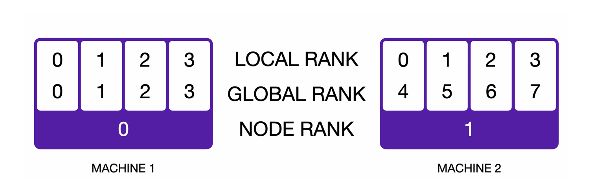

# 5. Distributed Data Parallel Training

In this next part of the assignment, we'll explore distributed for using multiple GPUs to train our language model, focusing on data parallelism.

We'll start with a primer on distributed communication in PyTorch.

Then, we'll study a naive implementation of distributed data parallel training, then implement and benchmark various improvements to communication efficiency.

## 5.1 Single-Node Distributed Communication in PyTorch

This is a simple distributed application in PyTorch, where the goal is to generate 4 random integer tensors and compute their sum.

example:

```py

import os
import torch
import torch.distributed as dist
import torch.multiprocessing as mp

def setup(rank,world_size):
    os.environ['MASTER_ADDR'] = 'localhost'
    os.environ['MASTER_PORT'] = '29500'
    dist.init_process_group("gloo", rank=rank, world_size=world_size)

def distributed_demo(rank, world_size):
    setup(rank, world_size)
    data = torch.randint(0, 10, (3,))
    print(f"rank {rank} data(before all-reduce): {data}")
    dist.all_reduce(data, async_op=False)
    print(f"rank {rank} data(after all-reduce): {data}")

if __name__ == "__main__":
    world_size = 4
    mp.spawn(fn = distributed_demo, args=(world_size,), nprocs=world_size, join=True)

```

After running the script above,we will get this:

```
rank 3 data (before all-reduce): tensor([3, 7, 8])
rank 0 data (before all-reduce): tensor([4, 4, 7])
rank 2 data (before all-reduce): tensor([6, 0, 7])
rank 1 data (before all-reduce): tensor([9, 5, 3])
rank 1 data (after all-reduce): tensor([22, 16, 25])
rank 0 data (after all-reduce): tensor([22, 16, 25])
rank 3 data (after all-reduce): tensor([22, 16, 25])
rank 2 data (after all-reduce): tensor([22, 16, 25])
```


The command mp.spawn spawns npcros processes that run fn with the provided args.

In addition,the function fn is called as fn(rank, *args), where rank is the index of the worker process.

Thus,our distributed_demo function is must accept this integer rank as its first positional argument. In addition, we pass in the world_size, which refers to the total number of worker processes.

Each worker process belongs to a process group, which is initialized via dist.init_process_group. The process group represents multiple worker processes that will coordinate and communicate via a shared master.

In this case, we initialized our process group with the "gloo" backend, but other backends are available. 

In particular, the "nccl" backend will use the NVIDIA NCCL collective communications library, which will generally be more performant for CUDA tensors. 

When running multi-GPU jobs, make sure that different ranks use different GPUs. One method for doing this is to call torch.cuda.set_device(rank) in the setup function, so that tensor.to("cuda") will automatically move it to the specified device. 
Alternatively, you can explicitly create a per-rank device string, (e.g, device = f"cuda:{rank}") and use that to move tensors to the correct GPU.


**Termonology:**

In the rest of the assignment (and various other resources you might see online), you may encounter the following terms in the context of PyTorch distributed communication.

**node**: A machine on the network

**world size**: The number of total workers in a process group

**global rank**: An integer ID that uniquely identifies a worker in the process group.

**local world size**:  When running applications across different nodes, the local world size is the number of workers running locally on a given node.
For example, if we have an application that spawns 4 workers on 2 nodes each, the world size would be 8 and the local world size would be 4.
Note that when running on a single node, the local world size of a worker is equivalent to the global world size.

**local rank**: An integer ID(between 0 and local world size -1) that uniquely identifies the index of a local worker on the machine.

For example, if we have an application that spawns 4 processes on 2 nodes each, each node would have workers with local ranks 0,1,2 and 3. Note that when running a single-node multi-process distributed application, the local rank of a process is equivalent to its global rank.




### 5.1.1 Best practice for benchmarking distributed applications

1. Whenever possible, run benchmarks on the same machine to facilitate controlled comparisons.

2. Perform several warm-up steps before timing the operation of interest. This is especially important for NCCL communication calls. 5 iterations of warmup is generally sufficient.

3. Call torch.cuda.synchronize() to wait for CUDA operations to complete when benchmarking on GPUs.  Note that this is necessary even when calling communication operations with async_op = False,
which returns when the operation is queued on the GPU.

4. Timings may vary slightly across different ranks, so it's common to aggregate measurements across ranks to improve estimates. You may find the all-gather collective (specifically the dist.all_gather_object function) to be useful for collecting results from all ranks.

5. In general, debug locally with Gloo on CPU, and then as required in a given problem, benchmark with NCCL on GPU.


**Problem distributed_communication_single_ndoe**: Distributed Communication.

Write a script to benchmark the runtime of the all-reduce operation in the single-node multi-process setup. The example code above may provide a reasonable starting point.

Experiment with varying the following settings:

all-reduce data size float 32 data tensors ranging over 1MB 10MB 100MB 1GB

Number of GPUs/Processes: 2 4 or 6

Resource requirements: UP to 6 GPUs, each benchmarking run should take less than 5 minutes.

Deliverable: Plots and / or table comparing the various settings, with 2-3 sentences of commentary about your results and thoughts about how the various factors interact.

实现见
`cs336_assignment2_codenote9_multiprocessingbenchmarking.md`

## 5.2 A naive implementation of Distributed Data Parallel Training

We've seen the basics of writing distributed applications in PyTorch, let's build a minimal implementation of distributed data parallel training.

Data parallelism splits batches across multiple devices, enabling training on large batch sizes that do not fit on a single device.


Here are the steps for naively doing distributed data parallel training. Initally , each device constructs a (randomly initialized) model.

We use the broadcast collective communication operation to send the model parameters from rank 0 to all other ranks.

At the start of training, each device holds an identical copy of the model parameters and optimizer states.

1. Given a batch with n examples, the batch is shared and each device receives n/d disjoint examples. (where d is the number of devices used for data parallel training)  d should devide n,otherwise some ranks would do more work than others, and the step is bottlenecked by slowest.
2. Each device uses its local copy of the model parameters to run a forward pass on its n/d examples and a backward pass to calculate the gradients. Note that at this point, each device holds the gradients computed from the n/d examples it processed.
3. We then use the all-reduce collective communication operation to sum the gradients to average the gradients across the different devices, so each device holds the gradients averaged across all n examples.
4. Next, each device runs an optimizer step to update its copy of the parameters—— from the optimizer's perspective, it is simply optimizing a local model. The parameters and optimizer states will stay in sync on all of the different devices since they all start from the same initial model and optimizer state, and use the same averaged gradients for each iteration. At this point, we've completed a single training iteration and can repeat the process.

**Problem Naive DDP**:

Implement a naive form of distributed data parallel training that all-reduces individual parameter gradients after the backward pass.

实现见
`cs336_assignment2_codenote10_naiveddp.md`


**Problem Naive DDP Benchmarking**:

In this naive DDP implementation, parameter gradients are individually all-reduced across ranks after each backward pass.

To better understand the overhead of data parallel training, create a script to benchmark your previously implemented language model when trained with this naive implementation of DDP.

Measure the total time per training step and the proportion of time spent on communicating gradients. Collect measurements in the single-node setting.

鉴于这个作业需要多卡运行，跳过。


## 5.3 Improving Upon the Minimal DDP Implementation

The minimal DDP implementation that we saw in section 5.2 has a couple of key limiations.

1. It conducts a separate all-reduce operation for every parameter tensor. Each communication call incurs overhead, so it may be advantageous to batch communication calls to minimize this overhead, so it may be advantageous to batch communication calls to minimize this overhead.

2. It waits for the backward pass to finish before communicating gradients. However, the backward pass is incrementally computed. Thus, when a parameter gradient is ready, it can immediately be communicated without waiting for the gradients of the other parameters. This allows us to overlap communication of gradients with computation of the backward pass, reducing the overhead of distributed data parallel training.

### 5.3.1 Reducing the number of Communication calls.

Rather than issuing a communication call for each parameter tensor, let's see if we can improve performance by batching the all-reduce.

Concretely,we'll take the gradients that we want to all-reduce , concatenate them into a single tensor, and then all-reduce the combined gradients across all ranks.

**Problem: Minimal DDP with Flat Gradients**:


```py


class FlatDDP(NaiveDDP):
    
    def synchronize_gradients(self) -> None:
        world_size = dist.get_world_size()
        
        gradients = [parameter.grad for parameter in self.module.parameters() if parameter.grad is not None]
        
        if not gradients:
            return

        flat_gradients = _flatten_dense_tensors(gradients)
        
        dist.all_reduce(
            flat_gradients,
            op = dist.ReduceOp.SUM,
            async_op = False,
        )
        
        flat_gradients.div_(world_size) #type: ignore
        
        synchronized_gradients = _unflatten_dense_tensors(flat_gradients, gradients)
        
        for original_gradient, synchronized_gradient in zip(
            gradients,
            synchronized_gradients,
            strict = True,
        ):
            original_gradient.copy_(
                synchronized_gradient
        )
```

adapter测试时间提升了，可能是因为静态验证无法反映时间。


### 5.3.2 Overlapping Communication with Communication of Individual Parameter Gradients

While batching the communication calls might help lower the overhead associated with issuing a large number of small all-reduce operations, all of the communication time still directly contributes to the overhead.

To resolve this, we can take advantage of the observation that the backward pass incrementally computes gradients for each layer (starting from the loss and moving toward the input). —— thus, we can all-reduce parameter gradients as soon as they're ready, reducing the overhead of data parallel training by overlapping computation of the backward pass with communication of gradients.


we'll start by implementing and benchmarking a distributed data parallel wrapper that asynchronously all-reduces individual parameter tensors as they become ready during the backward pass.

**Backward hooks**: To automatically call a function on a parameter after its gradient has been accumulated in the backward pass,you can use register_post_accumulate_grad_hook function.

**Asynchronous communication**: All PyTorch collective communication operations support synchronous (async_op=False) and asynchronous execution (async_op=True). Synchronous calls will block until the collective operation is queued on the GPU. This does not mean that the CUDA operation is completed since CUDA operations are asynchronous. That being said, later function calls using the 
output will behave as expected. In contrast, asynchronous calls will return a distributed request handle—as a result, when the function returns, the collective communication operation is not guaranteed to have been queued on the GPU, let alone completed. To wait for the operation to be queued on the GPU (and therefore for the output to be usable in later operations), you can call handle.wait() on the returned communication handle.

```py

tensors = [torch.rand(5) for _ in range(10)]

# Synchronous, block until operation is queued on the GPU
for tensor in tensors:
    dist.all_reduce(tensor, async_op=False)

# Asynchronous, return a immediately after each call and wait on results at the end
handles = []
for tensor in tensors:
    handle = dist.all_reduce(tensor, async_op=True)
    handles.append(handle)

# ...
# Possibly execute other commands that don't rely on the all_reduce results
# ...

# Ensure that all_reduce calls were queued and therefore other operations depending on the all-reduce output can be queued.

for handle in handles:
    handle.wait()

handles.clear()  # Clear the list of handles to free memory

```


**Problem: DDP with Overlapping Communication**:

Implement a Python class to handel distributed data parallel training. The class warp an arbitrary PyTorch nn.Module and take care of broadcasting the weights before training (so all ranks have the same initial parameters) and issuing communication calls for gradient averaging.

We recommend the following public interface:

```py

def __init__(slef, module: torch.nn.Module):

# Given an instantiated PyTorch nn.Module to be parallelized , construct a DDP container that will handle gradient synchronization across ranks

def forward(self, *inputs, **kwargs):

# Calls the warpped module's forward method with the provided positional and keyword arguments.

def finish_gradient_synchronization(self):

# When called , wait for asynchronous communication calls to finish on the GPU
```

To use this class to perform distributed training, we'll pass it a module to warp, and then add a call to finish_gradient_synchronization() before we run optimizer.step() to ensure that all gradients have been synchronized across ranks.


```py

model = ToyModel().to(device)

ddp_model = DDP(model)

for _ in range(train_steps):
    x, y = get_batch()
    logits = ddp_model(x)
    loss = loss_fn(logits, y)
    loss.backward()
    ddp_model.finish_gradient_synchronization()
    optimizer.step()
```


代码

```py

class OverlappingDDP(nn.Module):
    
    def __init__(self, module: nn.Module) -> None:
        
        super().__init__()
        self.module = module
        
        self.world_size = dist.get_world_size()
        
        # 保存通信，每项保存 (handle,parameter) 的元组
        self.pending_communications = []
        
        #注册 hook_handles:
        self.hook_handles: list = []
        
        with torch.no_grad():
            for parameter in self.module.parameters():
                dist.broadcast(parameter, src=0)
            
            for buffer in self.module.buffers():
                dist.broadcast(buffer, src=0)
        
        for parameter in self.module.parameters():
            if parameter.requires_grad == False:
                continue
            
            #增加当前参数的hook
            self.hook_handles.append(
                parameter.register_post_accumulate_grad_hook(self._create_hook(parameter))
                )

    # 梯度hook
    def _create_hook(self, parameter: torch.Tensor):
        def hook(_: torch.Tensor) -> None:
            if parameter.grad is None:
                return

            handle = dist.all_reduce(
                parameter.grad,
                op=dist.ReduceOp.SUM,
                async_op=True,
            )
            
            self.pending_communications.append((handle, parameter))

        return hook
    
    def finish_gradient_synchronization(self) -> None:
        
        for handle, parameter in self.pending_communications:
            handle.wait()
            
            parameter.grad.div_(self.world_size)
        
        self.pending_communications.clear()
        
    def forward(
        self,
        *args: Any,
        **kwargs: Any,
    ) -> Any:
        
        return self.module(*args, **kwargs)
```

梯度ready之后立马异步 all-reduce，等到 finish_gradient_synchronization() 时再等待所有通信完成。