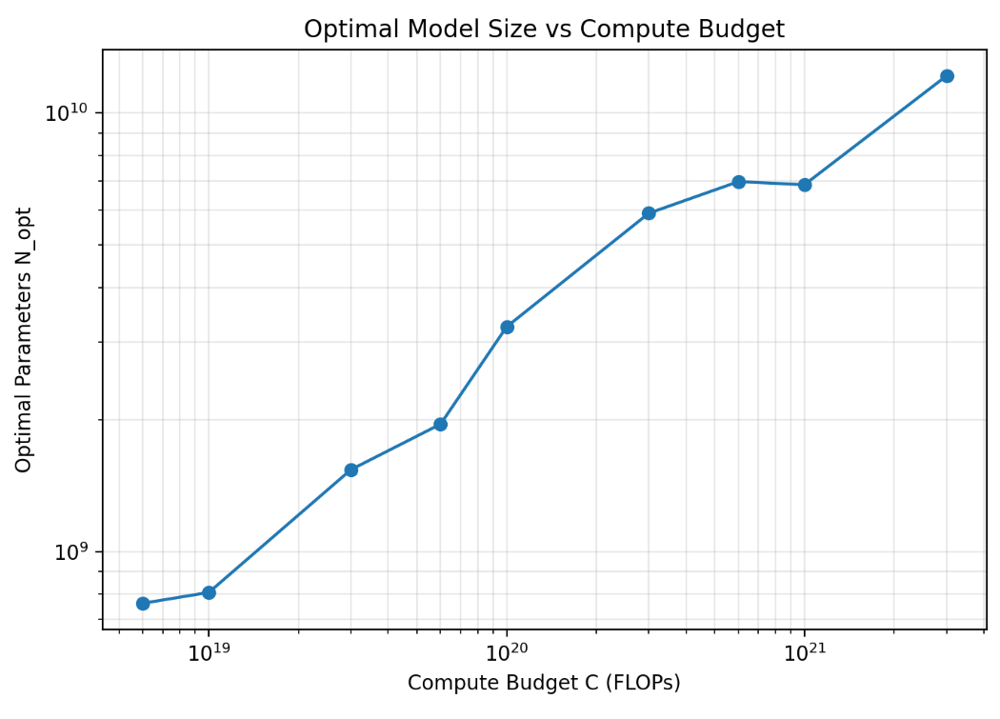
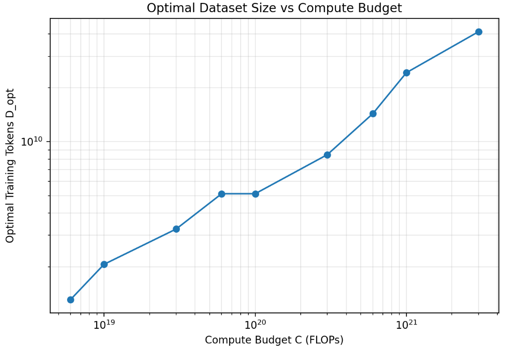
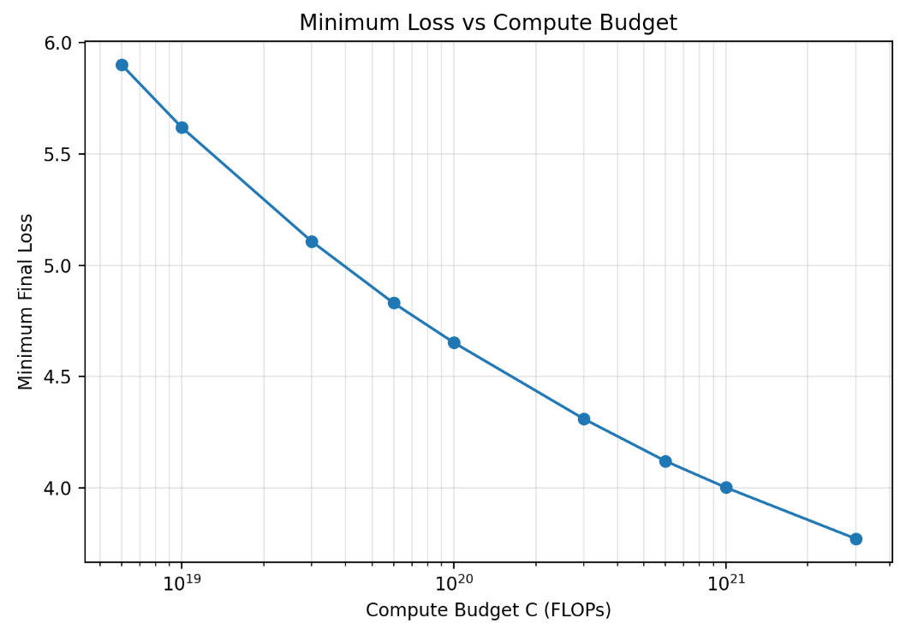
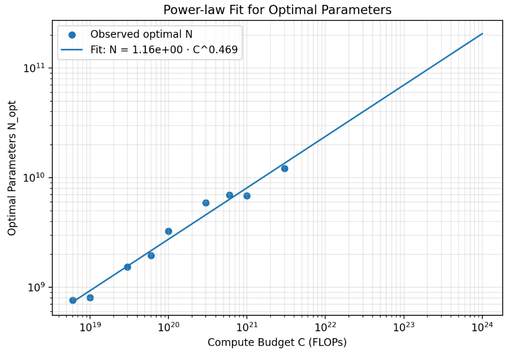
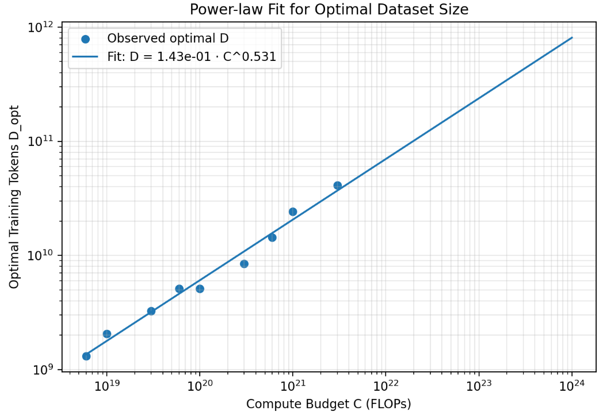

# 2. Scaling Laws Review

Given a compute budget C, which we will use to train a large language model, which choice of hyperparameters will lead to the lowest training loss? The main challenge is how to extrapolate from experiments done at a smaller scale to larger scale. For your own work in the second part of the assignment, you are welcome to incorporate ideas from other references,such as J.Kaplan and G.Yang.

## 2.1 Scaling Laws from IsoFLOPs profiles

Training a Transformer with N parameters on a dataset of D tokens is approximately C = 6ND. The IsoFLOPs approach to sacling laws in J.Hoffmann works as follows:

for each compute budget C, train language models of varying sizes N given compute budget C (with data size D = C/(6N)), producing a final training loss L.

一个直觉:

1. 当N 极度小的似乎和，model 不能适应数据，无论你加入多少计算量
2. 我们增加model size, final training loss 会平滑下降，直到一个固定点，我们的模型已经足够大，然后我们的数据量不足.

因此，这样总就会存在一个固定的最优点，N*，D*，L*，使得在给定的计算预算下，训练损失最小. 

经验上，我们得到的最优模型大小就可以和计算预算拟合函数，经验上，其满足幂律

$$ N_{opt}(C) = AC^{a} $$

最优数据量

$$ D_{opt}(C) = BC^{b} $$

where:

- A,B : 比例系数
- a,b : scaling exponent (缩放指数)  | 理论上一致性要求 a+b = 1

两边取对数，令 $ x = log(C) , y = log(N)$，我们得到一个线性关系

变成:

$$ y = ax + log(A) $$

**Problem 1 IsoFLOPs scaling laws**:

给定 `data/isoflops_curves.json`,读取runs,按照compute budget分组，每组找到 final_loss 最小的 run， 得到 (C, Nopt)，计算Dopt = C/(6Nopt)，然后画出 Nopt = A C^a, Dopt = B C^b 的拟合曲线， 并且计算 a,b 的值，验证 a+b=1. 外推到 10^23， 10^24

- Nopt和 Dopt在 log-log 坐标下都大致呈线性趋势，适合做 power-law 拟合。
- Nopt在 10^21FLOPs 附近略微下降，这是因为每个 budget 只有 8 个离散候选模型，直接取最低 loss 会有一定跳动。
- minimum loss 随 compute budget 增加稳定下降，符合预期。

参数规模拟合: 

$$ N_{opt}(C) = 1.163 C^{0.4687} $$

- A = 1.163411
- a = 0.468683
- R^2 = 0.9787

数据规模拟合

$$ D_{opt}(C) = 0.1433 C^{0.5313} $$

- B = 0.143257
- b = 0.531317
- R^2 = 0.9834

外推到 C = 10^24

预测

$$ N_{opt} \approx 2.06 x 10^{11} $$
$$ D_{opt} \approx 8.09 x 10^{11} $$

最优参数量 206B
最优Token数 809B

