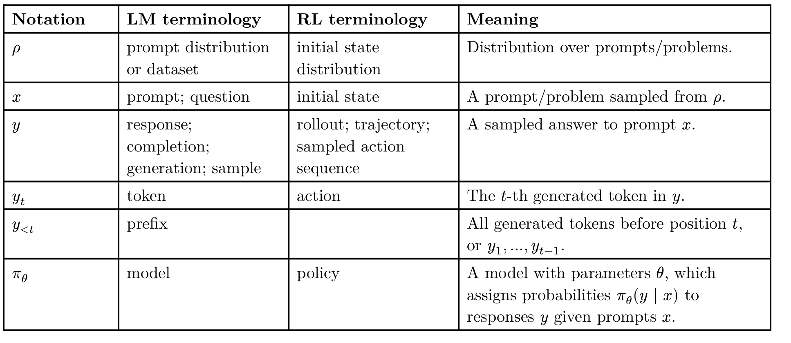
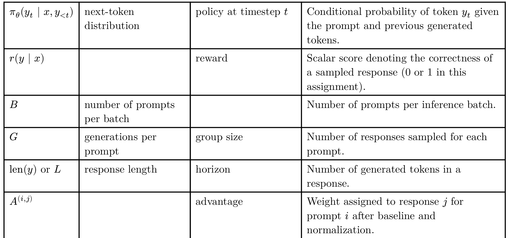

# 2. Introduction 

## 2.1 Background

In the first four assignments of this class, we learned about how to pretrain a base model.We're now ready to learn about post-training: once we have a base model,how do we turn it into a useful tool that can solve downstream tasks?

One component of post-training is alignment. Pre-training, due to both its data mixture and trianing objective, has the effect of imbuing a model with a broad range of knowledge and behaviors.

But when we ask the model to solve tasks, we want a specific behavior,that of a helpful and harmless assistant. The process of turning a broad base model into a focused chat model is called "instruction tuning" or "alignment", and we'll cover these techniques in the optional Assigment 5 supplement.


One other component of post-training is reinforcement learning. In pre-training, because our goal is to imbue the model with a broad knowledge base, we use a broad set of data. In post-training RL, our goal narrows: we want the model to attain high accuracy on a specific task, like solving math problems. This narrower goal differs from pre-training in at least two ways:
(a) we no longer have as much data
(b) our training objective changes from one of "coverage" to one of "precision". As a result of these differences,we need a new technique, namely reinforcement learning.

Unlike in pretraining,we are not given a dataset of responses to mimic: in the coding example,we are not given a correct Python program that solves the task,and in the mathematical reasoning example, we are not given a correct chain of reasoning that produces the answer.

Instead,in RL, we directly take gradient steps on model accuracy as the objective function. At a high level, RL will involve sampling responses from the model, grading them with the scoring function, and then upweighting the ones that are correct.

In this assignment, we’ll learn about RL both mathematically and empirically. It turns out that RL is hard, in that it is slow and unstable. Doing science for RL is also hard, in that RL runs have high variance across random seeds, and seemingly small details in implementation matter a lot. This assignment will introduce LLM RL and explore some of its challenges

## 2.2 Model and dataset

For this assignment,we will be using OLMo-2-0425-1B,a base model that was pre-trained on OLMo-mix-1124 and mid-trained on Dolmino-mix-1124,with 4 trillion tokens total.


As our downstream task,we will use the GSM8k dataset. This dataset contains a relatively easy collection of grade school mathematical reasoning word problems.

```py
{
  "question":...
  "answer":...
}
```

During RL, our model will learn to produce reasoning chains for problems of this styple,improving its ability to solve math problems.

**A note on model and dataset choice**: RL training dynamics are very model- and dataset-dependent, you should keep in mind that the results we see in this assignment may not transfer to other model-dataset combinations.

## 2.3 Notation

This assignment will have some math in it, so in the following table we provide some of the notation we will use later


