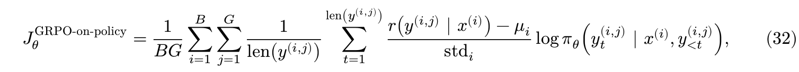

# Group Relative Policy Optimization

Now that we've measured the model's performance with just prompting,our next step will be to improve this performance via training. Specifically,we want to optimize the model's accuracy, or equivalently, its expected reward:

$$ J_\theta = E_{x~\rho} E_{y~\pi_\theta(y | x)}[r(y|x)]$$

where 𝜌 is our task distribution over prompts/problems 𝑥, 𝜋𝜃 is our model, 𝑦 is a sampled response/solution to 𝑥, and 𝑟(𝑦 | 𝑥) denotes whether 𝑦 is a correct answer to 𝑥 (we will also call 𝑟 our “reward function”).

这和交叉熵损失不一样，交叉熵损失中我们从dataset中sample, 所以在这里我们就使用RL强化学习。 RL 会参与 采样、打分和强化的过程。

OpenAI和Deepseek发现，使用RL训练的、有思维链的模型会潜在的优化其思考能力。


## 4.1 Deriving on-policy GRPO

### 4.1.1 Language models as policies


强化学习里，在时间步 t，我们有一个状态 st，policy 根据状态产生一个 action：

$$ \alpha_t \sim \pi_\theta( ·| s_t) $$

采取action之后，环境给reward，然后进入下一个状态

强化学习要做的就是调整policy的参数theta，让长期reward尽可能高


对于语言模型，causal language model 天然就是一个RL policy

state = 当前已经生成的文本， alpha <————> yt

action就是下一枚token

所以语言模型的next-token distribution就是policy

```
当前文本
"What is 2 + 2? The answer is"
        │
        ▼
   Transformer
        │
        ▼
      logits
        │
      softmax
        │
        ▼
P("4") = 0.72
P("5") = 0.03
P("the") = 0.02
...
```

做 policy gradient 时需要两个 primitive operation。第一是从 policy 中 sampling alpha,然后计算这个action的log-likelihood

$$ log\pi_\theta(\alpha_t | s_t)$$

### 4.1.2 Trajectories

RL从初始状况开始

$$ s_0 \sim \rho$$

然后不断重复采样alpha，再进入st+1，

最后查收

$$ \gamma = (s_0,a_0,s_1,a_1,...,s_T,a_T) $$

放进LLM里面，环境的state transition极其简单 $s_{t+1} = (s_t,a_t)$

最终可能得到
```
prompt x
   ↓
<think>
She first ...
...
</think>
<answer>72</answer>
```
这一整个 response 就是一条 rollout / trajectory

### 4.1.3 Rewards and return

接下来终于出现reward

传统RL当中，每一个 timestep可以有分数，但是我们这边只管最后答案是否正确


前面 r0 = r1 = rT-1 = 0

所有 rt = 1 if 整个trajectory 最终答案被verifier判断正确 else 0

训练目标  $ J_\theta $ 就是当前模型生成的trajectory的平均reward，因为 1对0错，实际上J就是模型答对问题的概率


### 4.1.4 Policy gradients

目标改写为

$$ J_\theta = E_{x\sim\rho} E_{y\sim\pi_\theta(y|x)}[r(y | x)] $$

x~p 就是从 GSM8K里面抽出来一道题， y~pi 就是随机生成一个回答，然后让r(y|x) grader看看对不对

我们的目标是 maximize J，原文写gradient ascent:

θ_k+1 = θ_k + α▽J

这里是加，不是监督学习里面loss的减

麻烦在于，y 是从模型中采样出来的离散序列，很难去算这个东西。


**核心公式**:

$$ \nabla_\theta J_\theta = E_{x\sim\rho} E_{y\sim\pi_\theta(y|x)} \nabla_\theta log \pi_\theta(y|x) $$

普通积分里面 dlog(fx)/dx = f'(x)/f(x)

所以 ▽logpi = ▽pi/pi


为什么这个公式重要？因为右边可以用 monte Carlo计算了

假设一个batch里面B个prompt，每个prompt G 个回答，得到的公式如下


reward 不需要可导。我们不对 reward 求导，而是用 reward 当权重，对“产生这个回答的 log probability”求梯度。

### 4.1.5 Baselines，为什么减去一个b

4.1.4得到基本的REINFORCE

$$ \nabla_\theta J_\theta = E_{x\sim\rho} E_{y\sim\pi_\theta(y|x)} \nabla_\theta log \pi_\theta(y|x) $$

对于二元reward, r = 1 正确 、 0 错误，这个estimator虽然期望是正的，但是variance很大，RL训练会很抖，Handout因此引入baseline。

r(y|x) -> r(y|x) -b

在这样之后，正确 为 0.5 增强， 错误为 -0.5 抑制，不再是 1 增强 0不管。

只要baseline b 不依赖于当前采样的action/response y ， 那么b不会影响平均梯度

但是baseline不一定要正降低variance。

**Problem:Compute the variance of the policy gradient estimator**

题目设 
A = {0, 1}
Policy是Bernoulli:
P(A = 1) = p = σ(θ)
因此:
P(A = 0) = 1 - p


题目要求计算有无baseline的policy-gradient estimator variance , 然后令 b = p 比较

我们首先需要 
$$ \nabla_\theta log \pi_\theta(A) $$

由于

$$ p = \sigma(\theta) $$

所以

$$ \frac{dp}{d\theta} = p(1-p) $$

当 A = 1

$$ \nabla_\theta log \pi_\theta (1) = \frac{1}{p} \frac{dp}{d\theta}
= 1-p$$

当A = 0

为 -p

**(a)没有baseline**:
过程略
$$ Var(\hat g) = \frac{p(1-p)^3}{n}$$

**(2)加baseline b**

$$ Var(\hat g_b) = \frac{p(1-p)(1-p-b)^2}{n}$$

所以 b = 1-p 的时候是最小的

population-mean baseline b = p 有时候降低variance,有时候反而提高variance


**Baselines in GRPO**

对于第i个prompt， sample G个 response，
定义group mean


然后把estimator改成


where Aij = rij - μi

它不再表示 rollout 的绝对 reward，而表示这个 rollout 相对于同一 prompt 下平均 rollout 的优势。

因为这个地方 μ明显依赖于采样出来的 y,所以前面的theorem不能套。


group-mean baseline 会让期望梯度缩放一个

G-1/ G 因子。

这样我们也就发现。如果一次采样结果是
[1,1,1,1]
or
[0,0,0,0]

模型不会学到任何东西。

所以Reasoning RL 特别喜欢模型能力边界的问题。

### 4.1.6 Advantage normalization

不只是减少group mean，还要除以group standard deviation


实测的时候还会加一个很小的epsilon，防止std等于0

mean subtraction 决定谁比同组平均水平好、谁差；std normalization 决定整个 group 的信号尺度。

这个地方由于我们是针对每一个prompt进行的缩放，和前面的那个mean division是不一样的，这个地方已经不再严格做 原始的 expected reward objective J 的 gradient ascent，而是一个stability trick

advantage normalization 是 heuristic，而不是无偏 policy-gradient 推导的必然结果。

### 4.1.7 Sequence normalization

我们现在把一个完整的response写成

$$ log\pi_\theta(y|x) $$

可是LM是autoregressive的，所以

$$ log\pi_\theta(y|x) = \sum_{t=1}^L log\pi_\theta (y_t | x, y_{<t}) $$

因为假设有两个response,A长50，B长200，如果不做归一化，B仅仅因为写的长，就有四倍的贡献

所以标准GRPO 处理 让其除以response length

对一个response的每个token来说，实际上权重是 $A_{ij}/L{ij}$

但是这个也是有争议的：
```
假如一条 200-token reasoning 真的是正确且有价值的，它包含 200 个 policy decisions；为什么它的每个 token 应该比 50-token response 小 4 倍？
```

所以后面 Section 5 的 Dr. GRPO 就明确认为标准 GRPO 的两个设计:
```
std advantage normalization
```
和
```
sequence length normalization
```
都使estimator偏离。

### 4.1.8 Putting it together

完整的 GRPO 通常还有 clipped importance reweighting，但这一部分暂时不讲。

当前做的是 on-policy RL


algorithm 1的翻译：

对于batch中的第 i个 问题 

$$ x^{i}$$

生成G个response

$$ y^{(i,1)},y^{(i,2)},y^{(i,3)}...y^{(i,G)}$$

算reward

$$ r_{ij} = r(y^{(i,j)}| x^{(i)})$$

然后Group mean

$$ \mu_{i} = \frac{1}{G} \sum_{j=1}^G r_{ij}$$

以及std

$$ std_i$$

得到normalized advantage

$$ A_{ij} = \frac{r_{ij} - \mu_{i}}{std_i}$$

最后公式28.

```
sample B 个问题
        ↓
每个问题生成 G 个回答
        ↓
grader 给每个回答 reward
        ↓
对同一道题：
计算 mean reward
计算 reward std
        ↓
A = (reward - mean) / std
        ↓
重新计算每个 response token 的 log probability
        ↓
所有 token 都乘该 response 的 advantage
        ↓
response 内按长度取平均
        ↓
BG 个 response 再取平均
        ↓
backprop
        ↓
更新 policy
        ↓
用更新后的 policy 重新生成 rollout
        ↓
repeat
```


## 4.2 Implementing on-policy GRPO

### 4.2.1 Using Hugging face Models

While previous assignments used our own language model implementation in cs336_basics,in this assignment we will use the Hugging face transformers library directly to load the pre-trained base model.

You're also welcome to implement your own transformer and pre-trained weight loader if you would like; just make sure the architecture matches that of OLMo-2-0425-1B.

To load a Hugging Face model and tokenizer (in bfloat16 and with FlashAttention-2 to save memory), you can use the following starter code,available in cs336_alignment/checkpoint.py:

```py
import torch
from transformers import AutoModelForCausalLM, AutoTokenizer

def get_model_and_tokenizer(model_id_or_dir: str, device: str):
  model = AutoModelForCausalLM.from_pretrained(
    model_id_or_dir,
    device_map = device,
    torch_dtype=  torch.bfloat16,
    attn_implementation = "eager" if device == 'cpu' else "flash_attention_2",
  )

  tokenizer = AutoTokenizer.from_pretrained(model_id_or_dir)

  return model, tokenizer

```

model_id_or_directory can be a model name like allenai/OLMo-2-0425-1B or the path to a directory. The directory will typically be the result of calling save_pretrained, which you can call to save your trained model:

```py
# save the model weights

model.save_pretrained(save_directory = output_dir)
tokenizer.save_pretrained(save_directory = output_dir)

```

First,let's implement a helper function, which uses the pre-trianed tokenizer to tokenize input prompts and responses.

除了tokenize之外，还要加上prompt_ids + response_ids.


**Problem:Prompt and output tokenization**
把prompt和response分别tokenize，不加special token，直接拼接，然后构建一个response_mask，只在label属于response token 时为1

不难，不单独设置codenote了
```py
import torch
from transformers import PreTrainedTokenizerBase


def tokenize_prompt_and_output(
    prompt_strs: list[str],
    output_strs: list[str],
    tokenizer: PreTrainedTokenizerBase,
) -> dict[str, torch.Tensor]:

    all_full_ids = []
    all_full_masks = []
    
    max_len = 0
    
    
    for prompt,output in zip(prompt_strs,output_strs):
        prompt_ids = tokenizer(prompt,add_special_tokens=False)["input_ids"]
        output_ids = tokenizer(output,add_special_tokens=False)["input_ids"]

        full_ids = prompt_ids + output_ids
        
        mask = [0]* len(prompt_ids) + [1] * len(output_ids)
        
        all_full_ids.append(full_ids)
        
        all_full_masks.append(mask)
        
        max_len = max(max_len, len(full_ids))
    
    for full_ids, full_masks in zip(all_full_ids,all_full_masks):
        
        len_for_pad = max_len - len(full_ids)
        
        full_ids += [tokenizer.pad_token_id]*len_for_pad
        full_masks += [0]*len_for_pad
    
    full_ids_tensor = torch.tensor(all_full_ids)
    
    full_masks_tensor = torch.tensor(all_full_masks)
    
    input_ids = full_ids_tensor[:,:-1]
    labels = full_ids_tensor[:,1:]
    response_mask = full_masks_tensor[:,1:]
    
    return{
        "input_ids": input_ids,
        "labels": labels,
        "response_mask": response_mask,
    }
```


Once we have a tokenized input,we can pass it through the model as follows:

```py
input_ids = train_batch["input_ids"].to(device)
labels = train_batch["labels"].to(device)
logits = model(input_ids).logits
```

With this syntax in hand,please implement the following method, which computes the per-token log-probabilities for a response under the model, a primitive we'll need for computing our policy gradient. In RL, it's often also useful to log the per-token entropies,so this function will include a `return_token_entropy` option you will need to implement as well.


**Problem Response log-probs (and entropy)**

Implement a method get_response_log_probs that gets per-token conditional log
probabilities (given the previous tokens) from a causal language model, and optionally the entropy of the model’s next-token distribution

```py

def get_response_log_probs(
    model:PreTrainedModel,
    input_ids: torch.Tensor,
    labels: torch.Tensor,
    return_token_entropy: bool = False,
) -> dict[str,torch.Tensor]
```

Returns
-  dict[str, torch.Tensor]
- - "log_probs" shape (batch_size, sequence_length),conditional log-probabilities
- - "token_entropy" optional,shape (batch_size,sequence_length)


关于logits怎么变成log-probs，假设某个位置的logits是

[z1,z2,...,zv]

先softmax,再求log

也不难，不单独开codenote

```py
import torch
import torch.nn.functional as F

def get_response_log_probs(
    model: torch.nn.Module,
    input_ids: torch.Tensor,
    labels: torch.Tensor,
    return_token_entropy: bool = False,
) -> dict[str, torch.Tensor]:
    
    output = model(input_ids)
    
    logits = output.logits
    
    all_log_probs = F.log_softmax(logits,dim= -1)
    
    token_log_probs = all_log_probs.gather(
        dim= -1,
        index=labels.unsqueeze(-1),
    ).squeeze(-1) #这个地方是只要 labels对应的那个vocab的概率，别的不要。
    
    if not return_token_entropy:
        return {
            "log_probs": token_log_probs
        }
    else:
        probs = all_log_probs.exp()
        
        entropy = -(probs*all_log_probs).sum(dim=-1)
        
        return {
            "log_probs": token_log_probs,
            "token_entropy": entropy
        }
```


### 4.2.2 Using vLLM in a reinforcement learning loop

In our RL loop, we'll also need to generate rollout. The specific configuration we'll use is to put the Hugging Face model and optimizer on one GPU for training, and vLLM (which includes the model and kv cache) on the other GPU.So in addition to the vLLM initialization and generation functions described in the previous section,we'll also need to sycn weights between the two devices before each inference step.

We describe the weight sync code below, which is available in `cs336_alignment/vllm_utils.py`

```py
@dataclass
class VLLMServer:
    gpt: int = 1 #Run training on gpu 0 and inference on gpu 1

    # Create the NCCL weight-transfer group between the training GPU and vLLM.
    def init_weight_sync(self,policy_device: str): ...

    # Copy the current Hugging Face policy weights into the vLLM server and
    # reset vLLM caches that depended on the old weights.
    def sync_policy_weights(self, policy:torch.nn.Module) -> None: ...

    # Generate rollouts from the current vLLM weights.
    def generate_completions(
      self,
      prompts: list[str],
      sampling_param: dict,
      batch_size: int | None = None,
    ) -> list[VLLMCompletion]: ...
```

Like our prompting experiment, we'll sample with temperature 1.0, top-p  1.0, max generation length 512. The prompt asks the model to end its answer with the string </answer>, so we can direct vLLM to stop when the model outputs this string:

```py
# Based on Dr.GRPO: stop when the model completes its answer
samling_param['stop'] = ["</answer>"]
samling_params["include_stop_str_in_output"] = True
```

### 4.2.3 GRPO components

Next,let's implement components that compute parts of the GRPO loss. Note that later on in the assignment, we will implement variants,like different advantage normalizers or importance reweighting approaches. The components below are designed so that we can swap between variants with minimal code overlap, so we've provided inferfaces with arguments that specify which variant. For this part of the assignment, you only need to implement the standard GRPO variant.

Our first step will be to implement a helper function that computes the rewards of responses.

**Problem: Computing the rewards of rollouts**:

Implement a method `compute_rollout_reward` that calculates raw rewards for each rollout response.

```py

def compute_rollout_rewards(
    reward_fn: Callable[[str,str], dict[str,float]],
    rollout_responses: list[str],
    repeated_ground_truths: list[str],
) -> tuple[torch.Tensor, dict[str, float]]
```

Args:
- reward_fn: Callable[[str,str], dict[str,float]] Scores the rollout responses against the ground truths, producing a dict with keys "reward","forward_reward", and "answer_reward".
- rollout_responses: list[str] Rollouts from the policy. The length of this list is rollout_batch_size = n_prompts_per_rollout_batch * group_size
- repeated_ground_truths: list[str] The ground truths for the examples. The length of this list is rollout_batch_size, because the ground truth for each example is repeated group_size times.

Returns:

- tuple[torch.Tensor, dict[str,floats]]
- - raw_rewards shape (rollout_batch_size). Unnormalized rewards for each rollout response.
- - metadata Reward statistics to log. At minimum, include the mean total and format rewards over the rollout batch.


这边的意思就是，假设B=2 G=3，即一批有两个问题，每个问题生成三个 rollout

比如：
```
prompt 1 的三个 rollout:
    y11
    y12
    y13

prompt 2 的三个 rollout:
    y21
    y22
    y23
```

那么传给这个函数时， rollout_responses 已经被flatten成:
```py
[
  y11,y12,y13,
  y21,y22,y23,
]
```

长度: $$B x G = 6 $$

所以:
```py
repeated_ground_truths = [
    gt1, gt1, gt1,
    gt2, gt2, gt2,
]
```

因此这个函数不需要知道 group_size

它只需要逐项
```
y11 <-> gt1
y12 <-> gt1
y13 <-> gt1
y21 <-> gt2
...
```


`reward_fn` 到底干什么

```py

reward_dict = reward_fn(
    response,
    ground_truth,
)

```

可能返回
```py
{
    "reward": 1.0,
    "format_reward": 1.0,
    "answer_reward": 1.0,
}
```

或者
```py
{
    "reward": 0.0,
    "format_reward": 1.0,
    "answer_reward": 0.0,
}
```


raw_rewards 是什么

```
y11 → reward 1
y12 → reward 0
y13 → reward 1

y21 → reward 0
y22 → reward 0
y23 → reward 1
```

那么函数产生
```py
raw_rewards =
tensor([1., 0., 1., 0., 0., 1.])
```

shape= (BG,)

**metadata 又是什么**
```
              reward    format    answer
rollout 1       1          1         1
rollout 2       0          1         0
rollout 3       0          0         0
rollout 4       1          1         1
```

那么可以记录:

$$ mean reward = \frac{1 + 0 + 0 + 1}{4} = 0.5 $$
$$ mean format reward = \frac{1 + 1 + 0 + 1}{4} = 0.75$$

```py
import torch
from typing import Any, Callable, Literal

def compute_rollout_rewards(
    reward_fn: Callable[[str, str], dict[str, float]],
    rollout_responses: list[str],
    repeated_ground_truths: list[str],
) -> tuple[torch.Tensor, dict[str, float]]:
    
    raw_rewards = []
    total_reward_sum  : float = 0
    format_reward_sum : float = 0
    answer_reward_sum : float = 0
    
    for response,ground_truth in zip(rollout_responses,repeated_ground_truths):
        
        result = reward_fn(response,ground_truth)
        
        raw_rewards.append(result["reward"])
        
        total_reward_sum  += result["reward"]
        format_reward_sum += result["format_reward"]
        answer_reward_sum += result["answer_reward"]
        
    raw_rewards = torch.tensor(raw_rewards,dtype = torch.float32)
    
    n = len(rollout_responses)
    
    metadata = {
        "mean_reward": total_reward_sum/n,
        "mean_format_reward": format_reward_sum/n,
        "mean_answer_reward": answer_reward_sum/n,
    }
    return raw_rewards,metadata
```

接下来，let's implement the core math in GRPO, which normalizes these rewards to turn them into advantages. Note that the rewards are flattened. so we need to take in the groupsize to reshape it back into groups to do normalization.

**Problem: Group normalization**:

Deliverable: Implement a method compute_group_normalized_rewards that normalizes raw rewards within their groups and returns the normalized rewards along with any metadata you think is useful.

For now, you only need to support baseline = "mean" and advantage_normalizer = "std". Feel free to raise a NotImplementedError for unsupported inputs. In later parts of the assignment we will implement the other options and run ablations. Remember to add advantage_eps to the normalizer to avoid division by zero.


接口:

```py
def compute_group_normalized_rewards(
  raw_rewards: torch.Tensor,
  group_size: int,
  baseline: Literal["mean", "none"] = "mean",
  advantage_eps: float = 1e-6,
  advantage_normalizer: Literal["std", "none", "mean"] = "std",
):
```

Return:

- tuple[torch.Tensor, dict[str, float]]
- - advantages Group-normalized rewards for each rollout response.
- - metadata (your choice of other statistics to log)


```py
import torch
from typing import Any, Callable, Literal


def compute_group_normalized_rewards(
    raw_rewards: torch.Tensor,
    group_size: int,
    baseline: Literal["mean", "none"] = "mean",
    advantage_eps: float = 1e-6,
    advantage_normalizer: Literal["std", "none", "mean"] = "std",
) -> tuple[torch.Tensor, dict[str, float]]:
    
    grouped_rewards = raw_rewards.reshape(-1, group_size)
    
    if baseline != "mean":
        raise NotImplementedError
    
    
    group_mean = grouped_rewards.mean(dim= 1, keepdim= True)


    if advantage_normalizer != "std":
        raise NotImplementedError
    
    group_std = grouped_rewards.std(dim = 1, keepdim=True)

    advantages_2d = (
        grouped_rewards - group_mean
    ) / (
        group_std + advantage_eps
    )

    advantages = advantages_2d.reshape(-1)
    
    metadata = {
        "mean":float(raw_rewards.mean())
    }
    
    return  advantages,metadata
```

本质就是几次torch操作模拟数学公式，没什么要讲的。


下一步就是写计算梯度的函数了。

我们这里要写的和Algorithm 1 的不大一样，这里是: write a pertoken loss such that taking the gradient produces each term of GRPO gradient estimator.

This expression is not a loss in the traditional sense, where we expect it to go down during training. It's just an expression such that when we take the gradient , we get the policy gradient.

The specific loss you should implement is:




Handout 明确把工作拆成了两步，compute_policy_gradient_loss 只产生per-token loss,下一题aggregate_loss_across_microbatch才负责做平均


把求和拿掉，实际上剩下的只有

$$ A_{ij}log\pi_\theta(y_{t}|x,y_{<t})$$

`compute_group_normalized_rewards` 已经得到的每个rollout的 Ai

`get_response_log_probs` 已经得到每个token的 log pi

所以我们只需要把他们逐元素相乘，返回值需要取负，因为optimizer.step() 实际上是朝着反方向走

```py
from typing import Literal

import torch

def compute_policy_gradient_loss(
    raw_rewards_or_advantages: torch.Tensor,
    policy_log_probs: torch.Tensor,
    importance_reweighting_method: Literal["none", "noclip", "grpo", "gspo"] = "none",
    old_log_probs: torch.Tensor | None = None,
    cliprange: float | None = None,
    response_mask: torch.Tensor | None = None,
) -> tuple[torch.Tensor, dict[str, torch.Tensor]]:
    
    if importance_reweighting_method != "none":
        raise NotImplementedError
    
    if raw_rewards_or_advantages.ndim == 1:
        # (B,) -> (B,1)
        raw_rewards_or_advantages = raw_rewards_or_advantages.unsqueeze(-1)
    
    per_token_loss = - raw_rewards_or_advantages * policy_log_probs
    
    metadata = {}
    
    return per_token_loss,metadata
```

主要是处理形状不同的情况，因为题目提到过 raw_rewards_or_advantages 传入的形状可能是(B,) or (B,1) 所有都得扩容到(B,1)


Finally,let's implement the aggragation function over tokens and sequences, whichi in standard GRPO involves averaging over tokens in each sequence, and then averaging over sequences.

**Problem: Aggregate loss across tokens and sequences**:

标准GRPO是再每条sequence上面平均，再在batch上面平均。

上一题已经得到per_token_policy_gradient_loss, shape(B,L),先mask，在每条sequence上面平均，再在batch上面平均。

```py
def aggregate_loss_across_microbatch(
    per_token_policy_gradient_loss: torch.Tensor,
    mask: torch.Tensor,
    loss_normalization: Literal["sequence","constant"] = "sequence",
    normalization_constant: int | None = None,
)-> torch.Tensor:
    
    if loss_normalization != "sequence":
        raise NotImplementedError
    
    masked_loss = per_token_policy_gradient_loss * mask
    
    loss_sum = masked_loss.sum(dim= 1)
    
    token_count = mask.sum(dim=1)
    
    sequence_loss = loss_sum / token_count
    
    final_loss = sequence_loss.mean(dim=0)
    
    return final_loss
```

mask的True or false可以用作 1 和 0 来计算，因此，逐元素乘法是最简单的方式


### 4.2.4 GRPO training step

We're now ready to piece these components together into a full training step.

**Gradient Accumulation**:
We need a large batch size to get good utilization during inference. As a result, in on-policy RL,where we set our train batch size equal to our  inference batch size, our GPU will not have enough memory to compute the gradient on the entire batch at once. 

Therefore , we'll need to split the batch into a series of *microbatches* and accumulate the gradient across these microbatches. The main tricky part is to handle normalization properly to ensure that the microbatch-accumulated gradient is equivalent to computing the gradient on the whole batch.


Gradient accumulation is straightforward to implement in PyTorch. Recall that each weight tensor has an attribute .grad that the stores its gradient. Before we call `loss.backward()`, the .grad attribute is None. After we call `loss.backward()` , the .grad attribute contains the gradient. Normally, we'd take an optimizer step , and then zero the gradient with `optimizer.zero_grad()`.

```py

# Forward pass.
logits = model(inputs)
loss = loss_fn(logits, labels)

# Backward pass.
loss.backward()

# Update weights
optimizer.step()
# Zero gradient in preparation for next iteration.
optimizer.zero_grad()
```

Assuming sequence normalization, where we first average loss over each sequence and then across sequences, after computing the average microbatch loss we’ll also need to reweight by the number of sequences.

```py

gradient_accumulation_step = 4
microbatch_size = len(inputs) // gradient_accumulation_step
for i in range(0, len(inputs), microbatch_size):
    inputs_microbatch = inputs[i:i+microbatch_size]
    labels_microbatch = labels[i:i+microbatch_size]

    # forward pass
    logits = model(inputs_microbatch)
    loss = loss_fn(logits, labels_microbatch) * (len(inputs_microbatch) / len(inputs))

    # Backward pass.
    loss.backward()

# Update weights
optimizer.step()
# Zero gradient in preparation for next iteration.
optimizer.zero_grad()
```


**Implementing the train step**:

The function will take in the model, tokenizer, optimizer, reward function , prompts and rollouts, and various hyperparameters, and it will accumulate gradients and take an optimizer step.

You will need to implement gradient accumulation, as described above, to not run out of memory.

Before the optimizer step, the function should also clip the gradient norm to max_grad_norm. The function should then return the training loss on the batch , along with metadata,both for logging, Please log at least the following:

- The loss
- Gradient norm
- Token entropy
- Train rewards (total,format)


代码较长，见 `cs336_assignment5_codenote2.md`