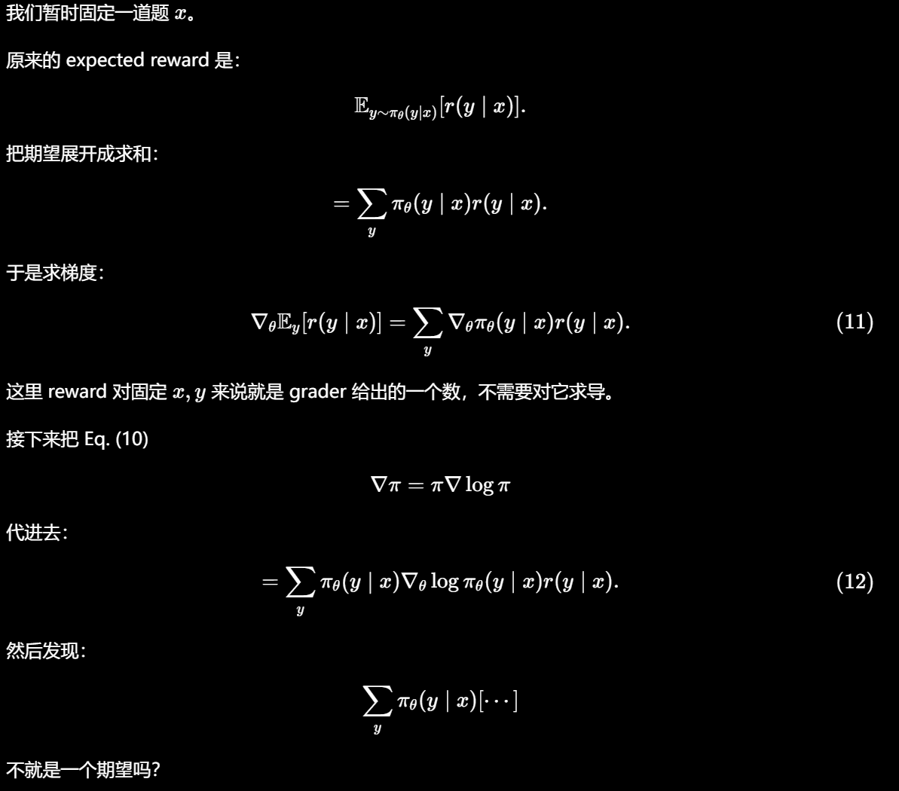
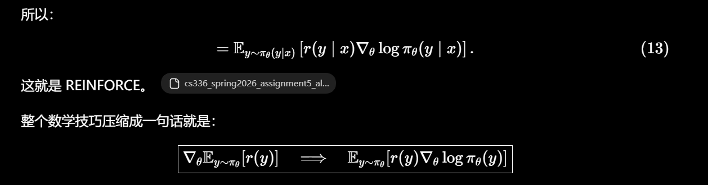
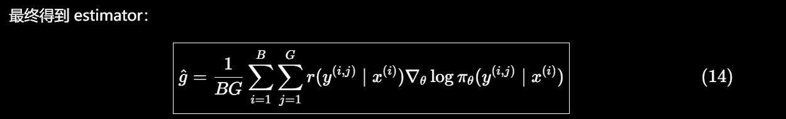
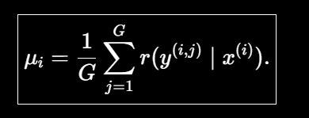
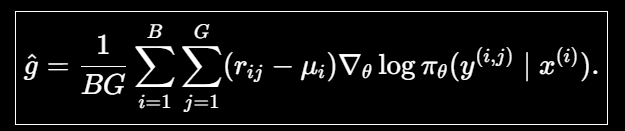
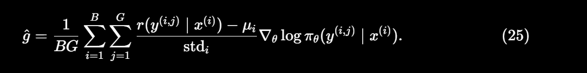
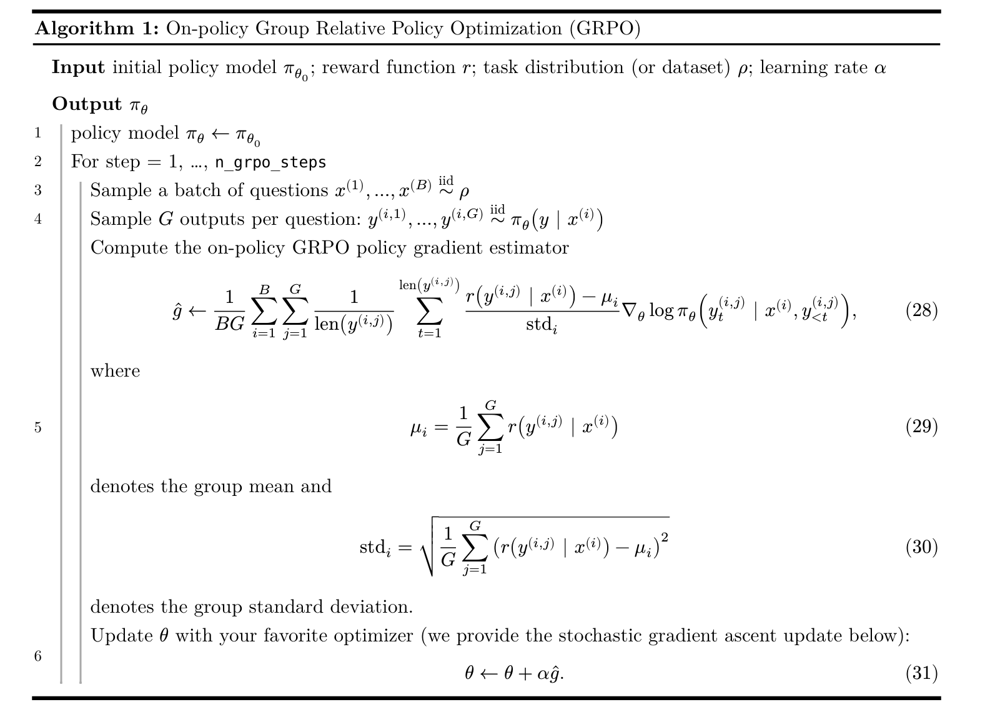

# Group Relative Policy Optimization

Now that we've measured the model's performance with just prompting,our next step will be to improve this performance via training. Specifically,we want to optimize the model's accuracy, or equivalently, its expected reward:

$$ J_\theta = E_{x~\rho} E_{y~\pi_\theta(y | x)}[r(y|x)]$$

where 𝜌 is our task distribution over prompts/problems 𝑥, 𝜋𝜃 is our model, 𝑦 is a sampled response/solution to 𝑥, and 𝑟(𝑦 | 𝑥) denotes whether 𝑦 is a correct answer to 𝑥 (we will also call 𝑟 our “reward function”).

这和交叉熵损失不一样，交叉熵损失中我们从dataset中sample, 所以在这里我们就使用RL强化学习。 RL 会参与 采样、打分和强化的过程。

OpenAI和Deepseek发现，使用RL训练的、有思维链的模型会潜在的优化其思考能力。


## 4.1 Deriving on-policy GRPO

### 4.1.1 Language models as policies


强化学习里，在时间步 t，我们有一个状态 st，policy 根据状态产生一个 action：

$$ \alpha_t \sim \pi_\theta( ·| s_t) $$

采取action之后，环境给reward，然后进入下一个状态

强化学习要做的就是调整policy的参数theta，让长期reward尽可能高


对于语言模型，causal language model 天然就是一个RL policy

state = 当前已经生成的文本， alpha <————> yt

action就是下一枚token

所以语言模型的next-token distribution就是policy

```
当前文本
"What is 2 + 2? The answer is"
        │
        ▼
   Transformer
        │
        ▼
      logits
        │
      softmax
        │
        ▼
P("4") = 0.72
P("5") = 0.03
P("the") = 0.02
...
```

做 policy gradient 时需要两个 primitive operation。第一是从 policy 中 sampling alpha,然后计算这个action的log-likelihood

$$ log\pi_\theta(\alpha_t | s_t)$$

### 4.1.2 Trajectories

RL从初始状况开始

$$ s_0 \sim \rho$$

然后不断重复采样alpha，再进入st+1，

最后查收

$$ \gamma = (s_0,a_0,s_1,a_1,...,s_T,a_T) $$

放进LLM里面，环境的state transition极其简单 $s_{t+1} = (s_t,a_t)$

最终可能得到
```
prompt x
   ↓
<think>
She first ...
...
</think>
<answer>72</answer>
```
这一整个 response 就是一条 rollout / trajectory

### 4.1.3 Rewards and return

接下来终于出现reward

传统RL当中，每一个 timestep可以有分数，但是我们这边只管最后答案是否正确


前面 r0 = r1 = rT-1 = 0

所有 rt = 1 if 整个trajectory 最终答案被verifier判断正确 else 0

训练目标  $ J_\theta $ 就是当前模型生成的trajectory的平均reward，因为 1对0错，实际上J就是模型答对问题的概率


### 4.1.4 Policy gradients

目标改写为

$$ J_\theta = E_{x\sim\rho} E_{y\sim\pi_\theta(y|x)}[r(y | x)] $$

x~p 就是从 GSM8K里面抽出来一道题， y~pi 就是随机生成一个回答，然后让r(y|x) grader看看对不对

我们的目标是 maximize J，原文写gradient ascent:

θ_k+1 = θ_k + α▽J

这里是加，不是监督学习里面loss的减

麻烦在于，y 是从模型中采样出来的离散序列，很难去算这个东西。


**核心公式**:

$$ \nabla_\theta J_\theta = E_{x\sim\rho} E_{y\sim\pi_\theta(y|x)} \nabla_\theta log \pi_\theta(y|x) $$

普通积分里面 dlog(fx)/dx = f'(x)/f(x)

所以 ▽logpi = ▽pi/pi





为什么这个公式重要？因为右边可以用 monte Carlo计算了

假设一个batch里面B个prompt，每个prompt G 个回答，得到的公式如下



reward 不需要可导。我们不对 reward 求导，而是用 reward 当权重，对“产生这个回答的 log probability”求梯度。

### 4.1.5 Baselines，为什么减去一个b

4.1.4得到基本的REINFORCE

$$ \nabla_\theta J_\theta = E_{x\sim\rho} E_{y\sim\pi_\theta(y|x)} \nabla_\theta log \pi_\theta(y|x) $$

对于二元reward, r = 1 正确 、 0 错误，这个estimator虽然期望是正的，但是variance很大，RL训练会很抖，Handout因此引入baseline。

r(y|x) -> r(y|x) -b

在这样之后，正确 为 0.5 增强， 错误为 -0.5 抑制，不再是 1 增强 0不管。

只要baseline b 不依赖于当前采样的action/response y ， 那么b不会影响平均梯度

但是baseline不一定要正降低variance。

**Problem:Compute the variance of the policy gradient estimator**

题目设 
A = {0, 1}
Policy是Bernoulli:
P(A = 1) = p = σ(θ)
因此:
P(A = 0) = 1 - p


题目要求计算有无baseline的policy-gradient estimator variance , 然后令 b = p 比较

我们首先需要 
$$ \nabla_\theta log \pi_\theta(A) $$

由于

$$ p = \sigma(\theta) $$

所以

$$ \frac{dp}{d\theta} = p(1-p) $$

当 A = 1

$$ \nabla_\theta log \pi_\theta (1) = \frac{1}{p} \frac{dp}{d\theta}
= 1-p$$

当A = 0

为 -p

**(a)没有baseline**:
过程略
$$ Var(\hat g) = \frac{p(1-p)^3}{n}$$

**(2)加baseline b**

$$ Var(\hat g_b) = \frac{p(1-p)(1-p-b)^2}{n}$$

所以 b = 1-p 的时候是最小的

population-mean baseline b = p 有时候降低variance,有时候反而提高variance


**Baselines in GRPO**

对于第i个prompt， sample G个 response，
定义group mean


然后把estimator改成



where Aij = rij - μi

它不再表示 rollout 的绝对 reward，而表示这个 rollout 相对于同一 prompt 下平均 rollout 的优势。

因为这个地方 μ明显依赖于采样出来的 y,所以前面的theorem不能套。


group-mean baseline 会让期望梯度缩放一个

G-1/ G 因子。

这样我们也就发现。如果一次采样结果是
[1,1,1,1]
or
[0,0,0,0]

模型不会学到任何东西。

所以Reasoning RL 特别喜欢模型能力边界的问题。

### 4.1.6 Advantage normalization

不只是减少group mean，还要除以group standard deviation



实测的时候还会加一个很小的epsilon，防止std等于0

mean subtraction 决定谁比同组平均水平好、谁差；std normalization 决定整个 group 的信号尺度。

这个地方由于我们是针对每一个prompt进行的缩放，和前面的那个mean division是不一样的，这个地方已经不再严格做 原始的 expected reward objective J 的 gradient ascent，而是一个stability trick

advantage normalization 是 heuristic，而不是无偏 policy-gradient 推导的必然结果。

### 4.1.7 Sequence normalization

我们现在把一个完整的response写成

$$ log\pi_\theta(y|x) $$

可是LM是autoregressive的，所以

$$ log\pi_\theta(y|x) = \sum_{t=1}^L log\pi_\theta (y_t | x, y_{<t}) $$

因为假设有两个response,A长50，B长200，如果不做归一化，B仅仅因为写的长，就有四倍的贡献

所以标准GRPO 处理 让其除以response length

对一个response的每个token来说，实际上权重是 $A_{ij}/L{ij}$

但是这个也是有争议的：
```
假如一条 200-token reasoning 真的是正确且有价值的，它包含 200 个 policy decisions；为什么它的每个 token 应该比 50-token response 小 4 倍？
```

所以后面 Section 5 的 Dr. GRPO 就明确认为标准 GRPO 的两个设计:
```
std advantage normalization
```
和
```
sequence length normalization
```
都使estimator偏离。

### 4.1.8 Putting it together

完整的 GRPO 通常还有 clipped importance reweighting，但这一部分暂时不讲。

当前做的是 on-policy RL



algorithm 1的翻译：

对于batch中的第 i个 问题 

$$ x^{i}$$

生成G个response

$$ y^{(i,1)},y^{(i,2)},y^{(i,3)}...y^{(i,G)}$$

算reward

$$ r_{ij} = r(y^{(i,j)}| x^{(i)})$$

然后Group mean

$$ \mu_{i} = \frac{1}{G} \sum_{j=1}^G r_{ij}$$

以及std

$$ std_i$$

得到normalized advantage

$$ A_{ij} = \frac{r_{ij} - \mu_{i}}{std_i}$$

最后公式28.

```
sample B 个问题
        ↓
每个问题生成 G 个回答
        ↓
grader 给每个回答 reward
        ↓
对同一道题：
计算 mean reward
计算 reward std
        ↓
A = (reward - mean) / std
        ↓
重新计算每个 response token 的 log probability
        ↓
所有 token 都乘该 response 的 advantage
        ↓
response 内按长度取平均
        ↓
BG 个 response 再取平均
        ↓
backprop
        ↓
更新 policy
        ↓
用更新后的 policy 重新生成 rollout
        ↓
repeat
```