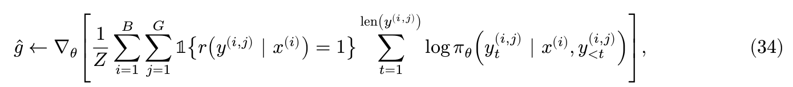

# 5. RL algorithm variants

GRPO is a popular choice for language model RL, but its algorithmic choices are contested in a variety of papers. In this assignment , we'll learn some of the theoretical arguments behind these choices,and perform controlled experiments to see for ourselves which algorithms are best.

This section will cover the on-policy setting, and the next section will cover off-policy algorithms.

## 5.1 Dr.GRPO

During the derivation of GRPO, you may have noticed a series of choices that meant that the GRPO policy gradient estimator no longer has the "correct" expectation.

These two choices were standard deviation advantage normalization and sequence length normalization. The first ablation we'll consider, argued for in the Dr.GRPO paper,is to undo these choices: remove std normalization,and divide the total loss by a constant rather than first normalizing each sequence by its length. Denoting this constant normalizer as Z,the Dr.GRPO gradient estimator is given by:


刚刚的GRPO处理
```
raw reward
    ↓
subtract group mean
    ↓
r - μ
    ↓
divide by group std          ← 修改 ①
    ↓
(r - μ) / std
    ↓
token policy gradient
    ↓
每条 response 除以自身长度   ← 修改 ②
    ↓
batch average
```

DR GRPO处理
```
group mean baseline      保留
std normalization       去掉
sequence normalization  去掉
```

除以 std 后已经不能保持原始 policy-gradient expectation；一种理解是，它让不同 group 的update norm 更接近，因此是一种 stability heuristic


Sequence length normalization 会让长 response 中的每个 token 被赋予更小权重

现在DR.GRPO
不再各自除 length。

假设外面统一除固定 Z：

**那这样sequence normalization一无是处吗？**
这正好就是 assignment 的 think_about_length_normalization 要思考的 trade-off。

Sequence normalization

优点:
- 每条rollout大致等权
- 不会让非常长的response 单纯因为长度主导update
- gradient scale 对 response length distribution 更稳定
缺点:
- 不再是原始 trajectory policy gradient
- 长 response 中每个token 会被额外 downweight
- 如果多步 reasoning 本来确实需要更多actions, 它们每一步的训练signal会被削弱

Constant normalization
有点:
- 所有 response token 权重一致；
- 贴近原始 trajectory policy gradient
- 不引入reweighting

缺点
- 长 response 会贡献更多 gradient terms；
- 如果出现异常长、啰嗦甚至 pathological rollout，它对 gradient 的影响可能很大；
- response length 波动较大时，gradient norm 的 variance 可能更高。

实现:

```py
def compute_group_normalized_rewards(
    raw_rewards: torch.Tensor,
    group_size: int,
    baseline: Literal["mean", "none"] = "mean",
    advantage_eps: float = 1e-6,
    advantage_normalizer: Literal["std", "none", "mean"] = "std",
) -> tuple[torch.Tensor, dict[str, float]]:
    
    grouped_rewards = raw_rewards.reshape(-1, group_size)
    
    if baseline == "none":
        centered_rewards = grouped_rewards
    
    if baseline == "mean":
        centered_rewards = grouped_rewards - grouped_rewards.mean(dim= 1, keepdim= True)

    # Normalize phase
    # ================================================================
    if advantage_normalizer == "none":
        
        advantages_2d = (
            centered_rewards
        ) 
        
        
    if advantage_normalizer == "std":
        group_std = grouped_rewards.std(dim = 1, keepdim=True)

        advantages_2d = (
            centered_rewards
        ) / (
            group_std + advantage_eps
        )
        
    if advantage_normalizer == "mean":
        raise NotImplementedError
    # ================================================================

    advantages = advantages_2d.reshape(-1)
    
    metadata = {
        "mean":float(raw_rewards.mean())
    }
    
    return  advantages,metadata
```

如果baseline 是none,那么啥都不做，然后如果normalizer是std,那么就除以std,如果是mean,那么就除以mean,目前mean还没实现。

baseline是mean的话就归中化。

```py
def aggregate_loss_across_microbatch(
    per_token_policy_gradient_loss: torch.Tensor,
    mask: torch.Tensor,
    loss_normalization: Literal["sequence","constant"] = "sequence",
    normalization_constant: int | None = None,
)-> torch.Tensor:
    
    masked_loss = per_token_policy_gradient_loss * mask
    loss_sum = masked_loss.sum(dim= 1)
    
    if loss_normalization == "constant":
        
        if normalization_constant is None:
            raise ValueError
        
        final_loss = loss_sum.div(normalization_constant).sum(dim=0)
    
    if loss_normalization == "sequence":
  
        token_count = mask.sum(dim=1)
        
        sequence_loss = loss_sum / token_count
        
        final_loss = sequence_loss.mean(dim=0)
    
    return final_loss
```
这个地方如果是constant的话，就不和sequence_loss那样自己去除以自己的长度，而是除以一个固定的normalization_constant。

最后用的也是求和，而非平均。

## 5.2 Rejection fine tuning

The next ablation we’ll look into is a much simpler algorithm, typically referred to as “rejection fine tuning” (RFT) or “expert iteration” (EI)

As the name suggests, the algorithm involves sampling a bunch of rollouts, keeping the ones that are correct, and then doing supervised fine tuning on these correct rollouts.

Specifically,our RFT gradient is:



where 𝑍 is a constant normalizer (like in Dr. GRPO),

然后 1{...} is an indicator function which keeps only correct responses.

In the following problem, we’ll think about whether the RFT gradient is actually a policy gradient,and how it relates to GRPO.

RFT对错误的rollout直接丢弃,只保留正确的rollout,然后对这些正确的rollout做supervised fine tuning。

刚刚的DR.GPRO 还是 Aj = rj - μ， μ还是group的平均
但是RFT这里就直接用 rj了

举例子来说，设G = 4 reward =  [1,0,1,0]  RFT 直接为 [1,0,1,0]

Dr.GRPO 要减去 group mean μ = 0.5, 所以 Dr.GRPO 为 [0.5,-0.5,0.5,-0.5]

注意，RFT仍然是一个policy gradient, 但是它的baseline是0, 而不是group mean。

**RFT 和 Dr. GRPO 的 expectation 一样吗？**

数学期望是不同的，Dr.GRPO因为group mean里面包含了当前的这个sample自己，所以引入了 G-1/G的缩放

另外一个差异是，当答案全对的时候，Dr.GRPO的gradient是0，而RFT的gradient是非0的。这个时候Dr.GRPO不会做出反应、学习之类的，而RFT会继续模仿

|                | RFT                            | Dr. GRPO                       |
| -------------- | ------------------------------ | ------------------------------ |
| advantage      | $r$                            | $r-\mu$                        |
| correct sample | reinforce                      | relative reinforce             |
| wrong sample   | ignore                         | suppress if group mixed        |
| all wrong      | zero gradient                  | zero gradient                  |
| all correct    | **still train**                | **zero gradient**              |
| expectation    | $\frac GZ\nabla J$             | $\frac{G-1}{Z}\nabla J$        |
| variance       | generally higher               | generally lower due baseline   |
| compute        | can drop all wrong samples     | can drop zero-advantage groups |
| interpretation | self-training/SFT on successes | group-relative policy gradient |


## 5.3 MaxRL

MaxRL选择的是除以 group mean μ , 而不是 GRPO 的 group std,也不是DR.GRPO的不除

假设我们已经有了

$$ \mu_i = \frac{1}{G} \sum_{j=1}^{G} r_{i,j} $$

Dr.GRPO:

$$ A_{ij} = r_{ij} - \mu_i $$

标准GRPO:

$$ A_{ij} = \frac{r_{ij} - \mu_i}{std_i + \epsilon} $$

MaxRL:

$$ A_{ij} = \frac{r_{ij} - \mu_i}{\mu_i + \epsilon} $$


**Intuition**: 除以Mean会强调难题,这是 MaxRL 最核心的 intuition

对 binary reward,某个问题的 group mean其实就是这个prompt的经验成功率

μ 大 → 当前模型觉得这个问题容易
μ 小 → 当前模型觉得这个问题难


而 MaxRL 又除以 μ，所以苦难问题会被放大

举个例子来看，一个问题8个response
reward: [1,0,0,0,0,0,0,0]  μ = 1/8 = 0.125

MaxRL:

对唯一正确的
$$ A_{correct} = \frac{1 - 0.125}{0.125 + \epsilon} \approx 7 $$

对于错误的
$$ A_{wrong} = \frac{0 - 0.125}{0.125 + \epsilon} \approx -1 $$

在一个很难的问题，偶然探索出来的成功trajectory会得到非常强的reinforcement

同理，对于一个很简单的问题，偶然的一个错误的response也会得到非常强的惩罚


一个对比:

| 成功率 (\mu) |  Dr 正确 |  Dr 错误 | MaxRL 正确 | MaxRL 错误 |
| --------: | -----: | -----: | -------: | -------: |
|     0.125 | +0.875 | −0.125 |   **+7** |       −1 |
|       0.5 |   +0.5 |   −0.5 |       +1 |       −1 |
|     0.875 | +0.125 | −0.875 |   +0.143 |       −1 |

Dr. GRPO：

>“相对于这个问题的平均水平，你这条 trajectory 好多少/坏多少？”

MaxRL：

>“困难问题上的成功特别珍贵，我要把它放大。”


定义

$$ \eta(x) = E_{y \sim \pi_\theta} [r(x,y)] $$

对于binary reward, η(x)就是这个prompt的经验成功率

当 G趋于无穷

$$ \mu \to \eta(x) $$

**Problem**:

6.1 Dr. GRPO 对应什么 reweighting?

Dr.GRPO 不根据difficulty重加权prompts

最后得到的
$$ w_{Dr}(x) = 1 $$

标准 GRPO 呢?

$$ w_{GRPO}{x} = \frac{1}{\sqrt{\eta(x)(1-\eta(x))}} $$

这个会强调两端

```
very hard                medium                 very easy
η≈0                      η≈0.5                  η≈1
 ↑                         ↓                      ↑
large weight             smallest              large weight
```

MaxRL

$$ w_{MaxRL}(x) = \frac{1}{\eta(x)} $$

MaxRL 最大化每个prompt 成功概率的log

既然如此，代码实现也很明显了。

步骤就是计算平均，然后除以这个平均。

```py
if advantage_normalizer == "mean":
        group_mean = grouped_rewards.mean(dim=1, keepdim=True)
        
        advantages_2d = (
            centered_rewards
        ) / (
            group_mean + advantage_eps
        )
```

## 5.4 Experiments

We're now ready to run experiments to explore these different policy gradient estimators.

First , we'll need to update our `grpo_train_step` method to support these variations,whose components we implemented above. The specific settings are as follows:

- GRPO_constant: baseline = "mean", advantage_normalizer = "std", loss_normalization = "constant"
- Dr_GRPO: baseline = "mean", advantage_normalizer = "none", loss_normalization = "constant"
- RFT: baseline = "none", advantage_normalizer = "none", loss_normalization = "constant"
- MaxRL: baseline = "mean", advantage_normalizer = "mean", loss_normalization = "constant"

To speed up training, note that once we've computed normalized advantages for each sequence, sequences with zero advantage don't need to be passed into the model since their contribution to the gradient is zero. Since our rewards are binary, sequences will have zero advantage in two cases:

- If baseline = "mean", the sequence in a group will have zero advantage if they all have the same reward.
- If baseline = "none", any sequences with zero reward will have zero advantage.

Once we prune zero-advantage sequences,we can also reduce `gradient_accumulation_steps` by the same factor: for exam,if half the sequences have zero advantage,we can take k/2 grad accum steps instead of k grad steps.

This optimization can be especially helpful for RFT, which will have quite a few zero-reward sequences. But you should be careful with your math and implementation to ensure that your pruned version computes the same gradient as the unpruned version.

**Problem: GRPO train step variants**:

Update your grpo_train_step method to support the full range of on-policy variants (still with importance_reweighting_method = "none"). These options include baseline: Literal["mean", "none"], advantage_normalizer: Literal["std", "none", "mean"], and loss_normalization: Literal["sequence", "constant"]. Also, to speed up training, your method should avoid passing zero advantage sequences into the model.


核心的变化如下:


```py
        if loss_normalization == "sequence":
            backward_loss = (
                microbatch_loss * actual_microbatch_size
            ) / full_batch_size
        
        elif loss_normalization == "constant":
            backward_loss = microbatch_loss
```

这个地方是因为，sequence的过程中，我们是1/M(...) 最终要的是 (1/N), 所以就得在这个地方做一个计算。

而如果是constant的话，没有这个问题，直接就是microbatch_loss就行了。


```py

    keep_mask = (advantages != 0 )
    # ====== pruning ======
    kept_prompts = [prompt for prompt,keep in zip(repeated_prompts,keep_mask) if keep]
    keep_responses = [response for response, keep in zip(rollout_responses, keep_mask) if keep]
    kept_advantages = advantages[keep_mask]
```

这个地方是保持剪枝，去掉那些advantage为0的prompt和response。

但是不要覆盖原始的size之类的东西，因为他们只是被删除不算，其占位置的作用并没有消失，如果去除会导致最后的gradient错位。

就这样.

