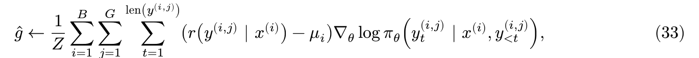

# 5. RL algorithm variants

GRPO is a popular choice for language model RL, but its algorithmic choices are contested in a variety of papers. In this assignment , we'll learn some of the theoretical arguments behind these choices,and perform controlled experiments to see for ourselves which algorithms are best.

This section will cover the on-policy setting, and the next section will cover off-policy algorithms.

## 5.1 Dr.GRPO

During the derivation of GRPO, you may have noticed a series of choices that meant that the GRPO policy gradient estimator no longer has the "correct" expectation.

These two choices were standard deviation advantage normalization and sequence length normalization. The first ablation we'll consider, argued for in the Dr.GRPO paper,is to undo these choices: remove std normalization,and divide the total loss by a constant rather than first normalizing each sequence by its length. Denoting this constant normalizer as Z,the Dr.GRPO gradient estimator is given by:




刚刚的GRPO处理
```
raw reward
    ↓
subtract group mean
    ↓
r - μ
    ↓
divide by group std          ← 修改 ①
    ↓
(r - μ) / std
    ↓
token policy gradient
    ↓
每条 response 除以自身长度   ← 修改 ②
    ↓
batch average
```

DR GRPO处理
```
group mean baseline      保留
std normalization       去掉
sequence normalization  去掉
```

除以 std 后已经不能保持原始 policy-gradient expectation；一种理解是，它让不同 group 的update norm 更接近，因此是一种 stability heuristic


Sequence length normalization 会让长 response 中的每个 token 被赋予更小权重

现在DR.GRPO
不再各自除 length。

假设外面统一除固定 Z：

**那这样sequence normalization一无是处吗？**
这正好就是 assignment 的 think_about_length_normalization 要思考的 trade-off。

Sequence normalization

优点:
- 每条rollout大致等权
- 不会让非常长的response 单纯因为长度主导update
- gradient scale 对 response length distribution 更稳定
缺点:
- 不再是原始 trajectory policy gradient
- 长 response 中每个token 会被额外 downweight
- 如果多步 reasoning 本来确实需要更多actions, 它们每一步的训练signal会被削弱

Constant normalization
有点:
- 所有 response token 权重一致；
- 贴近原始 trajectory policy gradient
- 不引入reweighting

缺点
- 长 response 会贡献更多 gradient terms；
- 如果出现异常长、啰嗦甚至 pathological rollout，它对 gradient 的影响可能很大；
- response length 波动较大时，gradient norm 的 variance 可能更高。

实现:

```py
def compute_group_normalized_rewards(
    raw_rewards: torch.Tensor,
    group_size: int,
    baseline: Literal["mean", "none"] = "mean",
    advantage_eps: float = 1e-6,
    advantage_normalizer: Literal["std", "none", "mean"] = "std",
) -> tuple[torch.Tensor, dict[str, float]]:
    
    grouped_rewards = raw_rewards.reshape(-1, group_size)
    
    if baseline == "none":
        centered_rewards = grouped_rewards
    
    if baseline == "mean":
        centered_rewards = grouped_rewards - grouped_rewards.mean(dim= 1, keepdim= True)

    # Normalize phase
    # ================================================================
    if advantage_normalizer == "none":
        
        advantages_2d = (
            centered_rewards
        ) 
        
        
    if advantage_normalizer == "std":
        group_std = grouped_rewards.std(dim = 1, keepdim=True)

        advantages_2d = (
            centered_rewards
        ) / (
            group_std + advantage_eps
        )
        
    if advantage_normalizer == "mean":
        raise NotImplementedError
    # ================================================================

    advantages = advantages_2d.reshape(-1)
    
    metadata = {
        "mean":float(raw_rewards.mean())
    }
    
    return  advantages,metadata
```

如果baseline 是none,那么啥都不做，然后如果normalizer是std,那么就除以std,如果是mean,那么就除以mean,目前mean还没实现。

baseline是mean的话就归中化。

```py
def aggregate_loss_across_microbatch(
    per_token_policy_gradient_loss: torch.Tensor,
    mask: torch.Tensor,
    loss_normalization: Literal["sequence","constant"] = "sequence",
    normalization_constant: int | None = None,
)-> torch.Tensor:
    
    masked_loss = per_token_policy_gradient_loss * mask
    loss_sum = masked_loss.sum(dim= 1)
    
    if loss_normalization == "constant":
        
        if normalization_constant is None:
            raise ValueError
        
        final_loss = loss_sum.div(normalization_constant).sum(dim=0)
    
    if loss_normalization == "sequence":
  
        token_count = mask.sum(dim=1)
        
        sequence_loss = loss_sum / token_count
        
        final_loss = sequence_loss.mean(dim=0)
    
    return final_loss
```
这个地方如果是constant的话，就不和sequence_loss那样自己去除以自己的长度，而是除以一个固定的normalization_constant。

最后用的也是求和，而非平均。