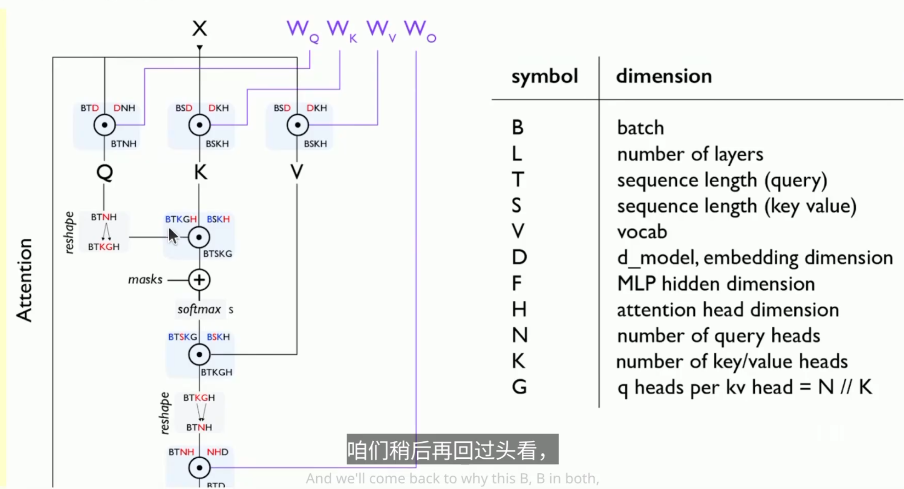
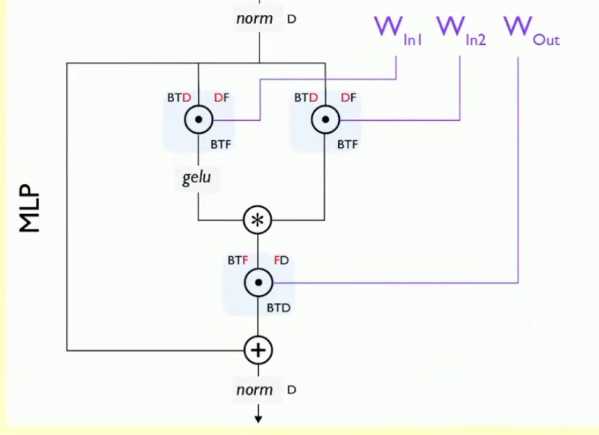
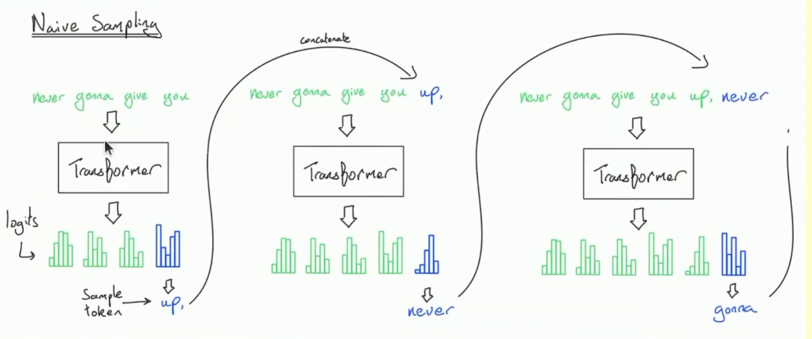
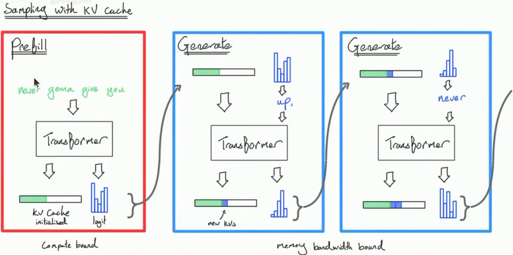
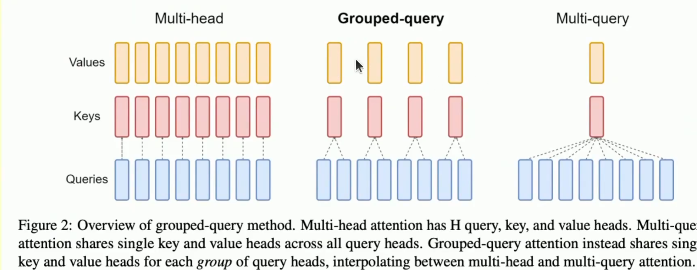
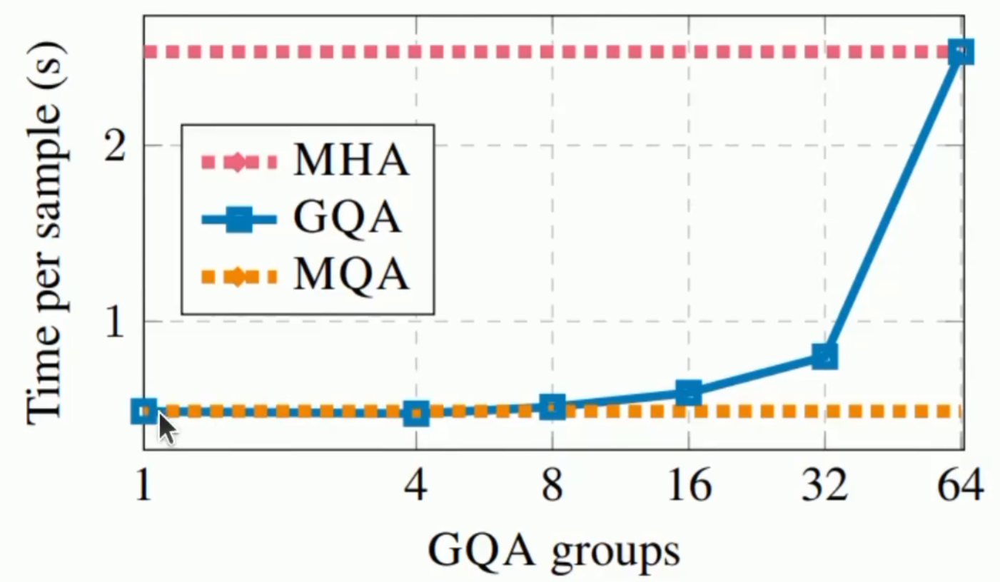
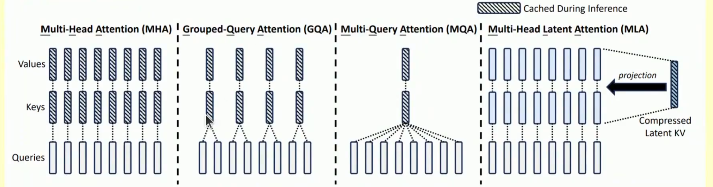
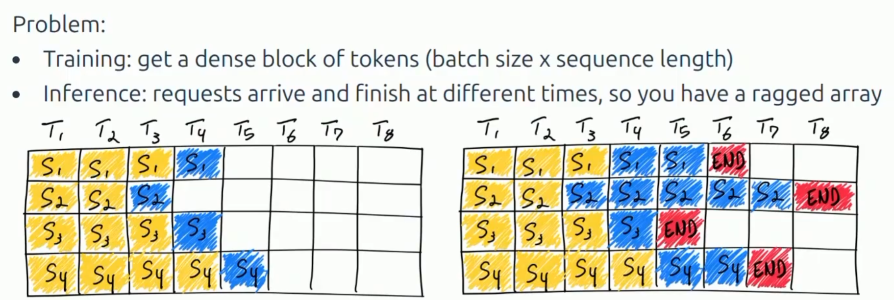
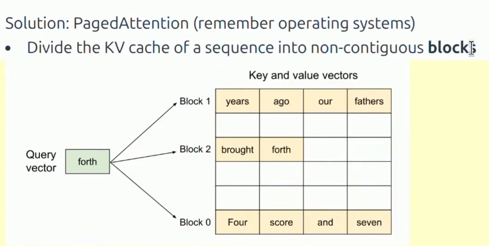

# Inference

- vLLM
- SGLang
- TensorRT-LLM
- llama.cpp

Inference is huge. Important to make it fast

What does "fast" mean?
- Time to first token (TTFT): How long user waits before any generation happens
- Latency (seconds / token): how fast tokens appear for one query
- Throughput (tokens / second): how fast tokens appear for many queries

What governs efficiency?
- Training(supervised): you see all tokens, can parallelize over sequence
- Inference: you have to generate sequentially, can't parallelize over generation, so harder to fully compute.

Arithmetic intensity:  (flops / bytes_transferred), 一般计算强度 为B，即batch size

For the two stages:

1. Prefill: easy to make compute-bound by making B*T large enough
2. Generation:
- Generation one token at a time
- B is a number of concurrent requests,unpredictable for interactive applications

Time to first token is essentially a function of prefill time.
Use smaller batch sizes during prefill for faster TTFT
Use larger batch sizes during generation to improve throughput

**Taking Shortcuts**:

- reduce kv cache size

KV cache很吃内存. 不要损失精度。GQA Grouped-query Attention

Multi-head attention K = N
Multi-query attention K = 1
Gouped-query attention K is between 1 and N

内存占用降低可以同时改善latency and throughput.

MLA 保持数量不变，但是做参数化处理，压缩空间等等。

**Sliding windows Attention**:

注意力机制等等。

例如 linear attention \ Mamba \ ... etc. 很多很多

**KV cache compression**:

- Compressed Sparse Attention (CSA): compresses every m token into 1
- DeepSeek Sparse Attention (DSA): selects the top k
- Heavily Compressed Attention (HCA): compresses even more

- Goal : Reduce the KV cache size
- Lower-dimensional KV cache
- Local attention on some of the layers
- Other ideas: linear attention / state-space-models / diffusion models.

**Quantization**:
只给少数重要的参数使用高精度，其他的参数使用低精度。减少内存占用。

**model_pruning**:

## Speculative_sampling

- Prefill: given a sequence, encode tokens in parallel
- Generation: Generate one token at a time

Speculative sampling
- Use a cheapter drafter model to generate multiple tokens 
- Evaluate the tokens with the main model

## Handling dynamic workloads

1. Request arrive at different times
2. Sequence have shared prefixes
3. Sequence have different lengths

Paged attention是为了解决类似于系统内存碎片的问题.