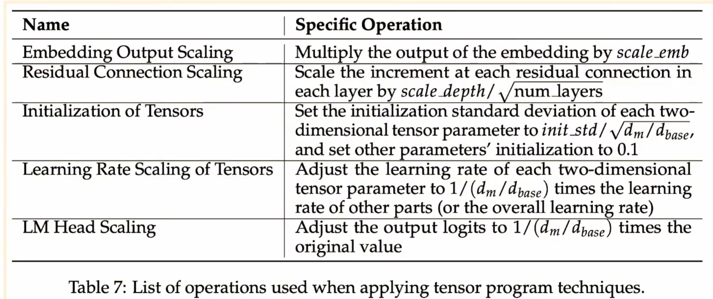
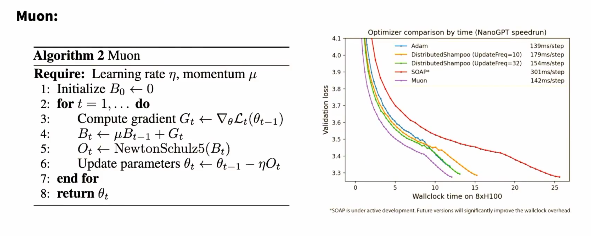

# MiniCPM

- MiniCPM(2024) -small , high-perf TsingHua team


初始化的重要性

## Techique 1: muP to stabilize scaling


非标准初始化的目的是让学习率稳定

## Techique 2: WSD 学习率


# DeepSeek

...


# Muon




# Scaling model 的同时，怎么控制 hyperparameter drift？

## MiniCPM：先造一个“风洞”

```
40M
100M
300M
500M
   ↓
大量便宜实验
   ↓
找 scaling 规律
   ↓
2B / 更大的模型
```

问题随即来了：

>我在 100M 上找到的 learning rate，到了 2B 还能用吗？

## µP：让小模型调出来的超参数能搬到大模型
让不同宽度模型具有尽可能一致的训练 dynamics​

这样在小模型上调出来的超参数，例如 learning rate，就更有机会直接 transfer 到大模型。

µP 论文把这称为 µTransfer：

```
small proxy model
     ↓
调 learning rate 等 HP
     ↓
large target model
     ↓
尽量直接复用
```

>**不是一个“更好的 optimizer”，而是一套 parameterization/scaling 规则，目标是让训练超参数具有跨模型规模的可迁移性。**

## WSD：你睡着前听到的另一个重点

Warmup-Stable-Decay
	​

```
learning rate
     ^
     |        ┌──────────────────┐
     |       /                    \
     |      /                      \
     |     /                        \
     |____/                          \____
          warmup       stable        decay
                                     
                         training ->
```


MiniCPM 明确把训练拆成这三个阶段，并观察到 decay 阶段 loss 会出现明显下降；他们的实验中，约占总 token 数 10% 的 decay 已足以取得很好的结果。

WSD 真正聪明的地方是：可以“续命”

假设原计划训练 100B tokens：
```
LR
│\
│ \
│  \
│   \____
└──────────── 100B
```

突然老板说：
>效果不错，再训练到 200B

问题来了。

正确的 200B cosine 应该本来长成：
```
LR
│\
│ \
│  \
│   \
│    \
│     \____
└──────────────── 200B
```
可是你前 100B 已经把 LR 降下去了。

回不去了。

MiniCPM 也实验发现 cosine 的最佳周期与实际训练 horizon 强相关。

WSD 就没有这个问题

跑到 100B 时，你可以：
```
checkpoint@100B
       ↓
      decay
       ↓
得到一个“100B 完成版”
```
之后继续
```
100B checkpoint
      ↓
继续 stable 到 200B
      ↓
decay
      ↓
得到“200B 完成版”

```

也就是说：
```
                       → stable → stable → ● → decay
                      /
warmup → stable → ●
                  \
                   → decay

```
这个结构极其适合 scaling-law 实验。MiniCPM 论文明确强调，可以重用 stable-stage checkpoint，在不同训练长度处分别做 decay，而不必为每个 data horizon 从头训练一遍。

一条长期 stable training trajectory 就能提供多个 data horizon 的 checkpoint，再从对应 checkpoint 做短 decay。

所以 MiniCPM 认为 WSD 可以显著降低研究 data-model scaling law 的实验成本

## DeepSeek 直接拟合超参数的 scaling law

µP 的思想是：

>我设计 parameterization，让 optimal hyperparameter 尽量不要随着 scale 变化。

DeepSeek LLM 展示的是另一种思路：

>既然它会变化，那我直接把这个变化也拟合成 scaling law。

然后拿小模型拟合出的规律去指导 7B、67B 等更大规模配置

```
方案 A：µP
让 hyperparameter 尽量不随模型 scale 漂移
→ small → large 直接 transfer

方案 B：scaling law
承认 hyperparameter 会漂移
→ 测出漂移规律
→ extrapolate 到 large
```


```
             Scaling 到大模型
                    │
          训练超参数也可能改变
                    │
        ┌───────────┴───────────┐
        │                       │
       µP                fit HP scaling laws
        │                       │
让 training dynamics       预测 LR / batch
跨规模更稳定                    │
        │                    DeepSeek
   MiniCPM 等
        │
       WSD
        │
训练 horizon 可延长
checkpoint 可复用
        │
降低 scaling experiment 成本
```

