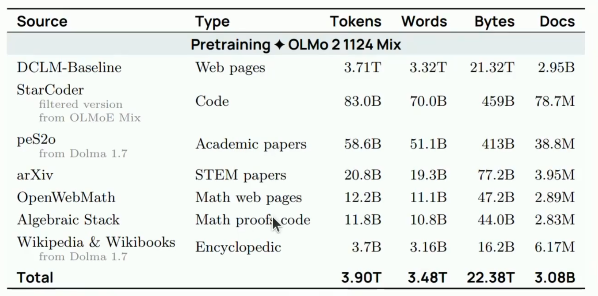
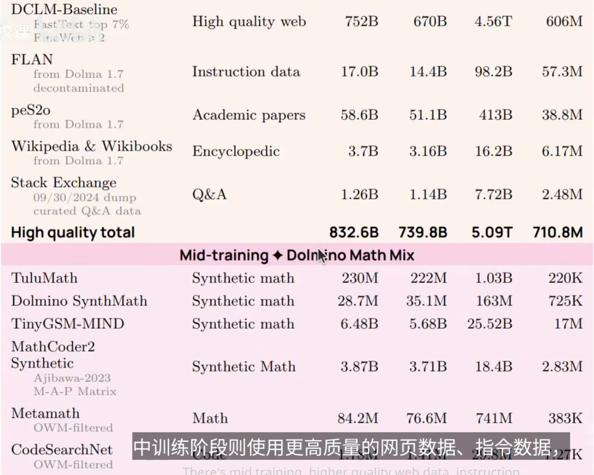
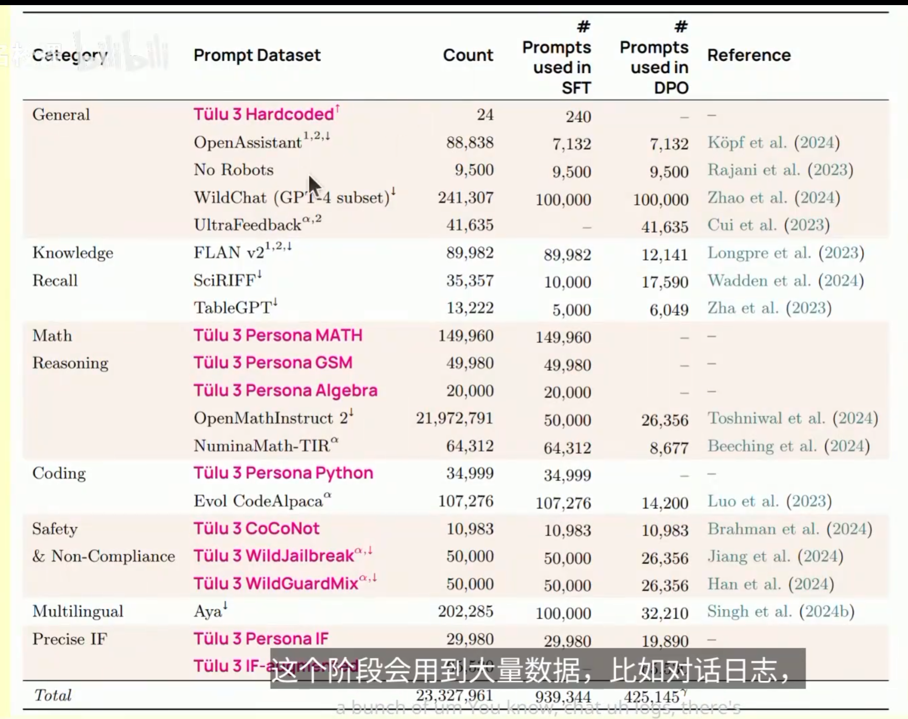
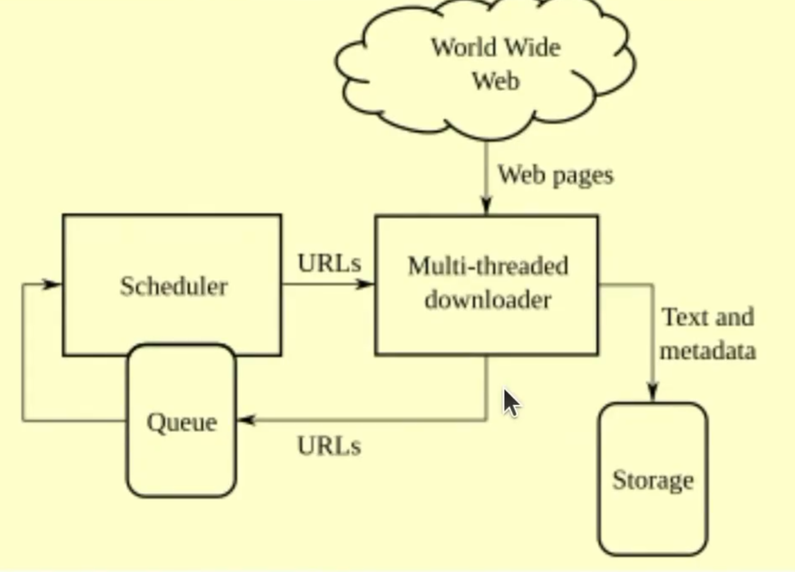
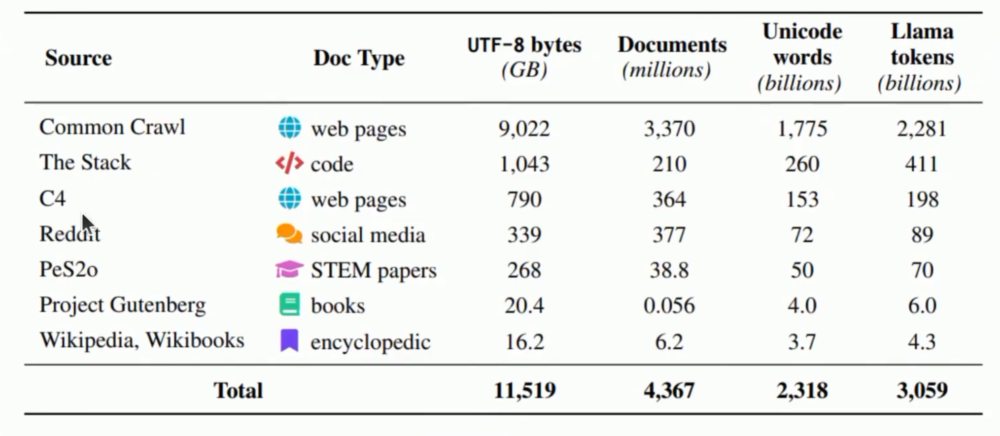

# Data.

例如Llama 模型，公开权重架构，但是对数据只字不提

Reasons
- Competitive dynamics
- Copyright liability

- Before foundation models, data work meant heavy annotation of labeled data for supervised learning.
- Now there's less annotation,but there's still a lot of curation and cleaning
- Data is fundamentally a long-tail problem,scales with human effort

Stages of Training
1. Pre-training : train on raw text
2. Mid-Training : train more on high quality data to enhance capabilities 
3. Post-training : train on chat transcripts or reinforcement learning
 

例子: (OLMo from AI2)

1. Pre-training:

2. Mid-training

3. Post-training

## Raw_sources:

A crawler
- Discovers webpages
- Downloads the discovered webpages

However,现在情况改变了

1. many sites these days are apps
2. URL doesn't change
3. Need to click buttons

Authentication:
1. need to sign in to access content

Technical restrictions:
- Not allowed to download some content based on robots.txt
- Website might use Cloudflare to block crawlers
- Website might block certain IP addresses
- Website might have rate limits.

Legal restrictions:
- Terms of service (ToS) might prohibit downloading content
- You might need to have a license to download content

Shadown libraries
- Technically part of the web
- Examples: Library Genesis, Z-library, Anna's Archive...

## Copyright

**Intellectual property law**:
- Goal" incentivize the creation of intellectual ...

版权的门槛很低

How to use a copyright work:
1. Get a license for it
2. Appeal to the fair use clause.

**Licenses**:

许可证。可以买，可以开源等等。。。

1. The purpose and character of the use
2. The nature of the copyrighted work
3. The amount and substantiality of the portion used in relation to the copyrighted work as a whole
4. The effect of the use upon the potential market for or value of the copyrighted work

**Terms of service**:
...

**Lawsuits**:

Anthropic的书诉讼，被告eyc.
训练算合理使用，但是盗版是违规

## Common Crawl

- Every month,Common Crawl releases a new crawl of the web
- 300 B pages so far.

Policies:
- Selection policy
- Politeness policy
- Re-visit policy
- Challenges Dynamic URL etc..

## wikipedia

有迹可查，注明出处。不含立场等等。

Produce periodic dumps every few weeks.

考虑到攻击者的存在任何地方都有可能混杂有毒数据。

## Github

代码，420M+ repositories (28M public)
2 types
- Repository
- Metadata: issues, pull requests...

## arxiv

PDF,latex源文件、 学术论文

all rights reserved or Creative Commons

## bert 

## gpt2_webtext

## ccnet

## t5_c4

谷歌，把自然语言全部看出text处理。

## project_gutenberg

## books3

## stackexchange
是问答模式的数据集
- Q＆A format is close to instruction fine-tuning
- 带有metadata，可以看投票过滤

## gopher_massivetext...

## llama

Dataset for llama
- CommonCrawl
- C4
- Github
- Wikipedia
- Project Gutenberg and books3
- arXiv
- StackExchange

## Refinedweb

- Web data is all you need
- trafilatura for HTML

FineWeb 不引入偏见...

## Dolma

## the_stack

代码数据集，3.1TB

github提取的数据

Stack v2

把一些语言编译成低级语言学习映射。

pull request改变，需要加上下文、文件等等

Subtleties:
- License laundering
- Collection licenses
- Synthetic data from LMs trained on unlicensed data is unclear