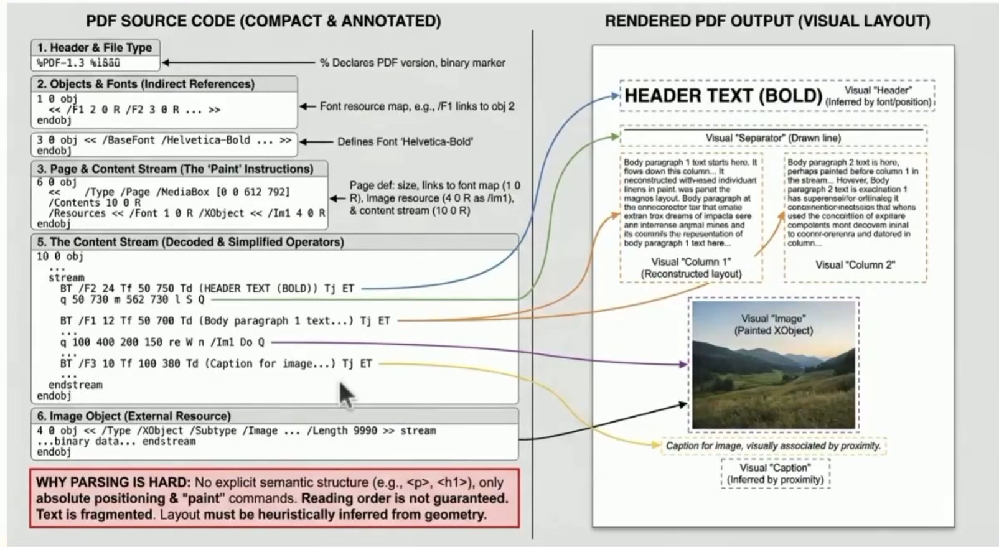
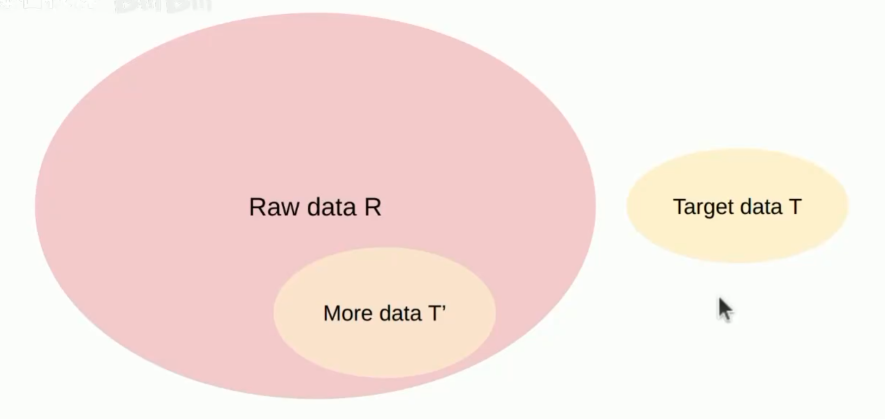
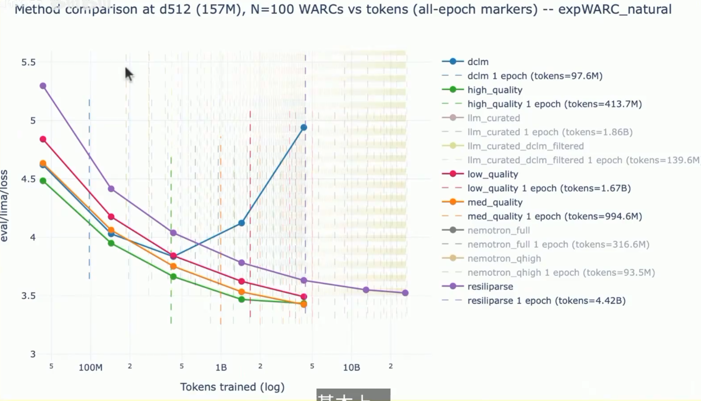
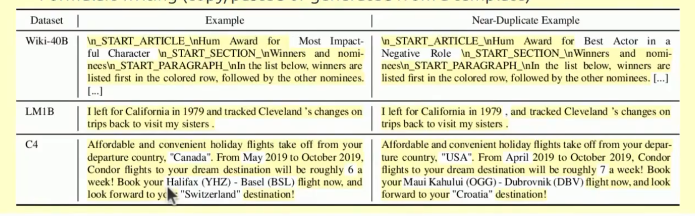
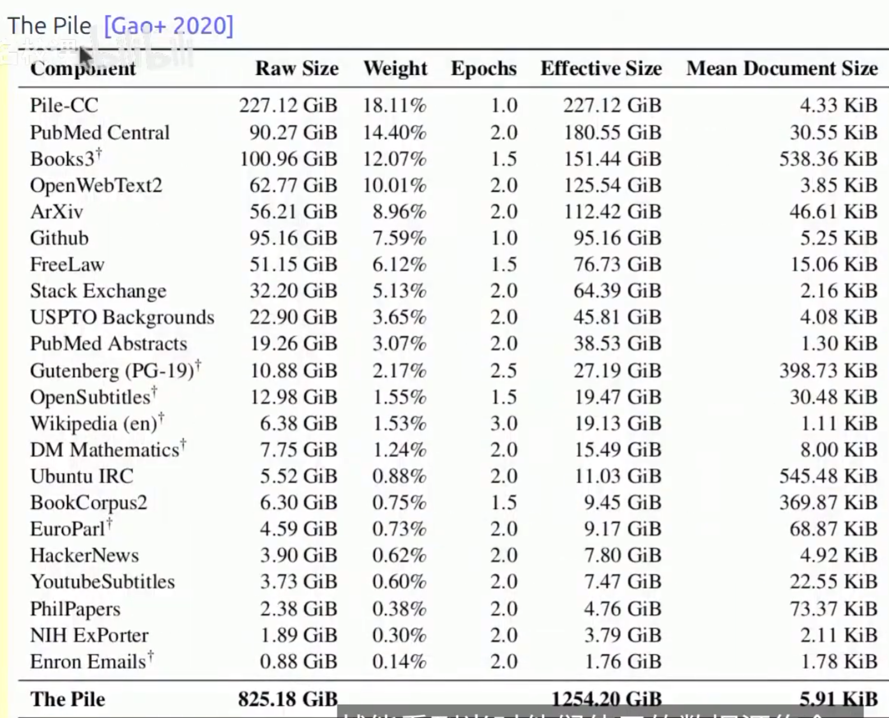
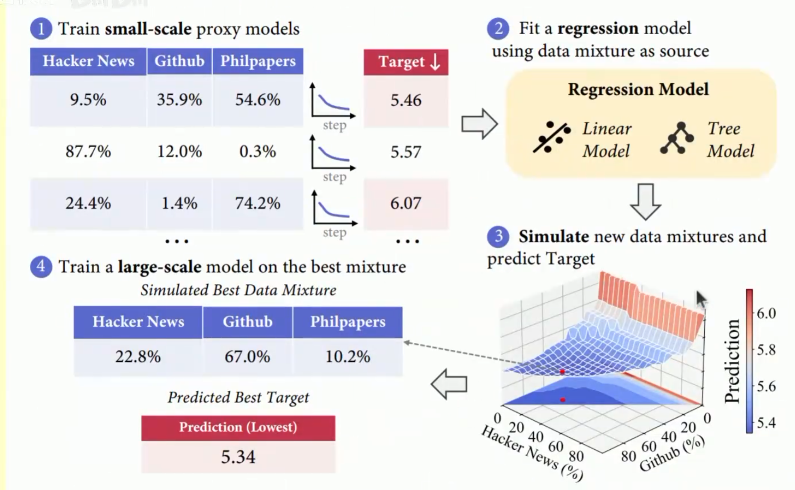
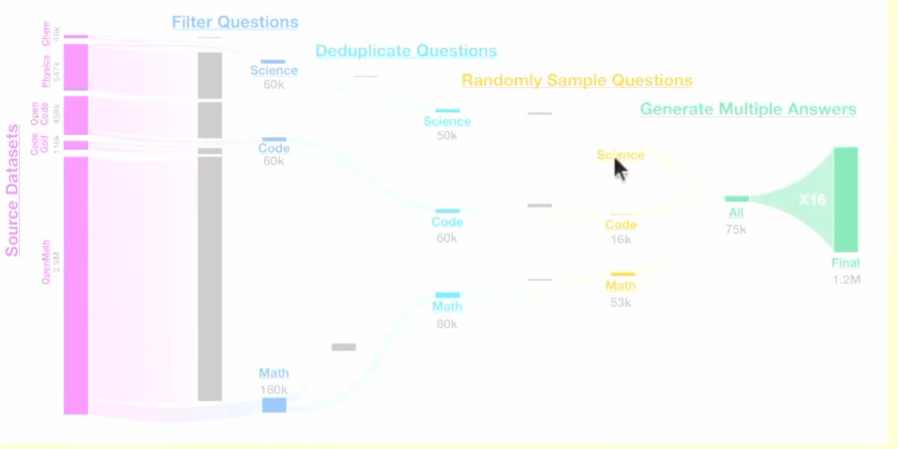

# Lecture 14 Data II

上一节课学习了数据的一些考量，这节课学习 data pipeline, mid-training...


## Transformation

Raw data does not come as text.

HTML to text.
- Remove Boilerplate
- Images, tables..
- Inherently lossy
- Tools: rule-based: trafilatura , resiliparse , justText, lynx...
- Accuracy matters

**PDF**


- Source: common crawl, truncated PDFs
- OCR, using a VLM or Docling
- Lots of cleanup and flitering
- A lot of layout information is missing



- Language identification
- Quality filtering
- Toxicity filtering


Types of classifiers:
- Generative model of T(KenLM)  score(x) = p_T(x)
- simple classifier: score(x) = p(T | x)

Language identification:
- Goal: find text of a specific language
- fasteText language identification


OpenMath Text:
- Goal: curate large corpus of mathematical text from CommonCrawl.
- Use rules to fliter.
- KenLM trained on ProofPile,keep if perplexity < 15000
- Trained fastText...
- Result...

GPT3
- Positives: samples from wikipedia.. webText2...
- Negatives: CommonCrawl


数据质量对模型的影响实验:



## deduplication
去重、镜像站和原站点是相同的

排版差别

- Terms of service...


C4数据集中出现了某种广告61000次。

simple example:

```py

items = ["Hello!","hello","hello there","hello","hi","bye"]

hash_items = itertools.groupby(sorted(items, key=mmh3.hash), key=mmh3.hash)

deduped_items = [next(group) for _, group in hash_items]
```
## jaccard_minhash
Definition: jaccard(a,b) = |a ∩ b| / |a ∪ b|

```py

def compute_jaccard(A,B):
    intersection = len(A & B)
    union = len(A | B)
    return intersection / union
jaccard = compute_jaccard(A,B)
```

**MinHash**:

a random hash function h so that Pr[h(a) = h(b)] = jaccard(a,b)

```py

def minhash(S: set[str], seed: int):
    return min(mmh3.hash(s, seed=seed) for s in S)

```

## data mixing
数据混合有利于充分学习
分配权重学习


sources = {"wekepedia", "CC", "Github"}
p = {"wekepedia": 0.5, "CC": 0.3, "Github": 0.2}

Baselines:
- Vibes: set p(s) manually
- Uniform sampling: sample uniformly 

简单的按照比例混合是不合适的。



通过采样确定损失曲面

但是有可能导致模型喜欢在高质量数据上面反复训练，导致过拟合。

Summary:
- Problem: how to weight different data sources?
- Regression-based mixing: estimate mixure -> loss scale.
...




