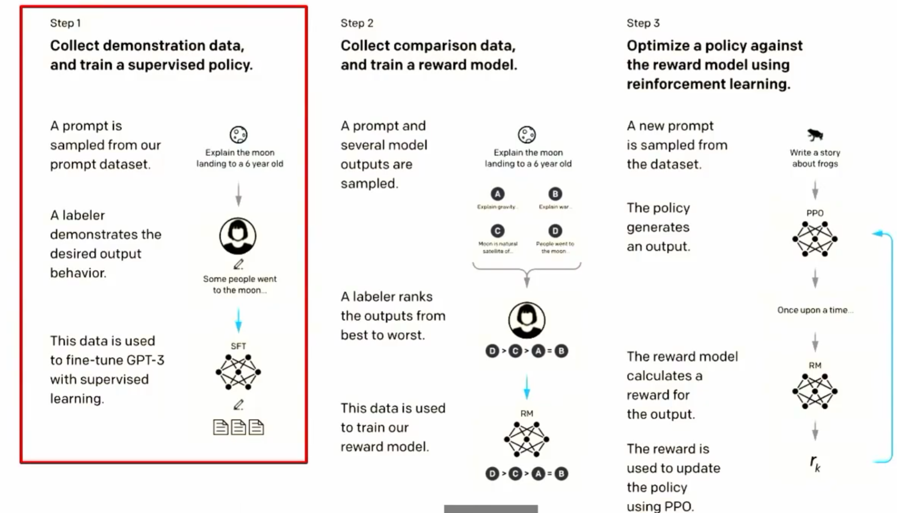
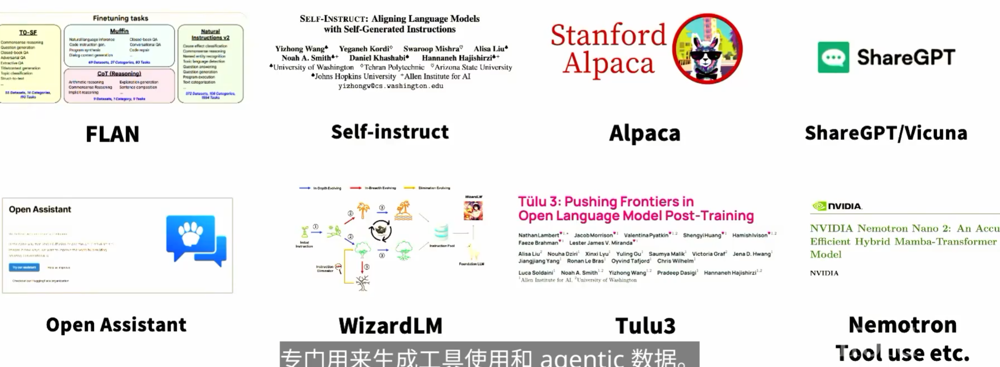
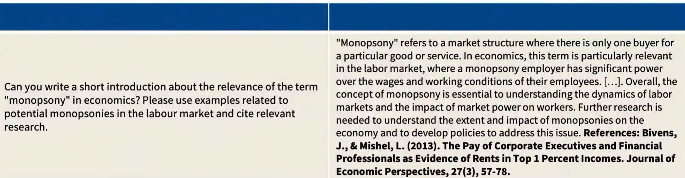

# The class thus far

We've biw covered pre-training, which gets you to GPT3.. But how do we get to instruct GPT?

# Instruction following is a remarkable form of control.

预训练已经不够了，我们需要post-training咯

1. What does the data like?
...

前沿post training 很多都不公开了，大都是商业机密了。

开源配方很多依赖于蒸馏，和正经的后训练一般不同。

# Where today's lecture fits in

# Progression of SFT data (in the open world)

Agent时代还会增加很多工具使用细节。

后训练主要依赖于准确的输入and 输出。

# References,complex knowledge, and factuality

# Takeaways on knowlegde extraction and alignment
1. You may not want to fine-tune on tail knowledge, even that's the LM use case.

2. In principle, 'RL' style correctness feedback could help

3. Knowledge storage and extraction in LMs is messy, and nuanced

# Putting it together: SFT data

1. Instruction fine-tuning (SFT) works works best when we are just extracting pre-training behaviors,not adding new ones.

2. Adding data can sometimes hurt

3. Small amounts of the right kinds of behavior make a big difference , but there is a long-tail that benefits from more data.

# The second part of RLHF

SFT: Fit the model to the data for sume reference behaviors

RLHF: Find the best behaviors that maximize for a reward.

