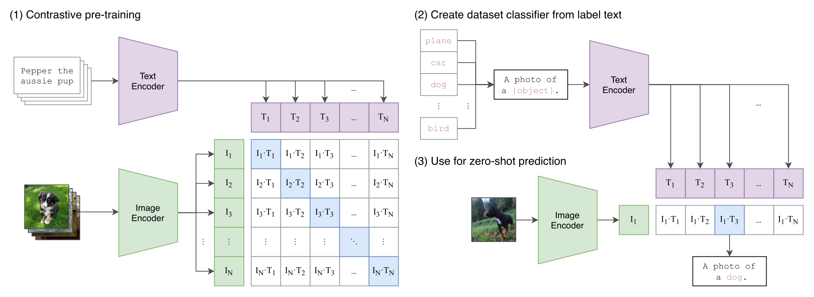
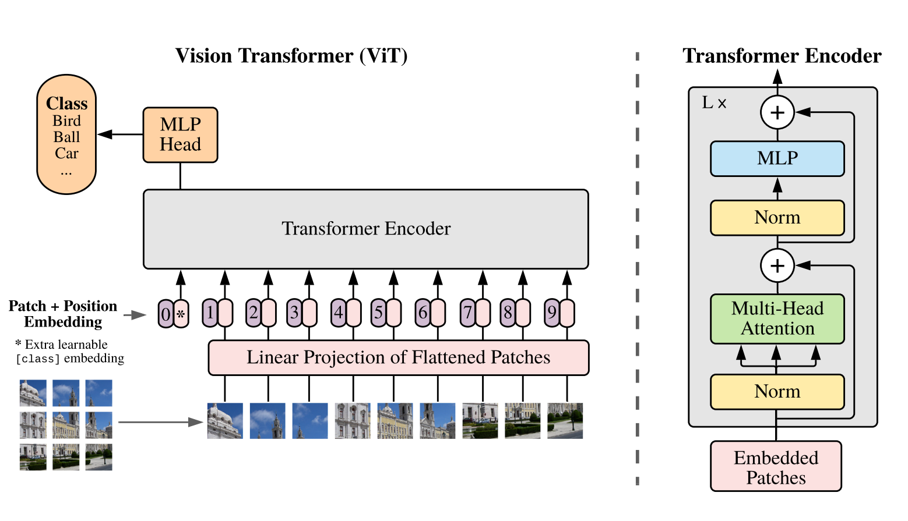
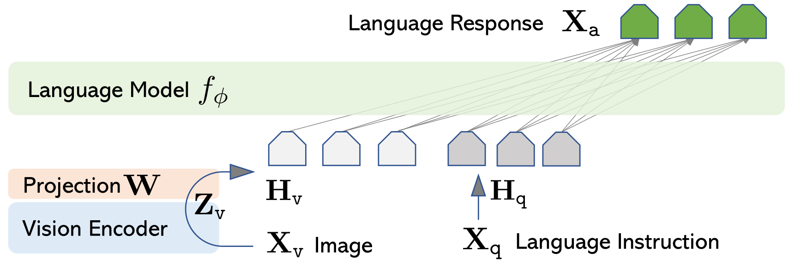
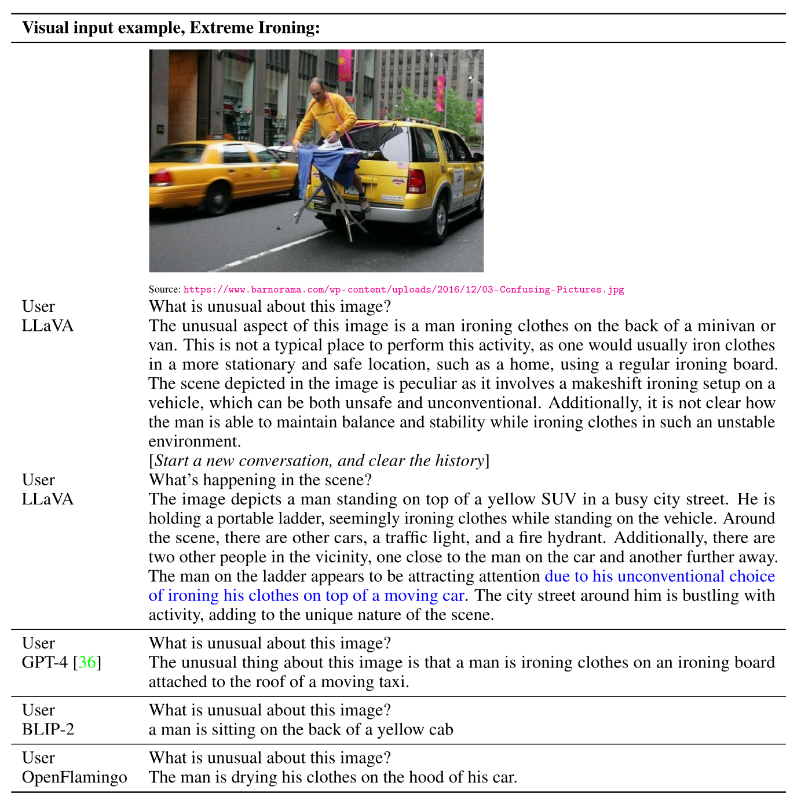
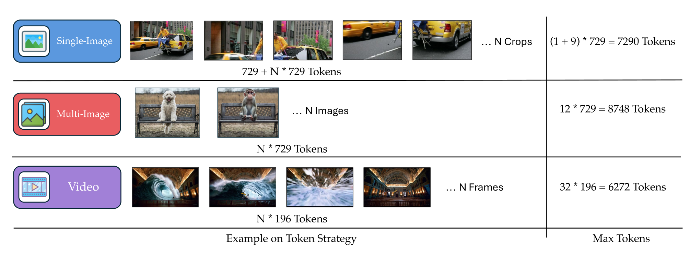
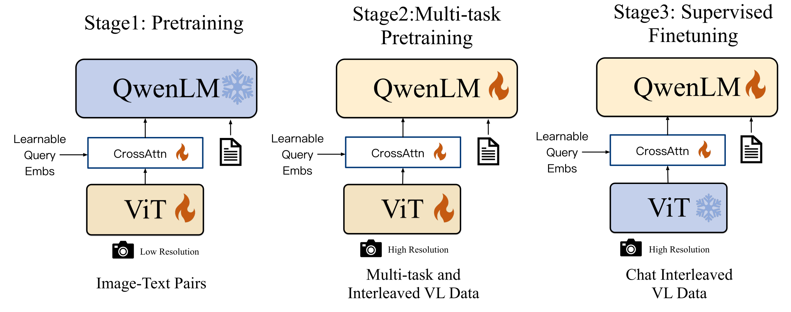

# 多模态模型的概述

**如何把图像等非文本模态转换成 Transformer 能消化的（离散或连续）token?**

Transformer 在所有模态上都表现得出奇地好,但 Transformer 是为文本设计的。它们有一个很根本的性质：它们"说"token——输入是一堆 token，输出也是一堆 token。


oken 不一定是文本里那种离散（discrete）的子词，也可以是连续（continuous）的向量——你可以把它们理解为"token 的嵌入（embedding）"。


于是我们面前摆着两个问题：

1. 如何把非文本数据（比如图像、视频、音频）输入 Transformer？——也就是"理解"那一侧；
2. 如何从 Transformer 输出非文本数据（比如生成音频、图像）？——也就是"生成"那一侧。

## CLIP Contrastive Language-Image Pre-training，对比语言-图像预训练

GPT-3、GPT-2 已经出现，语言模型整体已经进入了"基础模型（foundation model）"时代——互联网上有海量文本，虽然非常嘈杂，但只要模型足够大，就能从中"悟"出有用的东西。

然而视觉领域还停留在老一套：在大规模人工标注数据集（比如 ImageNet）上训练模型（比如 ResNet），再辅以各种数据增强（data augmentation）技巧来拿到好成绩。于是 OpenAI 的研究者们开始琢磨一个问题：能不能利用互联网上那海量、免费的（图像，文字描述）配对？

- 对每张图像，用一个图像编码器（image encoder）（后面再细讲是什么）编码成一个向量
- 对对应的文本做同样的事,得到一串向量


现在目标就是让 I 和 T 对齐， I_1与它自己的文本之间的点积（dot product）要远大于它与批内其它所有文本之间的点积。反过来，对于文本这一侧也一样.

这就是clip目标的全部。可以把它看作2n个softmax问题，对每一个图像做一次n分类



```py
def clip_loss(image_embeddings, text_embeddings, logit_scale, labels=None):
    # image_embeddings / text_embeddings：形状 (N, d)，先做 L2 归一化
    image_embeddings = image_embeddings / image_embeddings.norm(dim=-1, keepdim=True)
    text_embeddings  = text_embeddings  / text_embeddings.norm(dim=-1, keepdim=True)

    # logits[i, j] = <image_i, text_j> * exp(logit_scale)，温度是可学习的
    logits = logit_scale * image_embeddings @ text_embeddings.t()

    if labels is None:
        # 对角线上的 (image_i, text_i) 才是正样本
        labels = torch.arange(len(logits))

    loss_image = F.cross_entropy(logits, labels)        # 图像侧：N 分类
    loss_text  = F.cross_entropy(logits.t(), labels)    # 文本侧：N 分类（转置）
    return (loss_image + loss_text) / 2
```

数据处理：固定尺寸的预处理:

1. 先把图像缩放（resize，用双三次插值 bicubic interpolation），让较短的那条边变成目标尺寸——336 像素（也可以是 224）；
2. 再中心裁剪（center crop）成 336×336 的正方形。

**视觉编码器：Vision Transformer（ViT）**

1. 把图像切分成一个个 patch（图像块）。原始 ViT 论文用的是 16×16，CLIP 用的是 14×14；
2. 每个 patch 展开成一个向量——从某种意义上说，每个 patch 就是视觉 Transformer 的一个 token；
3. 像训练语言模型那样，加上位置嵌入（positional embedding）；
4. 送进一个标准的 Transformer 编码器。



CLIP 论文做了一个略有不同的操作——attention pooling（注意力池化）：先用所有激活的全局平均得到一个向量，然后再把这个向量作为 query，对每个位置的 key 和 value 再做一轮注意力，得到另一个向量。

这个向量比"直接平均"更有信息量——平均是所有 patch 等权，而 attention pooling 让模型自己决定哪些位置更重要。

## SigLIP：用二分类损失训练图像编码器

**动机：CLIP 的两个技术缺点**

1. 需要非常大的 batch size（比如 3 万）。batch size 为 1 显然不工作，甚至 10 都不工作；
2. softmax 要在整个 batch 上操作，所以损失很难"分解"——没法像普通语言模型训练那样，把一个 batch 里的各条序列完全并行、最后只做一次聚合。

**SigLIP 的目标：从多分类到二分类**

1. CLIP 做的是多分类（multiclass classification）：对于对齐的（文本，图像）对，要把"这一对"对所有其它图像、所有其它文本区分开来——也就是"我的配对是正的，其它全都是负的"；
2. SigLIP 要简单得多：对任意给定的（图像，文本）对，只回答一个问题——"它们对齐了吗？"（aligned or not？）

```py
def siglip_loss(image_embeddings, text_embeddings, logit_scale, bias):
    # 归一化后计算相似度矩阵
    image_embeddings = image_embeddings / image_embeddings.norm(dim=-1, keepdim=True)
    text_embeddings  = text_embeddings  / text_embeddings.norm(dim=-1, keepdim=True)

    logits = logit_scale * image_embeddings @ text_embeddings.t() + bias

    # 标签：对角线为 +1（匹配），其余为 -1（不匹配）
    labels = -torch.ones_like(logits)
    labels.fill_diagonal_(1.0)

    # 逐元素二分类损失：-log sigmoid(logits * labels)
    loss = -F.logsigmoid(logits * labels).mean()
    return loss
```

## LLaVA 与 LLaVA OneVision：把图像注入语言模型


现在我们已经有了 CLIP 和 SigLIP 这两种图像编码器：输入一张固定尺寸的图像，输出一个携带语义的向量。接下来要做的是构建视觉语言模型（vision language model，VLM）。本讲会讲两个开源模型家族——LLaVA 和 Qwen——它们在"大致模板"上非常相似，只有一些细节不同。

基本想法是：把图像编码器的输出直接注入一个语言模型。这更像是一次"中期训练 / 后训练"（mid-training / post-training）式的操作：取一个现成的图像编码器，取一个现成的 LLM，把它们"缝合"起来——而不是从头训练一个多模态模型

**架构：CLIP + Vicuna + 线性投影**

- 视觉编码器（vision encoder）：LLaVA 用 CLIP；
- 文本解码器（text decoder）：一个语言模型，LLaVA 用的是 Vicuna——第一代 LLaMA 模型在 ShareGPT 对话数据（人们分享出来的与 ChatGPT 的对话）上微调得到的模型；
- 投影器 / 适配器（projector / adapter）：把视觉编码器的输出变成语言模型的输入。


具体到 LLaVA，投影器简单得令人发指：只是一个线性投影（linear projection）矩阵 W





**三种输入：让各种模态的 token 量大致相当**:

能处理图像、多图和视频了，但所有模态本质上都可以归约成图像——他们却在分配上"动了手脚"，因为要保证各模态的 token 量大致可比：视频可能很长，不能让数据集被一堆重复帧主导。



具体策略：

- 单张图像：整图下采样 + 最多 9 块裁剪，用高分辨率仔细看；
- 多张图像：每张只给基础分辨率——"如果我要同时看多张图，就每张都远距离瞥一眼"；
- 视频：每帧用更低分辨率 / 更少 token——视频最多取 32 帧，很快会撞上上下文长度（context length）的限制。后面会看到，处理长上下文是多模态的一大关键。

**数据：质量优先**

LLaVA OneVision 的数据哲学是"质量优先于数量"（quality over quantity）。另一种理解是：数据高度任务化（targeted）——很多数据都是面向具体任务的，比如视觉问答、回答关于表格的问题。这明显是后训练的领域：你希望模型会做这些任务，于是造出这些任务的数据。

另外，这项工作毫不掩饰地在蒸馏 GPT-4（用 GPT-4 类模型合成数据换取最好性能）——Tatsu 直言这"不算理想，但如果你没有标注预算，这就是你会做的事"。数据集覆盖单图、多图、视频；有些任务非常具体，比如"给你两张图，找出它们之间的差异"。


第一阶段只训练投影器（适配器）；第二阶段引入高质量、偏知识的数据；第三阶段训练整个模型，数据换成更像下游任务的例子。Tatsu 说，他也不确定这里有没有什么原则性的理由，大概就是：第二阶段放高质量、偏知识的数据，第三阶段放更像下游任务的数据。整体哲学是"从易到难"（easier to harder）。

## Qwen-VL 系列：从 Qwen-VL 到 Qwen3-VL

- 视觉编码器：OpenCLIP 的 ViT（14×14 patch）——还记得 OpenCLIP 是 CLIP 的开源复现吧，所以本质上还是 CLIP 编码器；
- 适配器（adaptor）：一层交叉注意力（cross-attention），融入 2D 位置编码，并映射到固定的 256 长度。这个"固定长度"显然不够动态——不过在那个时间点，视觉编码器本身也不是动态的，所以无妨；
- 特殊 token：他们引入了 （图像标签）、<box>（边界框标签）、<ref>（描述标签）等特殊 token。幻灯片是 HTML 格式的，所以渲染出来偶尔会出点小问题。

训练: 和 LLaVA 一样分三阶段：

- 第一阶段（他们叫"预训练"，但并非从零预训练）：大规模、低质量数据。冻结语言模型，训练视觉编码器和适配器。使用的数据量级在 14 亿（1.4B）条左右；
- 第二阶段：更高质量、任务化的数据——都是些"老面孔"：各种 VQA（视觉问答）数据集、图表问答（chart question answering）等等。这个阶段训练所有参数，并且提高分辨率；
- 第三阶段：指令微调（instruction tuning）数据。冻结视觉编码器，训练适配器和语言模型.



## Qwen2-VL（2024）：动态分辨率与 MRoPE

Qwen2-VL 又是一次升级。新想法主要有两个：更大的视觉编码器，以及动态分辨率。回想从 LLaVA 到 LLaVA OneVision 时大家意识到的事：必须处理不同尺寸的图像；而一旦要处理视频，就更清楚了——你必然需要某种动态分辨率。

怎么做？ 与 AnyRes 是同一个思路：每个 224×224 的窗口用 ViT/14 编码（起点是 OpenCLIP 的 ViT，然后会被微调）；为了压缩上下文长度，每 2×2 压缩成一个 token，最终一个窗口大约产生 66 个 token。视频方面：每秒采样 2 帧，token 上限 16,384（16K）。