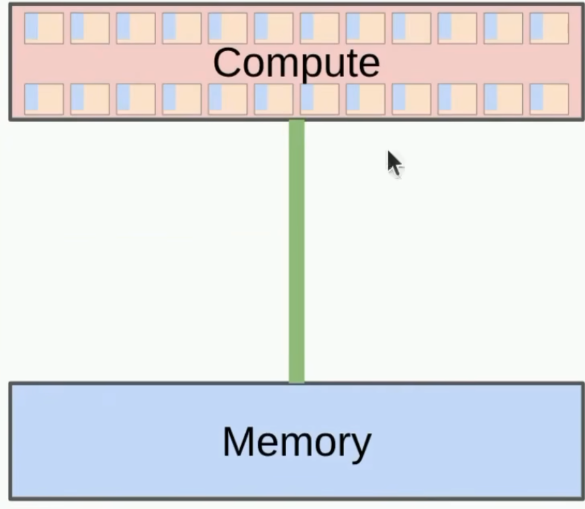
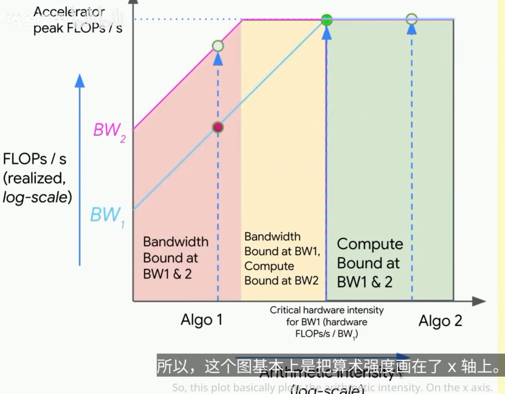
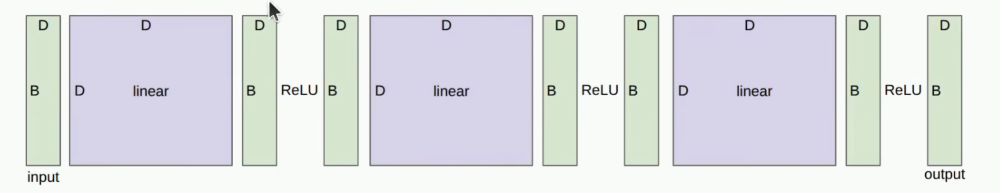

# Resource accounting

We need to understand the resources(compute memory) for a given computation.

example

**Question**: How long would it take to train a 70B parameter model on 15T tokens on 1024 B100s

```py
total_flops = 6 * 70e9 * 15e12
h100_flop_per_sec = 1979e12 / 2
mfu = 0.5 #mfu是模型的最大利用率
flops_per_day = h100_flop_per_sec * 1024 * 3600 * 24 * mfu
days = total_flops / flops_per_day
```

What Knowledge to take away:
- Mechanics: straightforward (PyTorch semantics)
- Mindset: resource accounting
- Intuitions: get a sense of how resources are spent, no ML magic today


# Tensors_basics

模型也是张量，不同的精度

张量包括向量和矩阵，可以拓展到任意维度

**float 32**: 32位浮点数，4字节

- 1 符号位
- 8 指数位
- 23 尾数位

float 32的精度对于机器学习来说已经很高了

```py
x = torch.zeros(4, 8)
assert x.dtype == torch.float32
assert x.numel() == 32
assert x.element_size() == 4 # float is 4 bytes
assert get_memory_size(x) == 128 # 32 * 4 = 128 bytes

# One matrix in the feedforward layer of GPT-3:
assert get_memory_usage(torch.empty(12288*4,12288)) == 2304 * 1024 * 1024 # 2.3 GB
```

**float 16**: 16位浮点数，2字节

- 1 符号位
- 5 指数位
- 10 尾数位

float 16没办法标识特别大和小的数值，容易溢出和下溢和NaN

**bfloat 16**: 16位浮点数，2字节
- 1 符号位
- 8 指数位
- 7 尾数位

总位数和fp16一样，但是bfloat16的指数位和fp32一样，所以可以表示更大的数值范围，适合训练大模型

分辨率差了。  但这种取舍是值得的。

现在普遍用的是混合精度训练
- bf16 用于参数激活值和梯度
- fp32 用于 optimizer states

**fp8**: 8位浮点数，1字节
有两个版本
FP8 E4 M3
FP8 E5 M2

**fp4** 2025 Nvidia

Use a separate scale factor per block
values: -6 -4 -3 -2 -1.5 -1.0 -0.5 0.0 0.5 1.0 1.5 2 3 4 6

对数值进行缩放

**Tensor on GPU**: GPU的显存是有限的，通常在8GB-80GB之间


# einops

einops是一个用于张量重排的库，提供了更直观的语法来操作张量。

带有良好索引管理的库

eg
```py

x = torch.ones(3, 4)
y = torch.ones(4, 3)

# old way
z = x @ y # seq1 seq2

# new (einops) way
z = einsum(x , y, "seq1 hidden , hidden seq2 -> seq1 seq2")
```

这里人为给每个维度起了名字
```
x.shape = (3, 4)
           ↑  ↑
         seq1 hidden

y.shape = (4, 3)
           ↑  ↑
         hidden seq2
z.shape = (3, 3)
           ↑  ↑
         seq1 seq2
``` 

**einsum 的核心阅读规则** : 出现在输入中、但没有出现在输出中的维度，会被求和消去。

```py

# 例如

einsum(x,"batch seq hidden -> batch seq") # hidden维度被求和消去

einsum(x,"batch seq hidden -> batch hidden seq") # 转置

# Attention的例子

q.shape = (batch, head, query_seq, head_dim)
k.shape = (batch, head, key_seq, head_dim)

scores = einsum(
    q,
    k,
    "batch head query head_dim, batch head key head_dim"
    " -> batch head query key",
)
```

**einops_reduce**

```py

x = torch.ones(2, 3, 4)

# old way
y = x.sum(dim=1) # shape: (2, 4)

# new (einops) way

y = reduce(x, "... hidden -> ...", "sum") # shape: (2, 4)
```

**einops_rearrange**

```py

x = torch.ones(3,8) #seq total_hidden

w = torch.ones(4,4) #hidden1 hidden2

# break up total_hidden into two hidden dimensions
x = rearrange(x, "... (heads hidden1) -> ... heads hidden1", heads=2) # shape: (3, 2, 4 )

x = einsum(x, w, "... hidden1 , hidden1 hidden2 -> ... hidden2") # shape: (3, 2, 4)

x = rearrange(x, "... heads hidden2 -> ... (heads hidden2)") # shape: (3, 8)
```

# Tensor_operations_flops

A floating-point operation (FLOP) is a basic operation like addition (x + y) or multiplication (x * y) 

- FLOPs
- FLOP/s

**Linear Model**

- we have n points
- Each point is d-dimensional
- The linear model maps each d-dimensional vector to a k outputs

```py

if torch.cuda.is_available():
    B = 16384 # number of points
    D = 32768 # dimension of each point
    K = 8192 # number of outputs
else:
    B = 1024
    D = 256
    K = 64


x = torch.ones(B, D, device=cuda_if_available())
w = torch.ones(D, K, device=cuda_if_available())

y = x @ w # shape: (B, K)

actual_num_flops = 2 * B * D * K # 2 for multiply and add
```

**FLOPs of other operations**
- Elementwise operations: 1 FLOP per element
- Addition of two mxn matrices: 2 * m * n FLOPs

但是一般都是只看矩阵乘法的开销，这是最主要的

Interpretation
- B is the number of data points
- (D K) is the number of parameters
- FLOPs for forward pass is 2 (#tokens) * (#params)

GPU 计时一般得调用
```py
torch.cuda.synchronize()
```
因为GPU是异步的，调用这个函数可以确保所有的GPU操作都完成了。
操作完也得调用一次


**Model Flops Utilization (MFU)**

Definition: (actual flops) / (promised flops)
为什么只能得到50%的MFU? 后面讲内存再说


# Arithmetic intensity



1. Send inputs from memory to accelerator
2. Perform computation
3. Send outputs from accelerator to memory

How long does this take?

Depends on:
1. Accelerator speed (FLOP/s)
2. Memory bandwidth (bytes/s)

```py
def arithmetic_intensity_relu():
    n = 1024 * 1024
    x = torch.ones(n, dtype = torch.bfloat16, device = cuda_if_available())
    y = torch.relu(x)

    bytes = (2*n) + (2 * n) # read x write y (bf16 is 2 bytes/float)
    flops = n # n comparisons

    communication_time = bytes / h100_bytes_per_sec
    computation_time = flops / h100_flop_per_sec

    # 假设可以重叠
    total_time = max(communication_time, computation_time)
```

Arithmetic intensity = flops / bytes  (how much actual work per byte for this workload) 

- Memory bound: arithmetic intensity < accelerator intensity
- Compute bound: arithmetic intensity > accelerator intensity

提升算数强度的方法

例如把 y变成 `y = F.gelu(x) ` , 算术强度会提高，但是瓶颈还是在内存上


```py

def arithmetic_intensity_dot_product():
    n = 1024
    x = torch.ones(n, dtype = torch.bfloat16, device = cuda_if_available())
    w = torch.ones(n, dtype = torch.bfloat16, device = cuda_if_available())
    y = x @ w

    bytes = (2*n) + (2 * n) + 2 # read x write y (bf16 is 2 bytes/float)
    flops = 2*n - 1 # n multiplications and n - 1 additions

    arithmetic_intensity = flops / bytes # ~ 1/2
```

```py
def arithmetic_intensity_matrix_vector_product():
    n = 1024
    x = torch.ones(n, dtype = torch.bfloat16, device = cuda_if_available())
    w = torch.ones(n, n, dtype = torch.bfloat16, device = cuda_if_available())
    y = w @ x

    bytes = (2*n*n) + (2 * n) + (2 * n) # read x write y (bf16 is 2 bytes/float)
    flops = 2*n*n - n # n multiplications and n - 1 additions

    arithmetic_intensity = flops / bytes # ~ 1
```

```py

def arithmetic_intensity_matmul():
    n = 1024
    x = torch.ones(n, n, dtype = torch.bfloat16, device = cuda_if_available())
    w = torch.ones(n, n, dtype = torch.bfloat16, device = cuda_if_available())
    y = x @ w

    bytes = (2*n*n) + (2 * n*n) + (2 * n*n) # read x read w write y (bf16 is 2 bytes/float)
    flops = n*n*(2 * n - 1) # n multiplications and n - 1 additions

    arithmetic_intensity = flops / bytes # 341   ~n/3
```

到了矩阵乘法一般就到了 compute bound了，算术强度大于加速器强度了

所以回到MFU，意思就是如果内存瓶颈限制，MFU大概率会降低。

**roofline plots(屋顶线图)**



ReLu、点积一般就是强度低，矩阵乘法比较高。


# 内存和计算



这个地方展示了一个BxD 的矩阵走了多层Linear乘法，多次ReLU

```py

# Define the network

D = 8 # Dimensionality of input activations and output
L = 3 # Number of layers
model = DeepNetwork(dim = D , num_layers = L).to(cuda_if_available())

num_parameters = get_num_parameters(model)
assert num_parameters == D * D * L # 3 layers of D x D matrices


class DeepNetwork(nn.Module):
    def __init__(self, dim, num_layers):
        super().__init__()
        self.layers = nn.ModuleList([Block(dim) for _ in range(num_layers)])
        self.relu = nn.ReLU()

    def forward(self, x):
        for layer in self.layers:
            x = layer(x)
        return x

class Block(nn.Module):
    def __init__(self, dim):
        super().__init__()
        self.weight = nn.Parameter(torch.randn(dim, dim))/np.sqrt(dim)

    def forward(self, x):
        x = self.linear(x)
        x = self.relu(x)
        return x
```

**梯度**

```py

x = torch.tensor([1.,2,3])
w = torch.tensor([1.,1,1], requires_grad=True) # want gradient

pred_y = x @ w
loss = 0.5 * (pred_y - 5).pow(2)

# Backward pass:compute gradients

loss.backward()

assert loss.grad is None
assert pred_y.grad is None
assert x.grad is None
assert torch.equal(w.grad, torch.tensor([1.,2,3]) ) # dloss/dw = x * (pred_y - 5)
```

计算梯度需要多少浮点运算？

```py

B = 1024
D = 256

x = torch.ones(B, D, device=cuda_if_available())
w1 = torch.randn(D, D, device=cuda_if_available(), requires_grad=True)
w2 = torch.randn(D, D, device=cuda_if_available(), requires_grad=True)

# forward pass
h1 = einsum(x, w1, "batch in , in out -> batch out")
h2 = einsum(h1, w2, "batch in , in out -> batch out")
loss = (h2.mean() - 0)**2

# backward pass
h1.retain_grad() # retain h1's gradient for inspection
h2.retain_grad() # retain h2's gradient for inspection
loss.backward()

```

**Forward pass** : 2*B*D*D

**Backward pass** : 
- h1.grad = d loss / d h1
- w2.grad = d loss / d w2

num_backward_flops = (2* B * D * D)+ (2* B * D * D)

Note that backward pass is roughly twice as expensive as forward pass. This is a general rule of thumb for neural networks.


**Consider all layers**:

- Forward pass : 2 (# data points)(# parameters)
- Backward pass : 4 (# data points)(# parameters)
- Total: 6 (# data points)(# parameters)

# Optimizer

在adagrad里面我们算的是梯度的平方的均值做除法

这个后面得写，这里就不展开了

**Memory**:

parameter_memory = 2 * D * D * L # 2 bytes for bf16

activation_memory = 2 * B * D * L # 2 bytes for bf16

gradient_memory = 2 * parameter_memory # 2 bytes for bf16


**optimizer_states**:

optimizer_state_memory = 4 * parameter_memory # 4 bytes for fp32


# 一些别的

梯度累计:

在多个批次上面累计梯度，节省算力

推理的时候不用计算梯度

前向传播的时候只保留一些值，反向传播的时候只补算一些值

# Summary

- Everything is operations on tensors
- einops: better way to think about tensor operations
- 6(#data points)(# parameters)FLOPs per training
- Arithmetic intensity / roofline analysis
- Matrix multiplications are compute-bound,elementwise operations are memory-bound
- Gradient accumulation, activation checkpointing: reduce memory to use bigger batch size

