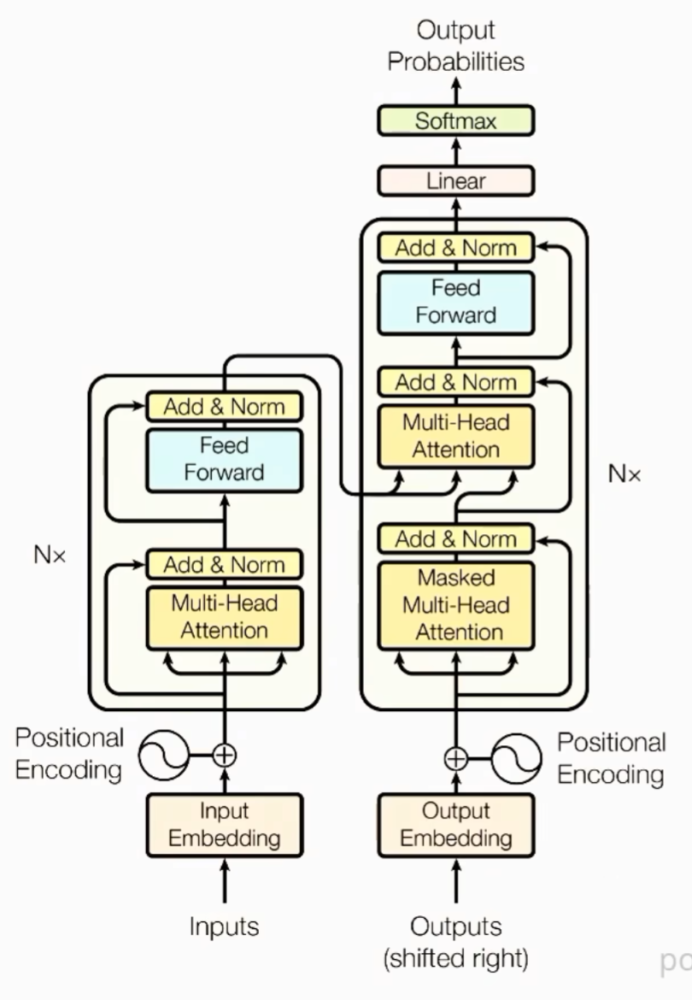
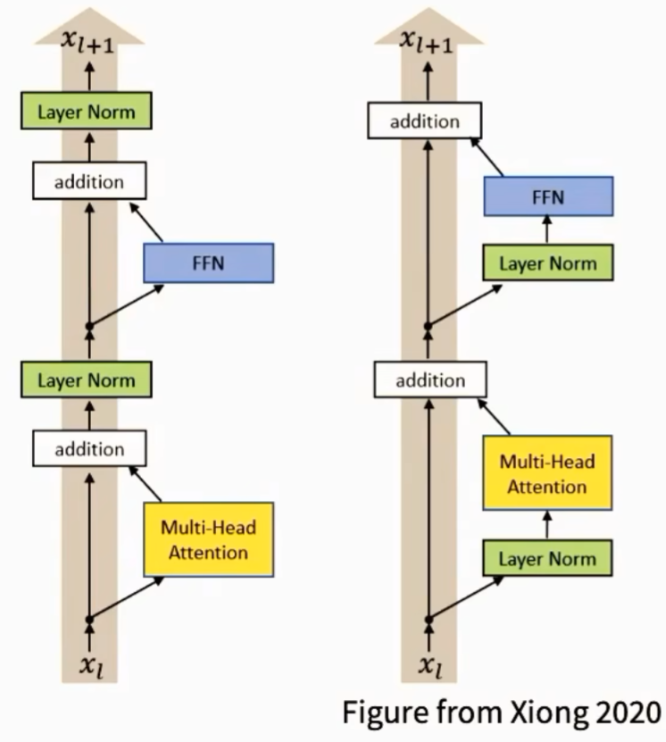

# Starting point: "The original" transformer



**Review**: Choices in the standard transformer

**Position embedding**: sines and cosines

$$ PE_{(pos,2i)} = sin(pos/10000^{2i/d_{model}}) $$
$$ PE_{(pos,2i+1)} = cos(pos/10000^{2i/d_{model}}) $$

**FFN**: ReLU

$$ FFN(x) = max(0, xW_1 + b_1)W_2 + b_2 $$

**Norm type**: post-norm,LayerNorm

**Difference**:

作业要求略有不同
- LayerNorm的位置不同，原始Transformer是post-norm，而作业要求是pre-norm
- Rotary position embeddings (RoPE) 
- FF layers use SwiGLU
- Linear layers have no bias terms

# Architecture variations...

llama 2的出现让人们趋之若鹜

# Pre-vs Post norm


Post Norm容易导致梯度消失，尤其是当网络很深时。Pre Norm可以缓解这个问题。

大家已经普遍同意把layernorm移除出残差流

# RMSNorm
RMSNorm是另一种归一化方法，它使用均方根来进行归一化，而不是使用均值和方差。RMSNorm的公式如下：

$$ RMSNorm(x) = \frac{x}{\sqrt{\frac{1}{n} \sum_{i=1}^{n} x_i^2 + \epsilon}} $$

# Gated variants of standard FF layers

GeGLU

SwiGLU (swish is x * sigmoid(x))

# RoPE: rotary position embeddings

嵌入向量进行旋转，旋转角度与位置相关。旋转的角度是根据位置编码计算出来的。

# Output softmax stability - the 'z-loss'

# Attention softmax stability - the 'QK norm'

# Attention heads


---

# 课程讲的过度泛泛而谈，所以我在这里总结一下，方便复习


# Decoder-only Transformer

Decoder-only 的输入是 token ID:  

```py
token_ids: (B,T) # B: batch size, T: sequence length
```

Embedding 将每个整数ID替换成一个长度为D的向量

```py
(B, T) 
-> Embedding: (B, T, D) # B: batch size, T: sequence length, D: embedding dimension
```

然后经过 L 个 Transformer block
```py
x0 = TokenEmbedding(token_ids) # (B, T, D)

x1 = Block1(x0) # (B, T, D)
x2 = Block2(x1) # (B, T, D)
...
xL = BlockL(x_{L-1}) # (B, T, D)
```

最后
```
(B, T, D)
-> Final RMSNorm
-> LM Head
-> (B, T, V) # V: vocabulary size
```
输出中的 `logits[b, t, :]` 是预测下一个 token 的概率分布。

**一个block内部发生什么**:

u = x + Attention(RMSNorm(x)) # (B, T, D)
y = u + SwiGLU(RMSNorm(u)) # (B, T, D)

- RMSNorm: 控制进入子层的尺度
- Attention: 不同Token之间交换信息
- SwiGLU: 每个token 独立的变换内部特征
- Residual connection: 保留原有信息，并叠加子层产生的更新
- RoPE: 加入token的位置信息

# Residual stream , 残差连接 和 Pre-norm

> Transformer不是把输入交给Attention,然后用Attention的输出完全替换输入

它更接近:

> 模型始终维护一条主干表示，Attention和MLP只负责像这条主干添加一些增量更新。

假设输入经过Embedding后

x ∈ R^{B×T×D}，其中B是batch size，T是sequence length，D是embedding dimension。

这个x就是残差流（residual stream），它会在每个block中被更新。

每个x都对应着一个D维向量

这个向量混合保存了模型目前对该token的各种信息
- token本身的语义
- 前面token的上下文信息
- 位置信息
- 前几层计算出的特征
- 对后续有用的中间表示

一个attention子层可以写成

```py
u = x + Attention(RMSNorm(x)) # (B, T, D)
```

MLP也只是另外一个更新量

```py
y = u + MLP(RMSNorm(u)) # (B, T, D)
```

完整的block
```
x ───────────────────────────────┐
│                                │
└→ Norm → Attention ─────────────+→ u

u ───────────────────────────────┐
│                                │
└→ Norm → MLP ───────────────────+→ y
```

- Attention：从其他 token 收集信息；
- MLP：对当前 token 已经拥有的信息做非线性加工；
- residual stream：保存和累积这些更新。

**残差链接**保留原始信息，可以让一层不一定要完全覆盖上一层的表示，模型可以选择只学习一个小的增量更新。甚至可以选择不更新，直接把上一层的表示传递下去。

**Pre-norm**的作用是让进入子层的表示保持在一个合理的尺度上，避免梯度消失或爆炸。
```py
x = x + attention(norm1(x))
x = x + mlp(norm2(x))
```
**Post-norm**

```py

x = norm1(x + attention(x))
x = norm2(x + mlp(x))
```
这是较为原始的transformer做法

现代LLM常用Pre-Norm

归一化只限制进入子层的输入，不会切断residual stream本身

**代码示例**

```py
def transformer_block(x):
    attn_update = attention(norm1(x))

    x = x + attn_update

    mlp_update = mlp(norm2(x))
    x = x + mlp_update

    return x
```

# RMSNorm

1. 为什么需要RMSNorm？

正如我们前面看到的代码
```py
x = x + attention_update
x = x + mlp_update
```

x会被无限制地累积更新，随着网络深度的增加，x的尺度可能会变得非常大。

所以在子层读取residual stream之前，先把向量缩放到相对稳定的尺度
```py
normalized_x = rms_norm(x)
update = attention(normalized_x)
x = x + update
```
2. RMS 是什么

对一个D维向量

$$ x = (x_1, x_2, ..., x_D) $$

它的root mean square (RMS) 定义为

$$ RMS(x) = \sqrt{\frac{1}{D} \sum_{i=1}^{D} x_i^2} $$

然后用它来缩放向量

$$ \hat{x}_i = \frac{x}{RMS(x)} $$

最后乘以一个可学习的缩放参数g

$$ RMSNorm(x) = g * \frac{x}{\sqrt{mean(x^2) + \epsilon}} $$

3. Tensor shape如何变化

输入
```py
x.shape = (batch, seq , d_model)
```

RMSNorm要对每个token的d_model维度进行归一化，所以输出shape不变

```py
x.pow(2).mean*(dim=-1, keepdim=True) # (batch, seq, 1)
```

代码:
```py
import torch

def rms_normalize(x:torch.Tensor, eps:float= 1e-5) -> torch.Tensor:
    squared_values = x.pow(2)

    mean_square = squared_values.mean(
      dim = -1,
      keepdim = True
    )

    rms = torch.sqrt(mean_square + eps)

    normalized_x = x / rms
    return normalized_x
```

用类的结构看
```py
class RMSNorm(torch.nn.Module):
    def __init__(self, d_model: int, eps: float = 1e-5):
        super().__init__()

        self.eps = eps

        # 一个长度为 d_model 的可学习参数。
        self.weight = torch.nn.Parameter(
            torch.ones(d_model)
        )

    def forward(self, x: torch.Tensor) -> torch.Tensor:
        # 1. 沿最后一维计算 mean(x^2)
        # 2. 加 eps 后开根号
        # 3. 用 x 除以 RMS
        # 4. 乘以 self.weight
        ...
```

此处常常转换为fp32去计算

计算的时候大概在Transformer block中是这么写的

```py

def forward(self, x):
  normalized_x = self.attn_norm(x)
  attn_update = self.attention(normalized_x)
  x = x + attn_update

  normalized_x = self.mlp_norm(x)
  mlp_update = self.mlp(normalized_x)
  x = x + mlp_update

  return x

```

# SwiGLU forward

普通的前馈网络MLP通常先升维，再降维

```
(B, T, 512)
-> Linear: (B, T, 2048)
-> ReLU: (B, T, 2048)
-> Linear: (B, T, 512)
```

最后必须得降维回去，否则残差流的维度就不匹配了。

**GLU:门控线性单元**
普通MLP只有一条升维分支

GLU引入了两条分支:

$$ a = W_{gate}x $$
$$ b = W_{up}x $$

然后逐个元素相乘

SwiGLU使用的激活函数是Swish，SiLU

$$ SiLU(z) = z * sigmoid(z) $$

$$ sigmoid(z) = \frac{1}{1 + e^{-z}} $$

$$ SwiGLU(x) = W_{down}(SiLU(W_{gate}x) * W_{up}x) $$

**Shape流动**

假设 x.shape = (B, T, D)
三组权重分别

```
w_gate D-> F
w_up D-> F
w_down F-> D
```

则
```
x (B, T, D)

gate = W_gate(x) (B, T, F)
up = W_up(x) (B, T, F)

SiLU(gate) (B, T, F)
SiLU(gate) * up (B, T, F)

down = W_down(SiLU(gate) * up) (B, T, D)
```

写法:
```py

import torch
import torch.nn as nn
import torch.nn.functional as F

class SwiGLU(nn.Module):
    def __init__(self, d_model: int, d_ff: int):
        super().__init__()
        self.gate_proj = nn.Linear(
            d_model,
            d_ff,
            bias=False
        )

        self.up_proj = nn.Linear(
            d_model,
            d_ff,
            bias=False
        )

        self.down_proj = nn.Linear(
            d_ff,
            d_model,
            bias=False
        )

    def forward(self, x: torch.Tensor) -> torch.Tensor:
        gate = self.gate_proj(x)
        up = self.up_proj(x)

        hidden = F.silu(gate) * up
        output = self.down_proj(hidden)

        return output
```

其中swiglu大概是
```py

def swiglu(
  x: torch.Tensor,
  w_gate: torch.Tensor,
  w_up: torch.Tensor,
  w_down: torch.Tensor
) -> torch.Tensor:
    gate = x @ w_gate
    up = x @ w_up

    hidden = F.silu(gate) * up
    output = hidden @ w_down
    return output
```

所以我们的Transformer就变成了:

```py

def forward(self, x):
  # Attention 子层

  attn_input = self.attn_norm(x)
  attn_update = self.attention(attn_input)
  x = x + attn_update

  # swiGLU 子层
  ffn_input = self.ffn_norm(x)
  ffn_update = self.swiGLU(ffn_input)
  x = x + ffn_update

  return x
```


# Scaled dot product attention

假设 residual stream
```py
x.shape = (B, T, D)
```
那么通过三个线性层得到Q,K,V

```py
q = q_proj(x) # (B, T, d_k)
k = k_proj(x) # (B, T, d_k)
v = v_proj(x) # (B, T, d_v)
```
通常单头 d_k = d_v = D

**QK 相似度**

对于第i个query token 和 第 j个token

S = QK^T

```py

scores = einsum(
    q,
    k,
    "batch query d_k , batch key d_k -> batch query key"
)

# 沿着d_k求和,等价于
scores = q @ k.transpose(-2, -1) # (B, T, T)
```

通常通过除以sqrt(d_k)来缩放

```py
scores = scores / sqrt(q.shape[-1])
```

**Causal Mask**

```py
mask = torch.tensor(
  [
    [True, False, False, False],
    [True, True, False, False],
    [True, True, True, False],
    [True, True, True, True],
  ]
)

mask = torch.tril(
  torch.ones(T, T, dtype=torch.bool)
)
```
`mask[i, j] == True` 表示第 i 个 token 可以看到第 j 个 token。

**mask如何应用**: 常见方式是把score替换成负无穷

```py
scores = scores.masked_fill(
    ~mask,
    float("-inf")
)
```

然后softmax把分数变成概率权重

```py

attention_weights = torch.softmax(
    scores,
    dim = -1,
)
```

用权重加权 value

得到attention weights 后

O = AV

```py
output = einsum(
    attention_weights,
    v,
    "batch query key , batch key d_v -> batch query d_v"
)

output = attention_weights @ v # (B, T, d_v)
```


Pytorch实现

```py

import math

import torch
from einops import einsum

def scaled_dot_product_attention(
    q: torch.Tensor,
    k: torch.Tensor,
    v: torch.Tensor,
    mask: torch.Tensor | None = None,
) -> torch.Tensor:
    """
    q: (..., query_length, d_k)
    k: (..., key_length, d_k)
    v: (..., key_length, d_v)

    mask： 可广播到(..., query_length, key_length)
    """

    d_k = q.shape[-1]

    scores = einsum(
        q,
        k,
        "... query d_k , ... key d_k -> ... query key"
    )
    scores = scores / math.sqrt(d_k)

    if mask is not None:
        scores = scores.masked_fill(
            ~mask,
            float("-inf")
        )

    attention_weights = torch.softmax(
        scores,
        dim = -1,
    )

    output = einsum(
        attention_weights,
        v,
        "... query key , ... key d_v -> ... query d_v"
    )
    return output
```
这样的实现可以支持多头注意力机制，只需要在Q,K,V的shape中加入head维度即可。

**Self-attention** 的完整输入输出

从 residual stream开始

```py

x.shape = (B, T, D)

q = q_proj(x) # (B, T, d_k)
k = k_proj(x) # (B, T, d_k)
v = v_proj(x) # (B, T, d_v)

attn_output = scaled_dot_product_attention(
    q,
    k,
    v,
    mask = causal_mask
) # (B, T, d_v)

output = output_proj(attn_output) # (B, T, D)

x = x + output # (B, T, D)
```

计算量主要在 QK^T 和 AV上面

einsum的写法可以让我们给每个维度起名字，方便理解
**右边定性，消失求和，如果哪个消失了就是沿着谁求和**

**同名维度要对齐**

**口诀3 Attention 就记两种矩阵模板**:

- 模板A: 和转置矩阵相乘
```
... m d , ... n d -> ... m n
```

含义
```
A @ B.transpose(-2, -1)
```

Q@K^T 就是这个模板

```
... m n , ... n d -> ... m d
```

A @ B -> 含义

# Multi-head attention

```py

x.shape == (B, T, D)
```

**第一步: 一次性生成全部 head QKV**
```py

q = q_proj(x) # (B, T, H * d_k)
k = k_proj(x) # (B, T, H * d_k)
v = v_proj(x) # (B, T, H * d_v)
```

虽然shape 还是 `(B,T,D)`, 但是最后一维内部包含:

```
H 个 head x 每个 head 的 d 个维度
```

**第二步: 拆成多个head**
```py

from einops import rearrange

q = rearrange(
    q,
    "batch seq (head d_k) -> batch head seq head_dim",
    heads = num_heads,
)

k = rearrange(
    k,
    "batch seq (head d_k) -> batch head seq head_dim",
    heads = num_heads,
)

v = rearrange(
    v,
    "batch seq (head d_v) -> batch head seq head_dim",
    heads = num_heads,
)
```

**第三步: 每个head独立做Attention**
```py

attn_output = scaled_dot_product_attention(
    q,
    k,
    v,
    mask = causal_mask
) # (B, H, T, d_v)
```
**第四步: 把heads 拼回去**
```py
attn_output = rearrange(
    attn_output,
    "batch heads seq head_dim -> batch seq (heads head_dim)",
)
```

**第五步: 输出投影**
```py
output = output_proj(attn_output) # (B, T, D)

x = x + output # (B, T, D)
```

**RoPE: 旋转位置编码**

> self-attention 本身只看 token位置，对 Q 和 K 的部分二维坐标做旋转


**完整Transformer block**

```py
class TransformerLM(nn.Module):
    def __init__(self, ...):
        super().__init__()

        self.token_embedding = Embedding(
            vocab_size,
            d_model,
        )

        self.blocks = nn.ModuleList(
            [
                TransformerBlock(...)
                for _ in range(num_layers)
            ]
        )

        self.final_norm = RMSNorm(d_model)

        self.lm_head = Linear(
            d_model,
            vocab_size,
        )

    def forward(self, token_ids):
        batch_size, seq_len = token_ids.shape

        positions = torch.arange(
            seq_len,
            device=token_ids.device,
        )

        mask = torch.tril(
            torch.ones(
                seq_len,
                seq_len,
                dtype=torch.bool,
                device=token_ids.device,
            )
        )

        x = self.token_embedding(token_ids)

        for block in self.blocks:
            x = block(
                x,
                positions=positions,
                mask=mask,
            )

        x = self.final_norm(x)
        logits = self.lm_head(x)

        return logits
```

