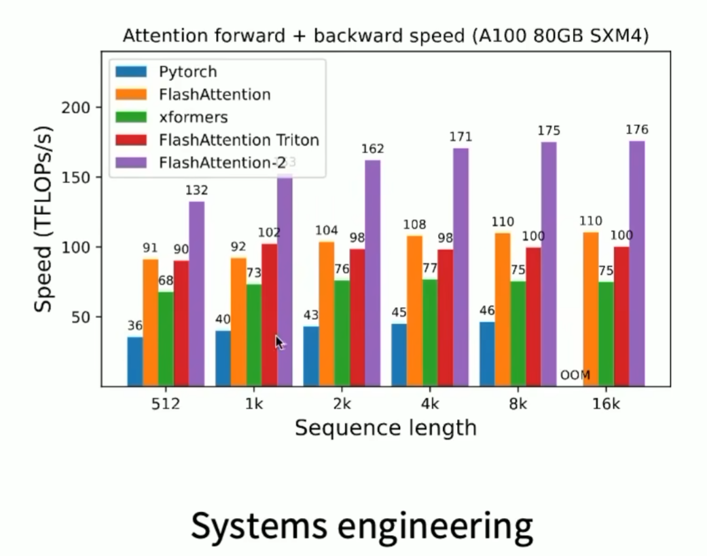
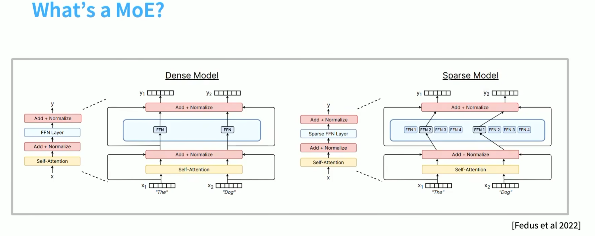

# Attention Alternatives and mistures of experts.

1. 线性注意力
2. MLP 混合专家

# Attention Alternatives

需要更长的context length, 但是注意力的计算复杂度是 O(n^2)，所以需要一些替代方案。

FlashAttention: 通过一些数学技巧，减少了注意力的计算复杂度。

## Linear Attention

Attn(Q,K,V) = ρ(QKT)V

经典的self-attention ↑

QKT 是一个 n x n 的矩阵，计算复杂度是 O(n^2)

但是如果我们调整一下

QKT V = Q KTV

通过结合律，先算KTV，改变了依赖关系

KTV 是一个 d x n 的矩阵，计算复杂度是 O(nd),而且我们可以类似RNN的串行形式

S_t = S_{t-1} + K_t V_t^T

e.g Minimax M1 , 7-to-1 hybrid attention. 

Mamba-2 对linear attention 做了拓展，加了一个γ稀疏

s_t = γ S_{t-1} + K_t V_t^T and y_t = qTSt + vTD

**Gated delta net**:

St = γ(I - βtktktT)St-1 + βtktvtT

yt = qT st  

β门控用于控制之前的信息多少被遗忘，γ门控用于控制之前的信息多少被保留。

## Sparse Attention

Sparse Attention 通过限制注意力机制中每个位置只关注一部分其他位置，从而减少计算复杂度。

# Mixtures of Experts (MoEs)

把大的ffn切成校的ffn，但是ffn大小不变，然后通过router选ffn

Why are MoEs getting popular?

Parrallelism: MoEs allow for parallel processing of different experts, which can lead to faster training and inference times.

moe目前只动了ffn部分，attention部分没有动。

- Token chooses expert
- Expert chooses token
- Global routing via optimization

主要用token选择expert

拿到token,router计算内积，和expert的embedding做内积，选出最相似的expert

- RL to learn routes
- Solve a matching problem

Deepseek MoE: shared experts.

**Heuristic balancing losses**

**load balancing** -> 启发式方法

训练moe会引入一些动态特性，需要通过负载均衡策略来确保各个专家的负载相对均匀。

