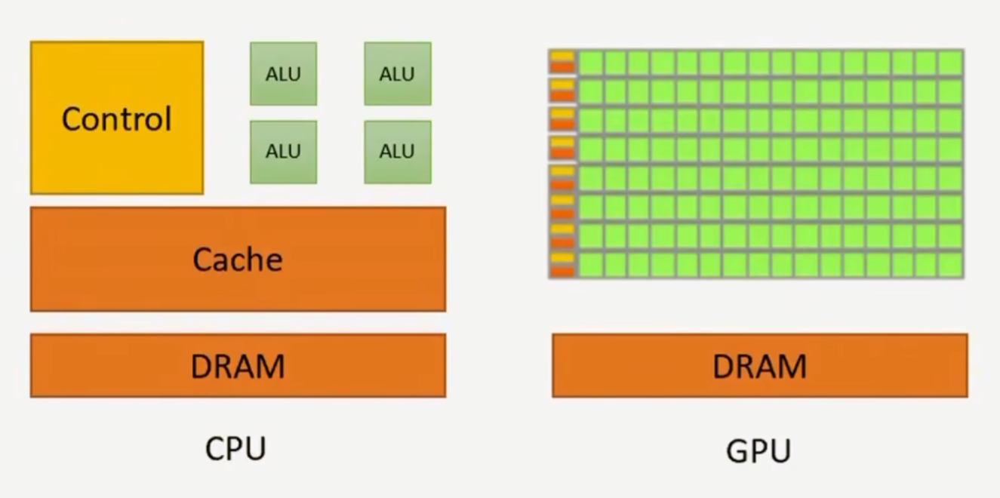
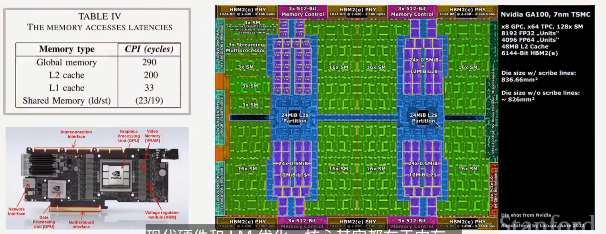
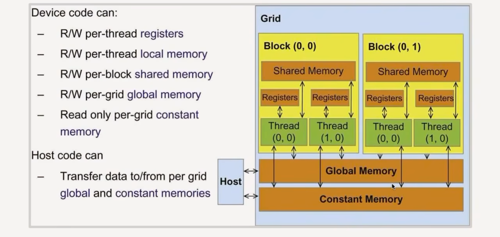
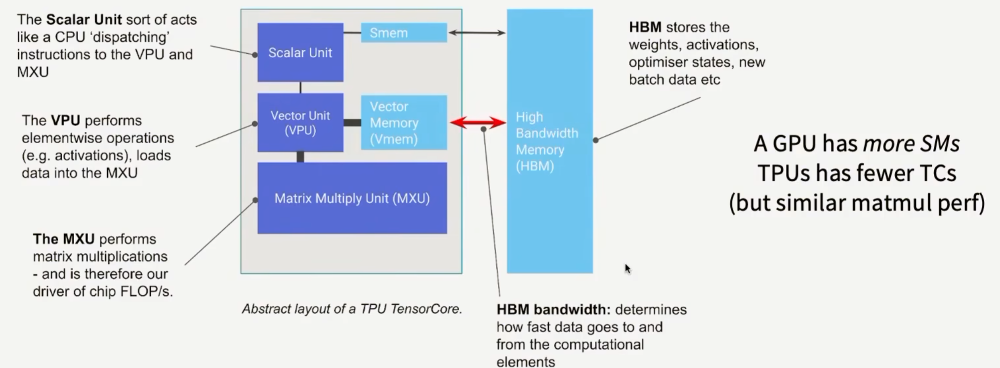
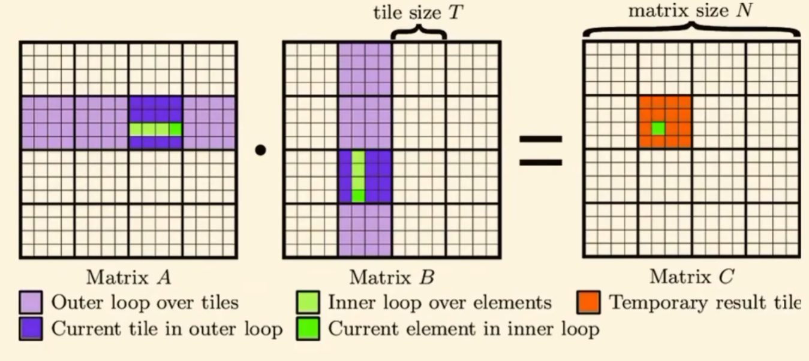
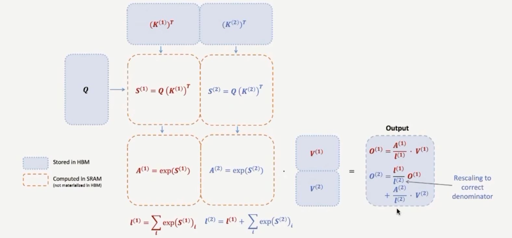

# Before we start

**Horace He's blog**
**CUDA Mode group**
**TPU and now GPU book**

## Parallel scaling continues.

GPU的算力增长推动了计算

2017- tensor

CPU 快速运算，少量 ALU

GPU的核心是吞吐量

**Anatomy of a GPU**:

SPs (streaming processors)

- Shared memory
- L1 cache
- L2 cache
- Global memory

There are 3 important players in the execution model

- Thread: Threads 'do the work' in parallel - all threads execute the same instructions but with different inputs (SIMT)
- Blocks: blocks are groups of threads. Each block runs on a SM w/ its own shared memory.
- Warp: Threads always execute in a 'warp' of 32 consecutively numberd threads each.

希望在线程之间共享数据，得使用共享内存

## TPU

GPU的概念大部分都能对应到TPU上面的概念

TPU靠的是少量大矩阵单元，而GPU靠的是大量小矩阵单元

# Part2: Making ML workloads fast on a GPU

**Control Divergence**: GPU的线程是SIMT的，所有线程执行同样的指令，如果有分支，GPU会把不同分支的线程分开执行，导致性能下降。

如果你不属于这个分支，你就得等着，直到所有线程都执行完毕。

**Trick 1:Low precision computation**: GPU的算力主要是吞吐量，低精度计算可以提高吞吐量。

缓解内存瓶颈

(Float 32 case)
- Memory access: 1 read, 1 write float32 = 4bytes per op
- Operation: 1 comparison op, 1 FLOP
- Intensity: 8 bytes / FLOP

(Float 16)
- Memory access: 1 read, 1 write float16 = 2bytes per op
- Operation: 1 comparison op, 1 FLOP
- Intensity: 4 bytes / FLOP

**Frontiers in low precision**:

FP8\MXFP8\ ...

**Trick2: Operation fusion**: GPU的吞吐量很高，但是内存带宽有限，GPU的瓶颈是内存带宽。

用一个单一的kernel来执行多个操作，减少内存访问次数。

**Trick3: recomputation**: 重计算

backward里面我们会往回走，直接用存好的中间结果来计算梯度，但是有些中间结果可能占用大量内存，GPU的内存是有限的。

把所有激活值全部扔掉，因为内存有限，重新计算梯度的时候再重新计算这些激活值，就不要了，再算一次

**Trick4: Memory coalescing and Dram**: Dram是GPU的内存，dram的访问是按行访问的，dram的带宽很高，但是延迟很高。

突发式读取。以块组织，读了一个块之后，dram会把这个块的后续数据也读进来，放在dram的cache里面。

合并访问，如果一个warp内的所有线程都位于一个突发传输内，那么就可以合并访问，充分利用

矩阵存储是行优先，假设我想要一列，我得读取完整个行，才能得到这一列的数据，浪费了很多带宽。所以可以把矩阵转置，存储的时候按列存储，这样就可以充分利用dram的带宽。

**Trick 5: tiling**:
分块，把大矩阵分成小块，每个小块可以放入GPU的共享内存中，减少对全局内存的访问次数。

合理的分块取值和配置可以让读取更好，速度更快

Flash attention: 分块计算，累计softmax，到下一个分块做同样的事情
