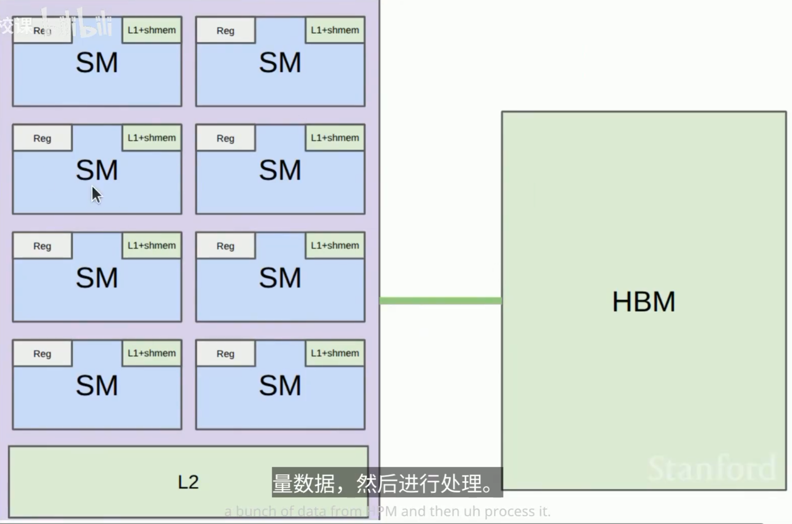
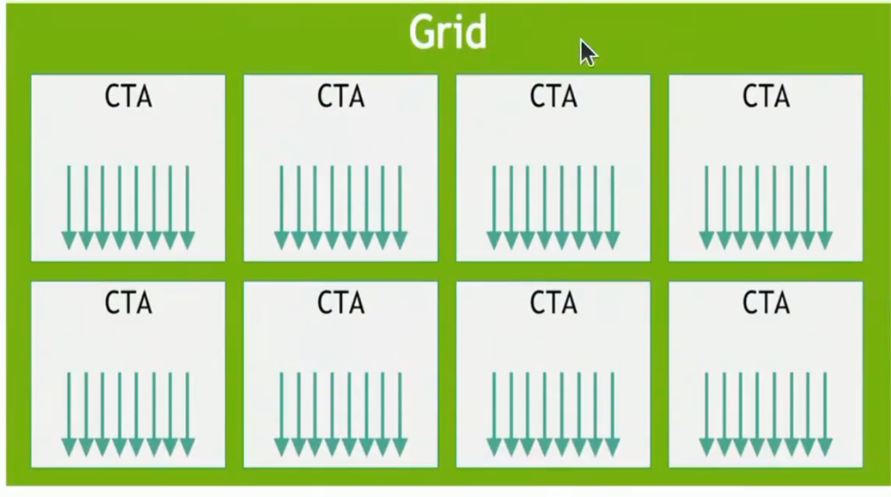
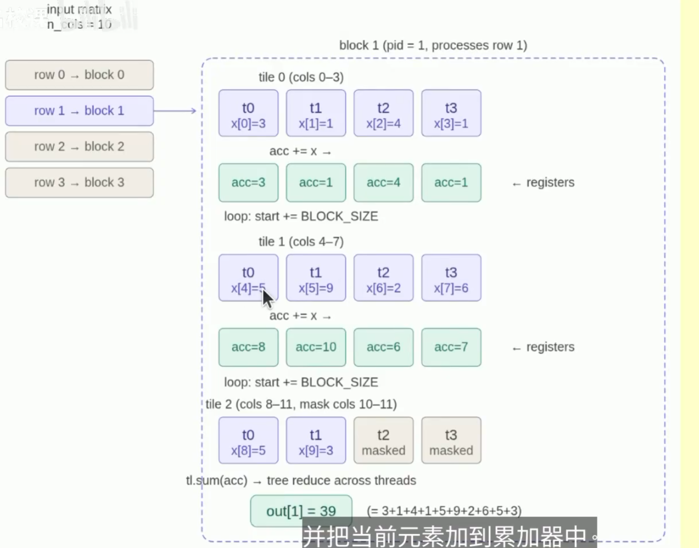

# 1.Overview -> 整体主要层级结构

Register   -> 256 KB
L1 cache + shared memory ->192~256 KB
L2 cache -> 40MB 50MB 96~126MB
HBM size -> 80GB  ~ 192GB

Register bandwidth -> 116~ 447 TB/s
L1 cache + shared memory bandwidth -> 19~33 TB/s
L2 cache bandwidth 5~12 TB/s
HBM bandwidth -> 2~8 TB/s



# Programming kernel
- Thread
- Thread block
- Grid : collection of thread blocks

Reading / writing from HBM is slow, so use shared memory

**Warps**:
- within a thread block, threads are grouped into warps (32 threads per warp).
- Example: thread block has 64 threads => it has 2 warps
- ALL threads within a warp must execute same instructions in lockstep on an SM
- Control divergence : if different threads in a warp need to execute different instructions (IF A,ELSE B), must be done sequencially.

| AAAA ............|
| .....BBBBBBBBBBBB|
- sm runs multiple warps and switches between them(e.g. , when one warp is blocked on HBM reads/writes) with zero cost. # sm -> 流式处理器

**(Warp) occupancy**:
- Each thread can use between 0 and 255 registers.
- The more registers threads use, the fewer threads can be scheduled on an SM
- Low occupancy isn't necessaryily bad if each thread is doing more work.
- Example: thread coarsening
- Example: thread block has 64 threads, each using 160 registers, SM has 65536 registers.


**Bank conflicts**:

**Memory coalescing**: 内存合并
按照块一起拿
- B200 has 148 SMs, if we launch 160 thread blocks, first wave has 148 blocks, second wave has 12 blocks.

- Wave quantization problem: last wave has fewer thread blocks, leaving some SMs idel.

- Make number of thread blocks Divide # SMs

# Benchmarking_and_profiling

1. Benchmark and profile your code
2. Make changes
3. Benchmark and profile your code again.

计时代码示例

```py

for _ in range(num_warmups):
    run()
torch.cuda.synchronize()

times: list[float] = []

for trial in range(num_trails):
    # use CUDA events for accurate GPU timing (avoid capturing CPU overhead)
    start_event = torch.cuda.Event(enable_timing = True)
    end_event = torch.cuda.Event(enable_timing = True)

    start_event.record()
    run()
    end_event.record()

    torch.cuda.synchronize()  # wait for the events to be recorded!
    times.append(start_event.elapsed_time(end_event))  # milliseconds
```

PyTorch的compile方法

一个对比

```py
compiled_gelu = torch.compile(gelu, backend="inductor", mode="max-autotune")

#benchmarking
naive_time = benchmark(run_operation(dim = 16384, operation = naive_gelu)) # 3.75
builtin_time = benchmark(run_operation(dim = 16384, operation = builtin_gelu)) # 0.66
compiled_time = benchmark(run_operation(dim = 16384, operation = compiled_gelu)) # 0.93
```

Notes:
- Naive implementation: multiple kernels, requires many reads/ writes from/to HBM (no fusion)
- Builtin and compiled versions: one kernel(kernel fusion), one read from HBM, one write to HBM
- The compiled kernel is a Triton kernel

# Triton
回忆： Thread -> Thread block -> Grid

In CUDA,specify what each thread does
- Pros:fine-grained control over how threads are mapped to data
- Cons: need to manage more things

In Triton
- Generally powerful enough
- Conceptual framework: load data into shared memory , operate on it , write back to global memory.

写法

```py

def triton_gelu(x: torch.Tensor):

    assert x.is_cuda
    assert x.is_contiguous()

    y = torch.empty_like(x)

    # Determine Grid

    num_elements = x.numel()
    BLOCK_SIZE = 1024
    num_blocks = triton.cdiv(num_elements, BLOCK_SIZE)

    # launch kernel
    kernel = triton_gelu_kernel[(num_blocks,)](x, y, num_elements,BLOCK_SIZE = BLOCK_SIZE)

    # Write out PTX (look at this later)
    output_ptx("triton_gelu.ptx", kernel)

    return y
```
```py

def triton_gelu_kernel(
    x_ptr,
    y_ptr,
    num_elements,
    BLOCK_SIZE: tl.constexpr
):

  pid = tl.program_id(axis=0)
  start = pid * BLOCK_SIZE

  offsets = start + tl.arange(0, BLOCK_SIZE)

  mask = offsets < num_elements

  x = tl.load(x_ptr + offsets, mask=mask, other=0.0)

  a = 0.79788456 * (x + 0.044715 * x * x * x)
  exp = tl.exp(2*a)
  tanh = (exp - 1) / (exp + 1)
  y = 0.5 * x * (1 + tanh)

  tl.store(y_ptr + offsets, y, mask=mask)
```

# PTX

GPU的中间汇编语言

r -> 整数寄存器
f -> 浮点寄存器

# Triton kernel

让每一行作为一个线程块，block之间互不交互

eg. softmaxkernel

```py

@triton.jit
def triton_softmax_kernel(
    x_ptr,
    y_ptr,
    x_row_stride: tl.constexpr,
    y_row_stride: tl.constexpr,
    num_cols,
    BLOCK_SIZE: tl.constexpr
):

  assert num_cols <= BLOCK_SIZE, "num_cols must be <= BLOCK_SIZE"

  row_idx = tl.program_id(axis=0)
  col_offsets = tl.arange(0, BLOCK_SIZE)

  x_start_ptr = x_ptr + row_idx * x_row_stride
  x_ptrs = x_start_ptr + col_offsets
  x_row = tl.load(x_ptrs, mask=col_offsets < num_cols, other=-float('inf'))

  # Compute
  x_row = x_row - tl.max(x_row, axis=0)
  numerator = tl.exp(x_row)
  denominator = tl.sum(numerator, axis=0)
  y_row = numerator / denominator

  # Write back to global memory
  y_start_ptr = y_ptr + row_idx * y_row_stride
  y_ptrs = y_start_ptr + col_offsets
  tl.store(y_ptrs, y_row, mask=col_offsets < num_cols)
```



行求和

```py

@triton.jit
def row_sum_kernel(
  x_ptr,
  out_ptr,
  N,
  BLOCK_SIZE: tl.constexpr
):

  row = tl.program_id(axis=0)# which row to compute

  # accumulator for each thread

  acc = tl.zeros([BLOCK_SIZE,], dtype=tl.float32)

  # loop over tiles
  for start in range(0, N, BLOCK_SIZE):
    cols = start + tl.arange(0, BLOCK_SIZE)
    mask = cols < N
    x = tl.load(x_ptr + row * N + cols, mask=mask, other=0.0)
    acc += x
  
  # Final reduction from BLOCK_SIZE to a scalar
  result = tl.sum(acc, axis=0)

  tl.store(out_ptr + row, result)
```

索引处理很麻烦。分块计算的话。

Summary
- Know the programming model to give you correctness
- Understand the hardware
- Benchmark to understand scaling
- Profile to see what's being executed for how long
- Triton: think in term of thread blocks
- Examples: GeLU, softmax, row sum , matmul