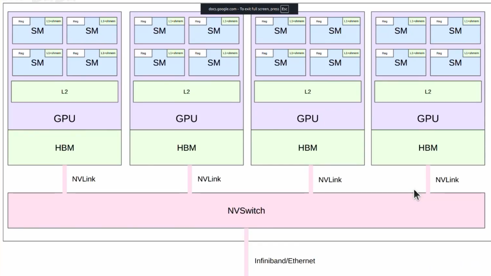
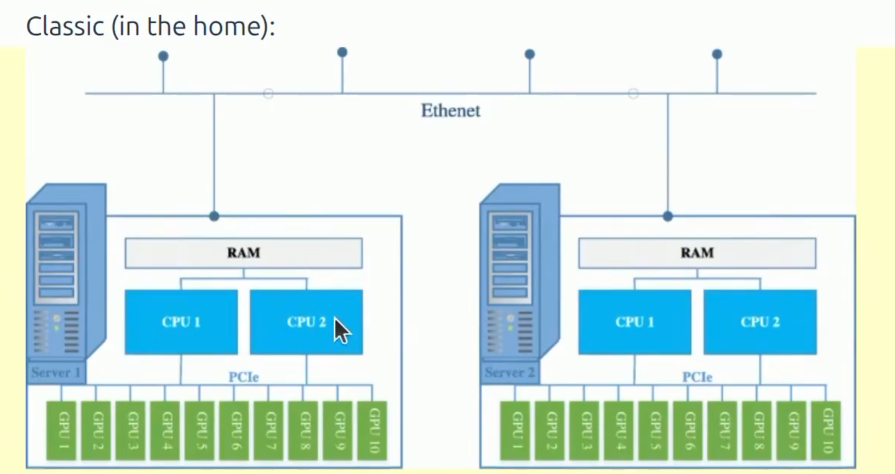

Last week: parallelism within a single GPU
This week: parallelism across multiple GPUs



Core: 编排计算，减少通信开销，充分利用硬件资源

- Single node: L1 cache / shared memory
- Single node single GPU HBM
- single node multi-GPU NVLink / NVSwitch
- Multi-node, multi-GPU: Infiniband / Ethernet(slowest)


Why do multi GPU
1. parameters dont fit on a single GPU
2. You want to use more GPUs to train faster

# Part 1: build blocks of distributed communication / computation

## collective operations

Collective operations are the conceptual primitives used for distributed programming.
- These are classic in the parrallel programmin
- Collective means that you specify a general communication


**Set up**
- Rank : a particular GPU
- World size: total number of GPUs in the distributed training

**Opertaions**
- Broadcast,scatter ,gather, reduce 
- All-gather reduce-scatter, all-reduce
- All-to-all (for MoEs)

**Broadcast**:  copy from rank 0 to all ranks

```py

rank0 = tensor([0,1,2,3])

# output
rank0 = tensor([0,1,2,3])
rank1 = tensor([0,1,2,3])
rank2 = tensor([0,1,2,3])
```

rank 0 loads initial checkpoint and broadcasts to all ranks.

**Scatter**: tensor on rank 0 to all ranks

```py

#input
rank0 = tensor([0,1,2,3])

#output
rank0 = tensor([0])
rank1 = tensor([1])
rank2 = tensor([2])
rank3 = tensor([3])
```

**Gather**: tensor on all ranks to rank 0

```py

# input
rank0 = tensor([0])
rank1 = tensor([1])
rank2 = tensor([2])
rank3 = tensor([3])

# output
rank0 = tensor([0,1,2,3])
```

**Reduce**: applying some operation.

```py

#input
rank0 = tensor([0])
rank1 = tensor([1])
rank2 = tensor([2])
rank3 = tensor([3])

# output
rank0 = tensor([6])
```

**All-gather**: perform gather to all ranks , not just rank 0

```py

# input
rank0 = tensor([0])
rank1 = tensor([1])
rank2 = tensor([2])
rank3 = tensor([3])

# output
rank0 = tensor([0,1,2,3])
rank1 = tensor([0,1,2,3])
rank2 = tensor([0,1,2,3])
rank3 = tensor([0,1,2,3])
```

Use case: each rank holds parameter shard, gather to get full parameter for forward pass

**Reduce-scatter**: perform reduce to all ranks, not just rank 0

```py

#input
rank0 = tensor([0,1,2,3])
rank1 = tensor([1,2,3,4])
rank2 = tensor([2,3,4,5])
rank3 = tensor([3,4,5,6])

# output
rank0 = tensor([6])
rank1 = tensor([10])
rank2 = tensor([14])
rank3 = tensor([18])
```

Use case: after backward pass, sum the gradients from different data shards , but distribute storage.

**All-reduce**: reduce-scatter + all-gather

```py

# input
rank0 = tensor([0,1,2,3])
rank1 = tensor([1,2,3,4])
rank2 = tensor([2,3,4,5])
rank3 = tensor([3,4,5,6])

# output
rank0 = tensor([6,10,14,18])
rank1 = tensor([6,10,14,18])
rank2 = tensor([6,10,14,18])
rank3 = tensor([6,10,14,18])
```

Use case: after backward pass, sum gradients from different data shards, but replicate full paramters 
Breaking all-reduce into reduce-scatter + all-gather allows for flexibility.

**All-to-all**: each rank sends each other rank some tensor

```py

# input
rank0 = tensor([0,1,2,3])
rank1 = tensor([4,5,6,7])
rank2 = tensor([8,9,10,11])
rank3 = tensor([12,13,14,15])

# output
rank0 = tensor([0,4,8,12])
rank1 = tensor([1,5,9,13])
rank2 = tensor([2,6,10,14])
rank3 = tensor([3,7,11,15])

# 有点像transpose
```

Notes:
- Useful for MoEs: each rank has split data.
- For balanced splits, all-to-all looks like transpose
- Also handle unbalanced splits

## hardware


- GPUS on same node communicate via a PCI(e) bus (v7.0, 16 lanes => 242 GB/s)
- GPUs on different nodes communicate via Ethernet (~200MB/s)


infiniband (~0.05 TB/s)

Bypassing the CPU:
- Ethernet requires passing through CPU
- Remote Direct Memory Access (RDMA) allows GPUs to communicate directly with each other without going through the CPU, which reduces latency and increases bandwidth.
- Infiniband supports RDMA, but Ethernet does not.

Advancements:
- GB200/GB300 NVL72: 8GPUs per tray.. 9 trays per rank -> 72 GPUs in one NVLink Domain
- RDMA over Converged Ethernet (RoCE): Ethernet bypasses CPU, similar but cheaper/weaker than infiniband, used by Meta

## NVIDIA collective communications library (NCCL)

NCCL translates collective operations into low-level packets...


## torch_distributed
- Provides clean interface for collective operations
- Supports multiple backends (gloo, nccl, mpi)
- Also supports higher-level algorithms.

eg.

```py

def spawn(func: Callable, world_size: int, *args, **kwargs):

    if not sys.gettrace():
        args = (world_size,) + args + tuple(kwargs.values())
        mp.spawn(func, args=args, nprocs=world_size, join=True)
    else:
        with DisableDistributed():
        args = (0, world_size) + args + tuple(kwargs.values())
        func(*args)
```

eg.2

setup function:

```py
def setup(rank, world_size):
    os.environ['MASTER_ADDR'] = 'localhost'
    os.environ['MASTER_PORT'] = '29500'

    if torch.cuda.is_available():
        dist.init_process_group("nccl", rank=rank, world_size=world_size)
    else:
        dist.init_process_group("gloo", rank=rank, world_size=world_size)
```

初始化进程组，指定rank和world_size，选择后端（nccl或gloo）。

```py

def collective_operations_main(rank:int, world_size:int):

    setup(rank,world_size)

    # all-reduce
    dist.barrier() # waits for all processes to reach this point before continuing

    data = tensor([0,1,2,3],device = cuda_if_available(rank)) + rank

    print(f"rank {rank} data(before all-reduce): {data}",flush=True)
    dist.all_reduce(data,op = dist.ReduceOp.SUM ,async_op=False)
    print(f"rank {rank} data(after all-reduce): {data}",flush=True)

    ## reduce-scatter
    dist.barrier()

    input = torch.arange(world_size, dtype = torch.float32 , device = cuda_if_available(rank)) + rank 
    output = torch.empty(1, device = cuda_if_available(rank))

    print(f"rank {rank} input(before reduce-scatter): {input}",flush=True)
    dist.reduce_scatter(output, input_list = list(input.chunk(world_size)), op = dist.ReduceOp.SUM, async_op=False)
    print(f"rank {rank} output(after reduce-scatter): {output}",flush=True)


    ## all-gather
    dist.barrier()

    ...

    cleanup()
```


## benchmarking

```py

def all_reduce(rank:int , world_size: int , num_elements: int)

    setup(rank, world_size)

    # Creat tensor
    data = torch.randn(num_elements, device = cuda_if_available(rank))

    # warmup

    dist.all_reduce(data, op = dist.ReduceOp.SUM , async_op=False)
    torch.cuda.synchronize()
    dist.barrier()

    # Perform all-reduce and measure time
    start_time = time.time()
    dist.all_reduce(data, op = dist.ReduceOp.SUM , async_op=False)
    torch.cuda.synchronize()
    dist.barrier() # wait for all processes to reach this point before continuing
    end_time = time.time()

    duration = end_time - start_time

    print(f"rank {rank} all-reduce time for {num_elements} elements: {duration:.6f} seconds", flush=True)

    # measure the effective bandwidth

    dist.barrier()
    size_bytes = data.numel() * data.element_size()
    sent_bytes = size_bytes * 2 * (world_size - 1)
    total_duration = duration * world_size
    bandwidth = sent_bytes / total_duration 
    print(f"[all_reduce] Rank {rank} :all_reduced measured bandwidth: {bandwidth / 1024**3} GB/s", flush=True)
```


# Part2: Distributed Training

 
Walk through bare-bones implementations of each strategy on deep MLPs

Recall that MLPs are the compute bottleneck in Transformers , so this is reprensentative.

## data parallelism

把数据矩阵按照行拆开，拆成等于world_size的份，每个rank处理一份数据，计算梯度后进行all-reduce。

同步梯度

```py

for param in params:
    dist.all_reduce(param.grad.data, op=dist.ReduceOp.AVG, async_op=False)
```

## tensor parallelism
把参数矩阵按照列拆开，拆成等于world_size的份，每个rank处理一份参数，计算梯度后进行all-reduce。
```py
# Create model
# |   |   |   |
# w1  w2  w3  w4
# |   |   |   |

params = [get_init_params(num_dim,local_num_dim,rank) for layer in range(num_layers)]

```

## pipeline parallelism
按照流水线区分。


# Summary

- Many ways to parallelize
- Data parallelism: DDP, FSDP/ZeRO
- Tensor parallelism: requires very fast interconnects
- Pipeline parallelism: can work with slow interconnects, but need to work to reduce pipeline bubbles.
- Can re-compute or store in Memory or store in another GPUs memory and communicate.
- Hardware is getting faster , but will always want bigger models, so will have this hierarchical structure.

