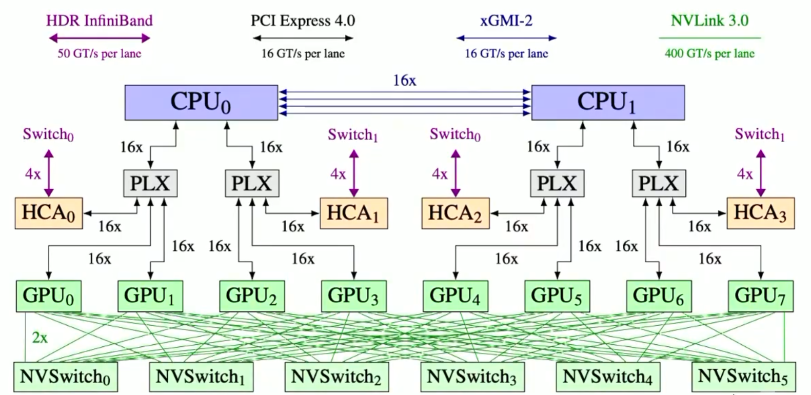
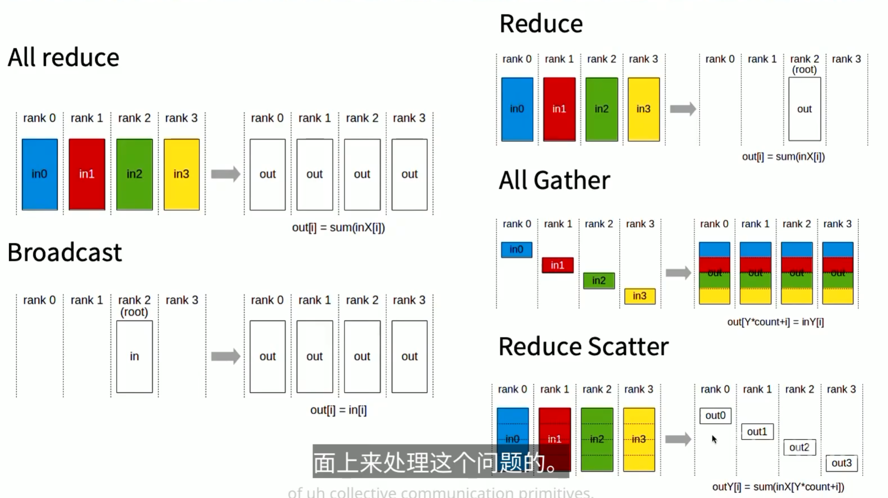
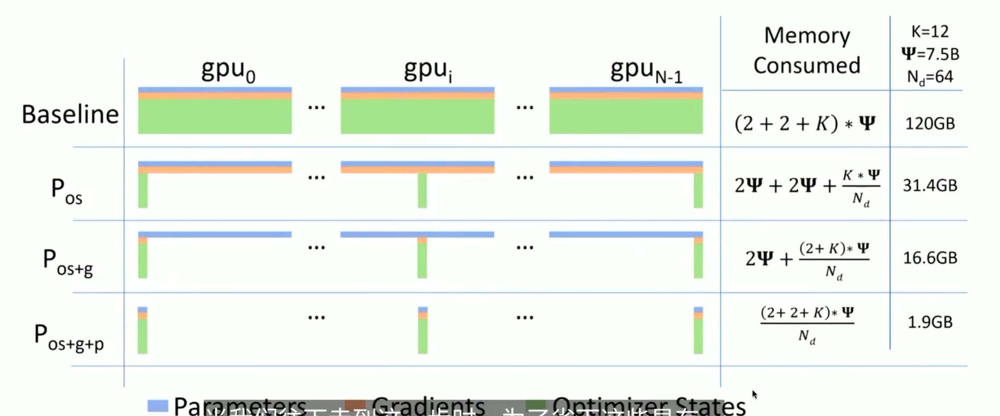
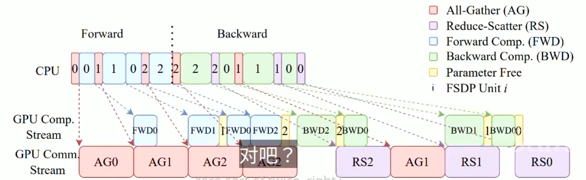
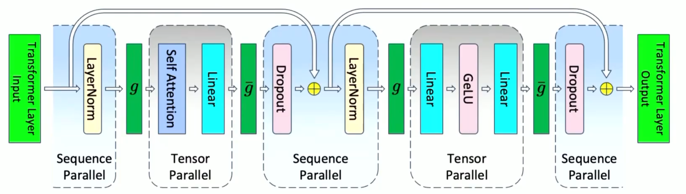
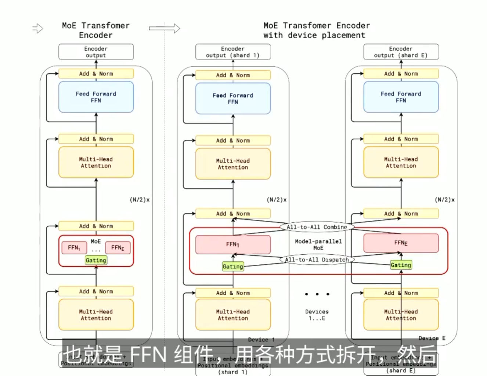
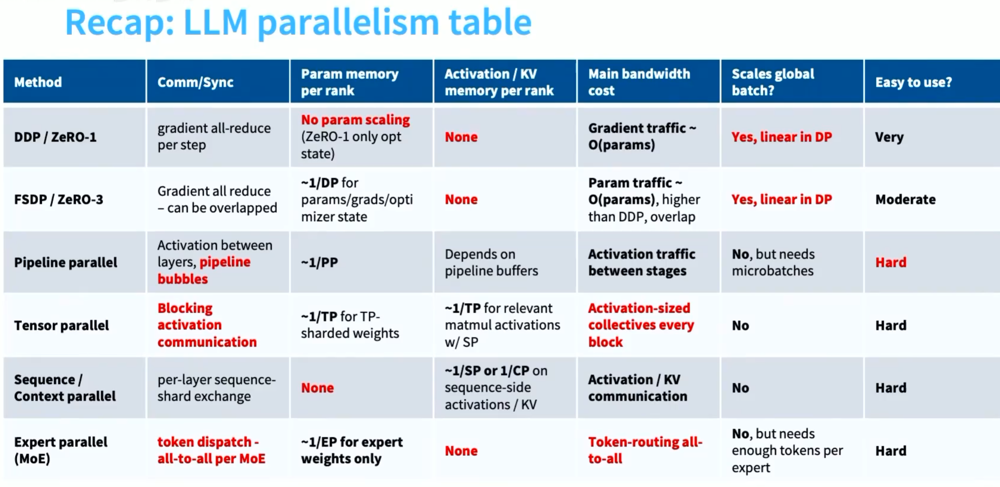

# Parallelism

节点间通信、节点内并行

TPU是环形网络连接

GPU是 All-to-all 的 “fat tree” 网络连接

## Naive data parallelism

每次拿到一个 batch，分成 N 份，分别送到 N 个 GPU 上训练，最后把梯度平均后更新模型参数。

通信开销——> 两倍数据大小

Pos -> Optimizer state sharding

1. 每个人各自算梯度
2. reduce-scatter，拿走更新有关的
3. 每个机器都可以更新了
4. all gather收回

Naive DDP:  one all-reduce, 通信开销 2倍 内存 4+k
ZeRO stage1: one reduce-scatter, one all-gather, 通信开销 2倍 内存 4+k/Ngpu

Zero stage2： 切片计算，边走边发
1. 沿着计算图反向遍历，规约，不要就释放掉
2. 更新
3. all-gather

Zero stage3: 参数也分片  按需发送接受参数

扫一遍计算图，传递通信，立马释放。

通信和计算重叠

## Pipeline parallelism

1. Pipelines same memory (compared to DDP)
2. Pipelines can have good communication properties (compared to FDSP) - it depends only on actications (bxsxh) and is point to point.

'zero bubble' pipelining:

Split up backwards into two parts.
1. Backpropagating activations (z,x)
2. Computing weight gradients (w)

## Tensor parallelism

张量并行特别吃通信带宽，一般到了8GPU就不会去考虑做这个了

## Expert Parallelism

# Recap: LLM parallelism table

