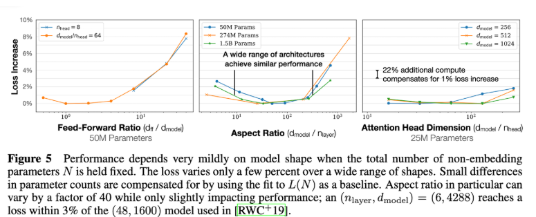
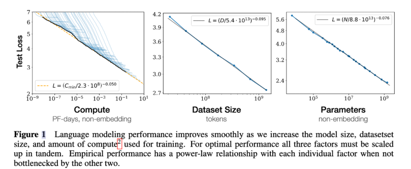
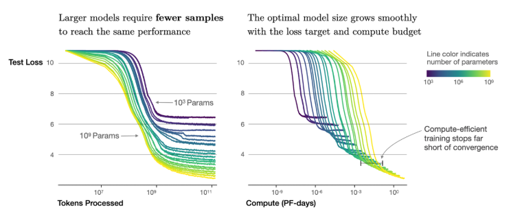
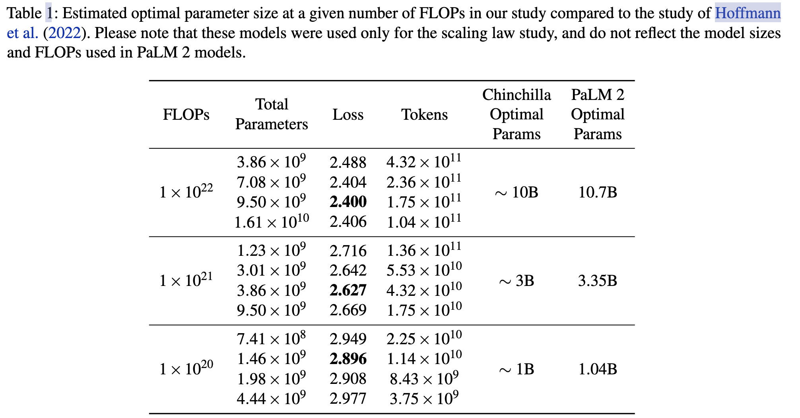

# Scaling Law

Scaling laws 是一种简单的 ， precitive 的规则。从小规模预测大规模模型的行为。

小规模完成优化，外推到大规模。
## Part1 Some history

早期就是纯粹的实验， 通过大量的实验，发现了规律。 但是没有理论支撑。

## Part2 Neural scaling behavior

1. Data vs performance
2. Data vs model size
3. Hyperparameter vs performance

数据量提升 -> 质量提升

很明显的问题，但是肯定数据最大之后，数据的质量很难把控。

**Batch size**

临界batch size = Emin / Smin  E min 是最小的loss， Smin 是最小的梯度方差。

# 补充资料

# 核心结论

1. 对于Decoder-only 模型，计算量 C，模型参数N，数据大小D，三者满足
$$ C \propto 6ND $$

2. 模型最终性能主要与C.N.D 相关，和模型具体结构无关
3. 对于计算量C，参数N，大小D，当不受其他两个因素制约的时候，模型性能与每个因素都成幂律关系

4. 为了提升性能，参数量N 和数据大小D需要同步放大
5. Scaling Law还适用于其他模态和跨模态任务。

## Scaling law 实操: 计算效率最优
根据幂律定律，模型的参数固定，无限堆数据并不能无限提升模型的性能，模型最终性能会慢慢趋向一个固定的值

根据 C = 6ND， 可以进一步转换成模型参数和计算量的关系。

## LLaMA: 反Scaling Law的大模型

假设遵循计算效率最优来研发LLM，那么根据Scaling Law，给定模型大小，可以推算出最优的计算量，进一步根据最优计算量就能推算出需要的token数量，然后训练就行。

但是计算效率最优这个观点是针对训练阶段而言的，并不是推理阶段，实际应用中推理阶段效率更实用。

Meta在LLaMA的观点是：给定模型的目标性能，并不需要用最优的计算效率在最快时间训练好模型，而应该在更大规模的数据上，训练一个相对更小模型，这样的模型在推理阶段的成本更低，尽管训练阶段的效率不是最优的（同样的算力其实能获得更优的模型，但是模型尺寸也会更大）。根据Scaling Law，10B模型只需要200B的数据，但是作者发现7B的模型性能在1T的数据后还能继续提升。

所以LLaMA工作的重点是训练一系列语言模型，通过使用更多的数据，让模型在有限推理资源下有最佳的性能。

具体而言，确定模型尺寸后，Scaling Law给到的只是最优的数据量，或者说是一个至少的数据量，实际在训练中观察在各个指标上的性能表现，只要还在继续增长，就可以持续增加训练数据。

