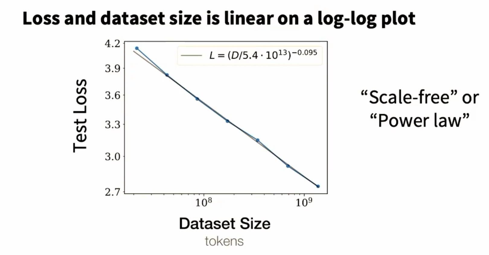
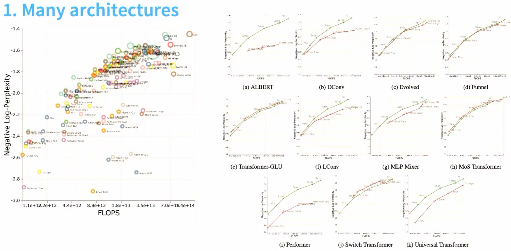
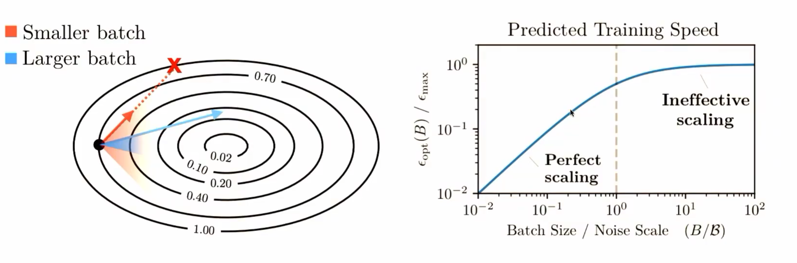
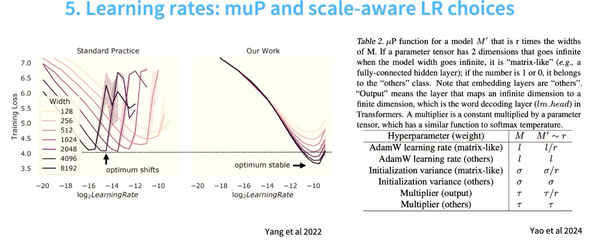

# Scaling Law

Scaling laws 是一种简单的 ， precitive 的规则。从小规模预测大规模模型的行为。

小规模完成优化，外推到大规模。
## Part1 Some history

早期就是纯粹的实验， 通过大量的实验，发现了规律。 但是没有理论支撑。

## Part2 Neural scaling behavior

1. Data vs performance
2. Data vs model size
3. Hyperparameter vs performance

数据量提升 -> 质量提升

很明显的问题，但是肯定数据最大之后，数据的质量很难把控。

**Batch size**

临界batch size = Emin / Smin  E min 是最小的loss， Smin 是最小的梯度方差。

